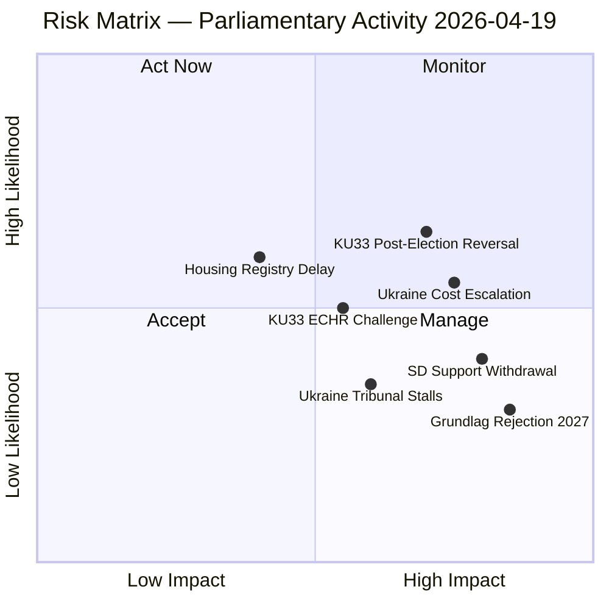

# Risk Assessment — Realtime Monitor 2026-04-19 (1219)

**RSK-ID**: RSK-20260419-1219  
**Date**: 2026-04-19  
**Analyst**: James Pether Sörling  
**Version**: 2.0 (Pass 2 enriched)

## Risk Heat Map

## Ranked Risk Register

| # | Risk | Likelihood (L) | Impact (I) | L×I | Trend | Mitigation |
|---|------|---------------|-----------|-----|-------|-----------|
| 1 | **KU33 confirmed by post-2026 riksdag** — opposition wins September 2026 election and rejects second reading | 0.40 | 0.90 | **0.36** | Rising | Monitor election polls; alert if opposition bloc exceeds 50% |
| 2 | **Ukraine compensation costs exceed projections** — International Compensation Commission levies exceed SEK 2bn annually | 0.55 | 0.75 | **0.41** | Rising | Track commission establishment milestones; fiscal provisions in spring budget |
| 3 | **SD withdraws cooperation on Ukraine financing** — SD voter base resistant to open-ended Ukraine financial commitments | 0.45 | 0.80 | **0.36** | Stable | Track SD party statements on Ukraine cost; watch Åkesson statements |
| 4 | **KU33 challenged under ECHR Art 10 (free expression)** — Swedish journalists union or Reporters Without Borders files complaint | 0.50 | 0.70 | **0.35** | Rising | Monitor Council of Europe response; track JK (Justitiekanslern) guidance |
| 5 | **Housing register (CU28) delayed** — Industry opposition slows implementation past Jan 2027 | 0.40 | 0.45 | **0.18** | Stable | Monitor Lantmäteriet capacity; track industry consultation |
| 6 | **Grundlag amendment rejected** — September 2026 election produces majority that refuses second reading | 0.30 | 0.85 | **0.26** | Stable | Electoral arithmetic: requires both S and V to oppose |
| 7 | **Ukraine Tribunal stalls** — Geopolitical shifts reduce participation; tribunal loses jurisdiction | 0.35 | 0.65 | **0.23** | Stable | Track Council of Europe participation numbers |

## Cascading Risk Analysis

**Primary risk chain**: SD withdrawal (Risk 3) → budget deal collapse → government confidence vote → snap election → KU33 second reading fails (Risk 6) → constitutional amendment abandoned.

**Probability of chain**: P(3) × P(chain given 3) = 0.45 × 0.35 = **0.16 (16%)** — within planning horizon for 2026-2027.

## Bayesian Update

Prior probability (pre-session): Government stability = 0.65  
New evidence: Multiple propositions passing committee, Ukraine propositions advancing = moderate positive signal  
Posterior: Government stability = **0.68** (+0.03 update)

Evidence weight: KU committees advancing government proposals without major dissent signals coalition cohesion is holding.

## Risk by Dimension

| Dimension | Top Risk | Score | Time horizon |
|-----------|---------|-------|-------------|
| Constitutional | KU33 rejection in 2027 | 7.5/10 | 12-18 months |
| International | Ukraine cost escalation | 7.0/10 | 24-36 months |
| Political | SD withdrawal from cooperation | 6.5/10 | 3-9 months |
| Legal | ECHR challenge to KU33 | 6.0/10 | 6-24 months |
| Administrative | CU28 implementation delay | 4.5/10 | 12-24 months |
