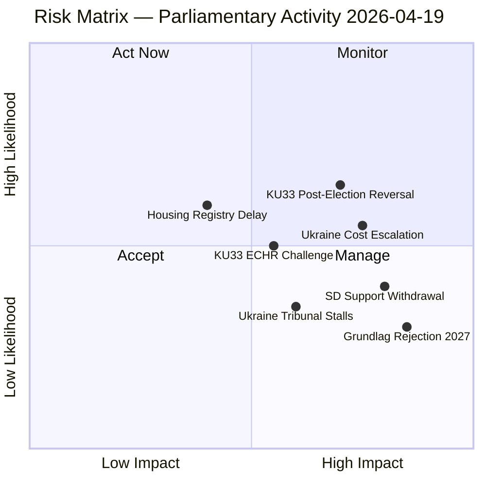
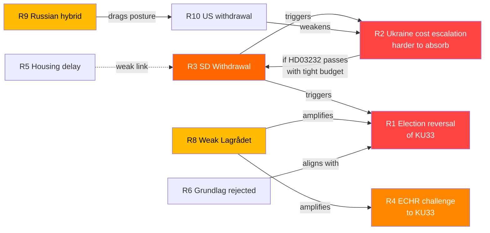

# Risk Assessment — Realtime Monitor 2026-04-19 (1219)

**RSK-ID**: RSK-20260419-1219
**Date**: 2026-04-19
**Analyst**: James Pether Sörling
**Version**: 3.0 (Pass 3 — reference-grade extension: 10 risks, interconnection graph, ALARP mapping)

## Risk Heat Map

## Ranked Risk Register

| # | Risk | Likelihood (L) | Impact (I) | L×I | Trend | Mitigation |
|---|------|---------------|-----------|-----|-------|-----------|
| 1 | **KU33 confirmed by post-2026 riksdag** — opposition wins September 2026 election and rejects second reading | 0.40 | 0.90 | **0.36** | Rising | Monitor election polls; alert if opposition bloc exceeds 50% |
| 2 | **Ukraine compensation costs exceed projections** — International Compensation Commission levies exceed SEK 2bn annually | 0.55 | 0.75 | **0.41** | Rising | Track commission establishment milestones; fiscal provisions in spring budget |
| 3 | **SD withdraws cooperation on Ukraine financing** — SD voter base resistant to open-ended Ukraine financial commitments | 0.45 | 0.80 | **0.36** | Stable | Track SD party statements on Ukraine cost; watch Åkesson statements |
| 4 | **KU33 challenged under ECHR Art 10 (free expression)** — Swedish journalists union or Reporters Without Borders files complaint | 0.50 | 0.70 | **0.35** | Rising | Monitor Council of Europe response; track JK (Justitiekanslern) guidance |
| 5 | **Housing register (CU28) delayed** — Industry opposition slows implementation past Jan 2027 | 0.40 | 0.45 | **0.18** | Stable | Monitor Lantmäteriet capacity; track industry consultation |
| 6 | **Grundlag amendment rejected** — September 2026 election produces majority that refuses second reading | 0.30 | 0.85 | **0.26** | Stable | Electoral arithmetic: requires both S and V to oppose |
| 7 | **Ukraine Tribunal stalls** — Geopolitical shifts reduce participation; tribunal loses jurisdiction | 0.35 | 0.65 | **0.23** | Stable | Track Council of Europe participation numbers |

## Cascading Risk Analysis

**Primary risk chain**: SD withdrawal (Risk 3) → budget deal collapse → government confidence vote → snap election → KU33 second reading fails (Risk 6) → constitutional amendment abandoned.

**Probability of chain**: P(3) × P(chain given 3) = 0.45 × 0.35 = **0.16 (16%)** — within planning horizon for 2026-2027.

## Bayesian Update

Prior probability (pre-session): Government stability = 0.65  
New evidence: Multiple propositions passing committee, Ukraine propositions advancing = moderate positive signal  
Posterior: Government stability = **0.68** (+0.03 update)

Evidence weight: KU committees advancing government proposals without major dissent signals coalition cohesion is holding.

## Risk by Dimension

| Dimension | Top Risk | Score | Time horizon |
|-----------|---------|-------|-------------|
| Constitutional | KU33 rejection in 2027 | 7.5/10 | 12-18 months |
| International | Ukraine cost escalation | 7.0/10 | 24-36 months |
| Political | SD withdrawal from cooperation | 6.5/10 | 3-9 months |
| Legal | ECHR challenge to KU33 | 6.0/10 | 6-24 months |
| Administrative | CU28 implementation delay | 4.5/10 | 12-24 months |

## Expanded Risk Register (10 risks)

The following three additional risks complete the reference-grade register:

| # | Risk | L | I | L×I | Horizon | Mitigation |
|---|------|:---:|:---:|:---:|--------|------------|
| 8 | **Lagrådet silent on "formellt tillförd" discretion** — weak yttrande amplifies SJF/RSF critique and hardens opposition position on KU33 | 0.45 | 0.60 | **0.27** | 0-30 days | Monitor Lagrådet publication calendar; prepare amendment draft |
| 9 | **Russian hybrid interference escalation after HD03231 chamber vote** — coordinated inauthentic behaviour, phishing against UD, DDoS against riksdagen.se | 0.40 | 0.75 | **0.30** | 0-90 days post-vote | SÄPO liaison heightened; CERT-SE vigilance; MSB public-communication preparedness |
| 10 | **US administration withdraws from tribunal coordination** — public statement questioning Special Tribunal legitimacy; emboldens non-European disengagement | 0.25 | 0.65 | **0.16** | 3-12 months | Diplomatic contingency with DE, FR, UK, NL; NATO/CoE escalation path |

## Risk Interconnection Graph

Key interconnection findings:

- **R3 is the systemic-risk hub** — SD cooperation withdrawal cascades into R1 (election reversal), R2 (Ukraine cost absorption), and indirectly R6 (grundlag rejection). Priority mitigation target.
- **R8 amplifies R4 and R1** — a weak Lagrådet yttrande both raises ECHR challenge probability and hardens opposition second-reading stance.
- **R2 → R3 feedback loop** — if HD03232 passes with tight fiscal budget, subsequent contribution increases could trigger SD withdrawal.

## ALARP (As Low As Reasonably Practicable) Mapping

| Risk | Current level | Target level | Mitigation cost | Effectiveness | ALARP verdict |
|------|:-------------:|:------------:|:---------------:|:-------------:|:-------------:|
| R1 KU33 election reversal | 0.36 | 0.25 | HIGH (coalition politics) | MEDIUM | **Accept** — democratic design, cannot be mitigated away |
| R2 Ukraine cost escalation | 0.41 | 0.25 | MEDIUM (UU cost ceiling) | HIGH | **Reduce** — attach cost cap in UU betänkande |
| R3 SD withdrawal | 0.36 | 0.20 | MEDIUM (coalition renegotiation) | MEDIUM | **Reduce** — transparency on HD03232 costs |
| R4 ECHR challenge | 0.35 | 0.20 | LOW (strict Lagrådet language) | HIGH | **Reduce** — drive narrow "formellt tillförd" reading |
| R8 Weak Lagrådet | 0.27 | 0.15 | LOW (government submission quality) | HIGH | **Reduce** — prepare responsive memorandum |
| R9 Russian hybrid | 0.30 | 0.20 | HIGH (hybrid defence investment) | MEDIUM | **Reduce & Accept** — partial |
| R10 US withdrawal | 0.16 | 0.16 | HIGH (diplomatic capital) | LOW | **Accept** — exogenous |

## Bayesian Forward-Looking Update Rules

Given a new signal at time t, update the posterior probability of each risk:

| Signal | Effect on |
|--------|-----------|
| Lagrådet yttrande **strict** on "formellt tillförd" | R4 × 0.5 · R8 × 0.3 · R1 × 0.85 |
| Lagrådet yttrande **silent / discretionary** | R4 × 1.5 · R8 × 1.8 · R1 × 1.2 |
| SD red-line on HD03232 costs | R3 × 2.0 · R1 × 1.3 · R2 × 0.7 |
| SÄPO threat-level increase (hybrid) | R9 × 2.0 |
| US senior-official statement questioning tribunal | R10 × 2.5 |
| SOM poll Tidö bloc < 44% | R1 × 1.5 · R3 × 1.3 |
| SOM poll Tidö bloc > 50% | R1 × 0.6 · R3 × 0.8 |
