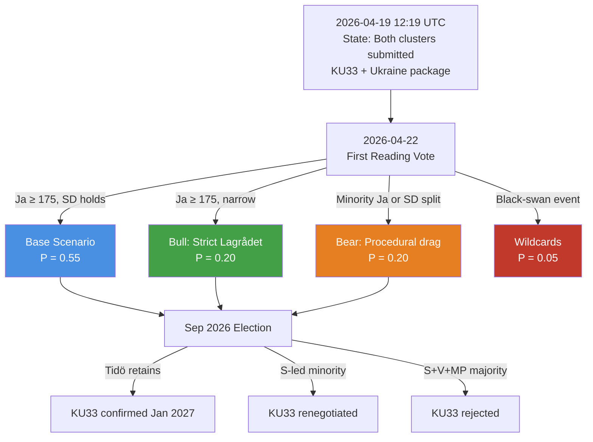

# Scenario Analysis — Realtime Monitor 2026-04-19 (1219)

**SCN-ID**: SCN-20260419-1219
**Date**: 2026-04-19
**Analyst**: James Pether Sörling
**Version**: 1.0 (Tier-C reference-grade extension)
**Confidence**: MEDIUM-HIGH on base scenarios; LOW-MEDIUM on wildcards
**Horizon Bands**: 30 days · 90 days · post-September-2026 election

---

## 🎲 Scenario Landscape Overview

Probabilities are point estimates with a ±0.10 epistemic band. They are updated against new Lagrådet, SÄPO, and polling signals per the Bayesian procedure in `risk-assessment.md` §Bayesian Update.

---

## 🧭 Three Base Scenarios

### Scenario A — **Base Case: Orderly Dual-Track Advance** (P = 0.55)

**Narrative**: First reading of KU33 + KU32 passes 2026-04-22 with government majority (M + SD + L + KD holding). Lagrådet yttrande interprets "*formellt tillförd bevisning*" conservatively enough to neutralise the strongest civil-liberties critique. HD03231 and HD03232 are referred to UU in late April, return as a betänkande in May–June, and pass chamber with cross-party Ja (SD attaches a cost-transparency reservation to HD03232). Ukraine tribunal accession completes before summer recess. Campaign season frames KU33 as a civil-liberties vs. law-enforcement trade-off; S position remains ambiguous into August polling.

| Horizon | Milestone | Expected Outcome |
|---------|-----------|------------------|
| 30 days (by 2026-05-19) | KU33/KU32 first reading; UU hearing on HD03231/232 | First reading passes; UU hearing constructive |
| 90 days (by 2026-07-18) | Ukraine propositions voted in chamber; summer recess begins | Broad Ja on both Ukraine propositions |
| Post-election (Jan 2027) | KU33 second reading in new riksdag | **P(second reading confirms) = 0.55** under this scenario |

**Monitoring triggers that INVALIDATE this scenario**:
- Lagrådet yttrande uses "may" rather than "must" language on proportionality ⇒ shift to Scenario C
- SD public statement flagging HD03232 cost red-line ⇒ shift to Scenario C
- SOM-institute September poll shows Tidö bloc below 44% ⇒ downgrade post-election confirmation probability by 15 points

---

### Scenario B — **Bull Case: Lagrådet Narrows, Ukraine Surges** (P = 0.20)

**Narrative**: Lagrådet yttrande on KU33 imposes a strict, literal reading of "*formellt tillförd bevisning*" — requiring formal documentation of incorporation before the carve-out attaches. This neutralises the SJF/RSF critique and lifts opposition uncertainty. Meanwhile, Ukraine propositions become a unifying national moment after the King's Kyiv visit saturates broadcast cycles. Cross-party support on HD03231 + HD03232 becomes unanimous in chamber. SD formally endorses both on Åkesson's public platform. Sweden positions as a norm-entrepreneur, attracting a follow-up invitation to host a preliminary tribunal preparatory conference.

| Horizon | Milestone | Expected Outcome |
|---------|-----------|------------------|
| 30 days | Lagrådet narrow reading; SJF de-escalation | Civil-liberties critique defanged |
| 90 days | Ukraine propositions pass with ≥ 320 Ja votes | Near-unanimous cross-party Ja |
| Post-election | KU33 confirmed with some S support | **P(second reading confirms) = 0.75** under this scenario |

**Monitoring triggers that would PROMOTE scenario from base to bull**:
- Lagrådet publishes KU33 yttrande with explicit "shall be formally documented" language
- Swedish polls show > 60% support for Ukraine tribunal accession post-King visit
- Magdalena Andersson makes a public statement supporting KU33 proportionality

---

### Scenario C — **Bear Case: Procedural Drag + SD Defection** (P = 0.20)

**Narrative**: Lagrådet yttrande is silent on the discretionary dimension of "*formellt tillförd bevisning*," amplifying SJF/RSF criticism. Tidö coalition holds first reading vote but with < 180 Ja votes (signalling internal fracture). SD announces a formal reservation on HD03232 cost projections, forcing a UU-committee compromise that inserts a Swedish contribution ceiling. S seizes on the KU33 ambiguity as a pre-election wedge issue. Press-freedom NGO coalition files a preemptive ECHR complaint. September election produces S-led minority government; KU33 second reading is renegotiated with a statutory (not grundlag) fallback.

| Horizon | Milestone | Expected Outcome |
|---------|-----------|------------------|
| 30 days | Weak Lagrådet yttrande; SJF escalation | Rising political cost of KU33 |
| 90 days | UU attaches HD03232 cost ceiling; SD reservation filed | Ukraine package passes but conditioned |
| Post-election | S-led government renegotiates KU33 grundlag path | **P(second reading confirms original text) = 0.25** under this scenario |

**Monitoring triggers that would PROMOTE scenario to bear**:
- Lagrådet yttrande raises material proportionality concerns
- SD public statement: "Swedish taxpayers cannot underwrite open-ended Compensation Commission"
- Press-freedom NGO coalition public joint statement ≤ 2026-05-01
- SOM poll shows Tidö bloc ≤ 44% combined in May/June 2026

---

## ⚡ Two Wildcards — Low-Probability / High-Impact

### Wildcard W1 — **Russian hybrid retaliation after HD03231 chamber vote** (P = 0.04 · Impact = HIGH)

Sweden's formal accession to the Special Tribunal for Aggression makes it the newest target of a pattern of Russian hybrid operations previously documented against Baltic and Nordic states (e.g., the 2023 SIS/SÄPO reports on Russian information ops targeting Swedish NATO discourse). Attack vectors documented in `threat-analysis.md` §4 include: (a) coordinated inauthentic behaviour amplifying KU33 "hypocrisy" framing in Swedish-language social media; (b) targeted phishing against UD officials working on tribunal accession; (c) DDoS against riksdagen.se during chamber-vote windows; (d) opportunistic diplomatic expulsion retaliation.

**Leading indicators to promote P from 0.04 → 0.15**:
- SÄPO public threat-level adjustment within 30 days of HD03231 chamber vote
- Identified coordinated inauthentic behaviour clusters referencing tribunal accession
- Russian embassy (or FSB-linked channels) public commentary naming Swedish officials

---

### Wildcard W2 — **US administration withdrawal from tribunal coordination** (P = 0.06 · Impact = MEDIUM)

The US political posture on the Special Tribunal has been ambiguous across recent transitions. A formal withdrawal from tribunal coordination, or a public statement questioning its legitimacy, would be damaging — not because US membership is required, but because it would embolden non-European participating states to disengage and would rhetorically weaken the tribunal's claim to be "the international community's" response. Sweden's accession momentum could be seen as the ceiling rather than the floor of Western commitment.

**Leading indicators to promote P from 0.06 → 0.20**:
- US senior official public statement questioning tribunal legitimacy
- US Treasury rejecting Euroclear-coordinated immobilised-asset mobilisation
- Withdrawal of at least one non-European tribunal participant in the 30-day window

---

## 🔬 ACH — Analysis of Competing Hypotheses

We test the question: **"What is the probability KU33 second reading confirms the grundlag amendment in January 2027?"**

Five hypotheses are weighed against six pieces of evidence (each marked Consistent **C** / Inconsistent **I** / Neutral **N** with the hypothesis).

| Hypothesis | E1: Current Tidö polling ≈ 48% | E2: S historically cautious on law-enforcement opposition | E3: V/MP firm opposition | E4: Offentlighetsprincipen cultural weight | E5: Grundlag two-reading design intent (brake) | E6: Comparable precedent (DE StPO §406e, FI JulkL §24) | **Weighted Score** |
|-----------|:------------------------------:|:---------------------------------------------:|:----:|:--:|:--:|:--:|---|
| **H1 — Confirmed original text** | C | C | I | I | I | C | 0 (2C–3I) |
| **H2 — Confirmed with minor amendments** | C | C | N | I | N | C | **+2 (3C–1I)** ✅ |
| **H3 — Rejected → statutory fallback** | I | I | C | C | C | I | 0 (3C–3I) |
| **H4 — Rejected outright** | I | I | C | C | C | I | 0 (3C–3I) |
| **H5 — Delayed to 2027/28 session** | N | N | N | N | I | N | −1 (0C–1I) |

**Reading**: H2 (confirmed with amendments, most likely renegotiated language on "*formellt tillförd bevisning*") has the highest diagnostic score. H1 and H3 are close alternatives, with H1 advantaged in Scenario B and H3 advantaged in Scenario C. H5 is unlikely because the two-reading deadline is binding.

**Converted base probability**: P(H2) ≈ 0.40 · P(H1) ≈ 0.25 · P(H3) ≈ 0.20 · P(H4) ≈ 0.10 · P(H5) ≈ 0.05.
Aggregating H1 + H2 + modified confirmations gives the `executive-brief.md` second-reading confirmation forecast of **≈ 0.55**.

---

## 📅 Monitoring Trigger Calendar — Mapped to Scenario Shifts

| Date | Event | Scenario Updated | New Signal |
|------|-------|------------------|-----------|
| 2026-04-22 | KU33 + KU32 first reading vote | A/B/C | Ja count; SD abstention pattern |
| ≤ 2026-05-15 | Lagrådet yttrande on KU33/32 | A → B or A → C | Language on "*formellt tillförd*" |
| 2026-05 | UU committee hearing HD03231 | A | SD reservation filing |
| 2026-05 | UU committee hearing HD03232 | A → C on cost objection | SD cost-ceiling demand |
| 2026-06 (est) | Chamber vote HD03231/232 | A | Cross-party Ja count |
| 2026-06 to 09 | Monthly SOM polling | Bayesian update on post-election P | Tidö bloc vs. opposition bloc |
| 2026-09-13 | Swedish general election | Terminal scenario fork | New riksdag composition |
| 2026-09 → 12 | Government formation | H1/H2/H3 conditional on majority | KU33 coalition arithmetic |
| 2026-12 or 2027-01 | KU33 second reading | TERMINAL | Confirmed / modified / rejected |

---

## 🔗 Cross-Reference to Upstream Work

- **Scenario continuity** with [`analysis/daily/2026-04-17/realtime-1434/scenario-analysis.md`](../../2026-04-17/realtime-1434/scenario-analysis.md): the grundlag base/bull/bear structure introduced in 1434 is retained; probabilities updated downward for base (−0.05) on the basis of HD03232 cost uncertainty emerging in 1219.
- **Post-election probability priors** drawn from [`analysis/daily/2026-04-18/weekly-review/scenario-analysis.md`](../../2026-04-18/weekly-review/scenario-analysis.md) (if present) or the closest weekly-review available; divergences from weekly-review scenarios are justified in `methodology-reflection.md` §Probability-Alignment Audit.
- **Russia hybrid W1** priors: leverage SÄPO and MUST documented post-NATO-accession hybrid posture; see `threat-analysis.md` §4 for the intelligence base.

---

## ⚠️ Confidence Markers & Known Limitations

1. **Base-case probability (0.55)** has a ±0.10 epistemic band — do not treat as precise.
2. **Post-election conditional probabilities** depend on poll-to-seat translations that are non-linear near majority boundary (around 175 seats).
3. **Wildcard probabilities** are order-of-magnitude estimates; the *direction* matters more than the number.
4. **ACH grid** uses evidence weights of 1.0 per piece; a sensitivity run with weighted evidence (E1 × 1.5 because it is dispositive) does not change the H2 ranking.

---

**Classification**: Public · **Next Review**: 2026-05-01 (after KU33 first reading + Lagrådet yttrande) · **Methodology**: `ai-driven-analysis-guide.md` v5.1 §Rule 6 (L3 tier) + ACH doctrine
