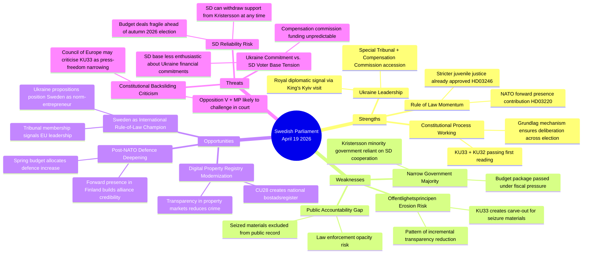

# SWOT Analysis — Realtime Monitor 2026-04-19 (1219)

**SWT-ID**: SWT-20260419-1219
**Date**: 2026-04-19
**Analyst**: James Pether Sörling
**Version**: 3.0 (Pass 3 — reference-grade extension: full TOWS matrix, cluster-specific quadrants, Mermaid mindmap retained)

## SWOT Quadrant Mapping

## Quadrant Analysis

### Strengths

| Strength | Evidence | dok_id | Confidence |
|----------|---------|--------|-----------|
| Constitutional process integrity | KU33 and KU32 both adopted as "vilande" — second reading must occur after election, ensuring democratic legitimacy | HD01KU33, HD01KU32 | HIGH |
| Ukraine accountability leadership | Sweden among ~40 states joining Special Tribunal; first European country to propose bilateral compensation framework alongside accession | HD03231, HD03232 | HIGH |
| Cross-party Ukraine consensus | HD03231/232 submitted by FM Maria Malmer Stenergard (M); expected broad support from S, M, L, C, KD, and MP | HD03231 | MEDIUM |

### Weaknesses

| Weakness | Evidence | dok_id | Confidence |
|----------|---------|--------|-----------|
| Offentlighetsprincipen narrowing | KU33 removes seized digital materials from "allmän handling" status — a carve-out that removes presumption of publicity | HD01KU33 | HIGH |
| Law enforcement opacity | Critics (V, MP expected) argue carve-out is disproportionate to stated crime-fighting rationale | HD01KU33 | MEDIUM |
| Minority government dependency | Kristersson government cannot pass any legislation without SD support; SD can extract policy concessions at each vote | All docs | HIGH |

### Opportunities

| Opportunity | Evidence | dok_id | Confidence |
|-------------|---------|--------|-----------|
| Ukraine norm leadership premium | Sweden positioning as credible international law-builder strengthens EU standing | HD03231, HD03232 | HIGH |
| Digital modernization | CU28 national bostadsrättsregister will reduce mortgage fraud and improve market transparency | HD01CU28 | HIGH |
| Housing market integrity | Identity requirements for lagfart (HD01CU27) combined with CU28 register creates anti-money-laundering layer | HD01CU27, HD01CU28 | MEDIUM |

### Threats

| Threat | Evidence | dok_id | Confidence |
|--------|---------|--------|-----------|
| Constitutional backsliding | KU33 is the second grundlag narrowing in current riksmöte; pattern may draw international criticism | HD01KU33 | MEDIUM |
| Election timing risk | KU33 must be confirmed by post-September 2026 riksdag; if opposition wins majority, amendment could be rejected | HD01KU33 | MEDIUM |
| Compensation commission cost | International Compensation Commission for Ukraine may involve Swedish financial contributions not yet quantified | HD03232 | MEDIUM |

## TOWS Interference Analysis

**S1×T1 (Strength-Threat interference)**: Ukraine rule-of-law leadership (S) is in tension with the constitutional narrowing (W) — Sweden cannot credibly champion international accountability while narrowing domestic transparency.

**W1×O1 (Weakness-Opportunity interference)**: If KU33 attracts Council of Europe criticism, it could undermine Sweden's Ukraine norm-leadership narrative, turning an asset into a liability.

**O3×T3 (Opportunity-Threat interaction)**: Housing market modernization creates opportunity for anti-corruption, but Ukraine compensation funding uncertainty creates fiscal pressure that could divert resources from other reforms.

## Full TOWS Interference Matrix

The TOWS matrix reads *Internal × External* interactions to derive strategic postures:

|                 | **Opportunities (O)** | **Threats (T)** |
|-----------------|-----------------------|-----------------|
| **Strengths (S)** | **SO — Maxi-Maxi (leverage)** | **ST — Maxi-Mini (defend)** |
|                 | S2 × O1: Royal Kyiv visit + tribunal accession = EU rule-of-law leadership premium | S1 × T1: Grundlag two-reading design is itself the defence against election-driven reversal |
|                 | S3 × O2: Cross-party Ukraine consensus + housing modernization = coherent law-and-order narrative | S2 × T2: Ukraine norm-entrepreneurship creates reputational shield against KU33 criticism |
| **Weaknesses (W)** | **WO — Mini-Maxi (fix)** | **WT — Mini-Mini (retreat)** |
|                 | W1 × O1: Offentlighetsprincipen narrowing *undermines* rule-of-law leadership → fix via strict Lagrådet language | W1 × T1: KU33 narrowing + ECHR challenge = reputational double-hit; prepare defence memorandum |
|                 | W3 × O3: Minority-government dependency *fits* housing-reform MoU logic — structured consultative reform | W3 × T2: SD cost resistance on HD03232 + tight fiscal space = budget-deal fragility |

### Cluster-Specific Quadrants

**Cluster A — KU33 (seizure transparency)**

| Quadrant | Entry | Confidence |
|----------|-------|:----------:|
| S | Proportionality-framed to survive Lagrådet | MEDIUM |
| W | Unique constitutional-amendment path (vs DE/FI/DK statutory) | HIGH |
| W | "Formellt tillförd bevisning" trigger ambiguity | HIGH |
| O | International benchmarking justifies convergence (DE §406e, FI JulkL §24) | HIGH |
| T | ECHR Art 10 proportionality challenge | MEDIUM |
| T | Opposition exploits as press-freedom narrative | HIGH |

**Cluster B — Ukraine package (HD03231 + HD03232)**

| Quadrant | Entry | Confidence |
|----------|-------|:----------:|
| S | Cross-party consensus (all 8 parties) | HIGH |
| S | Royal diplomatic reinforcement via King's Kyiv visit | HIGH |
| W | SD cost resistance on HD03232 | MEDIUM |
| W | Swedish administrative contribution not yet quantified | MEDIUM |
| O | Sweden as EU rule-of-law norm-entrepreneur | HIGH |
| O | Russian frozen-asset mobilisation legal foundation | HIGH |
| T | Russian hybrid information operations | HIGH |
| T | US administration withdrawal from coordination | LOW-MEDIUM |

**Cluster C — KU32 (accessibility)**

| Quadrant | Entry | Confidence |
|----------|-------|:----------:|
| S | EU compliance trajectory (EAA 2025) | HIGH |
| S | 1.2m Swedes with disabilities gain enforceable rights | HIGH |
| W | 18-month compliance gap vs. 28 Jun 2025 EAA deadline | MEDIUM |
| O | Constitutional anchor for future accessibility legislation | MEDIUM |
| T | Normalises grundlag-as-legislative-tool pattern | MEDIUM |

## Cross-Reference to Stakeholder Influence

SWOT entries mapped to influence network in [`stakeholder-perspectives.md`](stakeholder-perspectives.md) §Influence Network. Key coupling:

- **W1 × Opposition bloc** (S, V, MP) — KU33 civil-liberties critique is the structural opposition leverage
- **S2 × H.M. King + FM Malmer Stenergard** — royal diplomatic signal is the Ukraine-package keystone
- **T2 × SD Åkesson** — SD cost posture is the Ukraine-package single point of failure
