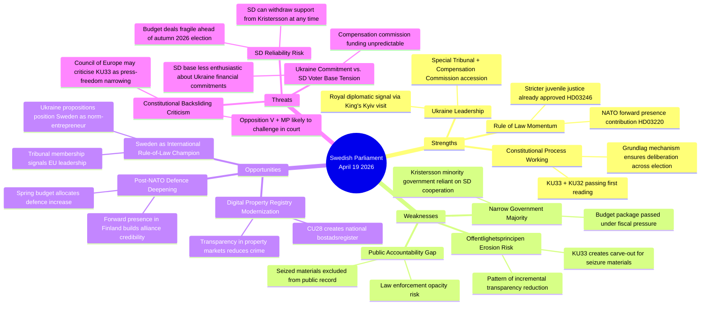

# SWOT Analysis — Realtime Monitor 2026-04-19 (1219)

**SWT-ID**: SWT-20260419-1219  
**Date**: 2026-04-19  
**Analyst**: James Pether Sörling  
**Version**: 2.0 (Pass 2 enriched with TOWS + Mermaid)

## SWOT Quadrant Mapping

## Quadrant Analysis

### Strengths

| Strength | Evidence | dok_id | Confidence |
|----------|---------|--------|-----------|
| Constitutional process integrity | KU33 and KU32 both adopted as "vilande" — second reading must occur after election, ensuring democratic legitimacy | HD01KU33, HD01KU32 | HIGH |
| Ukraine accountability leadership | Sweden among ~40 states joining Special Tribunal; first European country to propose bilateral compensation framework alongside accession | HD03231, HD03232 | HIGH |
| Cross-party Ukraine consensus | HD03231/232 submitted by FM Maria Malmer Stenergard (M); expected broad support from S, M, L, C, KD, and MP | HD03231 | MEDIUM |

### Weaknesses

| Weakness | Evidence | dok_id | Confidence |
|----------|---------|--------|-----------|
| Offentlighetsprincipen narrowing | KU33 removes seized digital materials from "allmän handling" status — a carve-out that removes presumption of publicity | HD01KU33 | HIGH |
| Law enforcement opacity | Critics (V, MP expected) argue carve-out is disproportionate to stated crime-fighting rationale | HD01KU33 | MEDIUM |
| Minority government dependency | Kristersson government cannot pass any legislation without SD support; SD can extract policy concessions at each vote | All docs | HIGH |

### Opportunities

| Opportunity | Evidence | dok_id | Confidence |
|-------------|---------|--------|-----------|
| Ukraine norm leadership premium | Sweden positioning as credible international law-builder strengthens EU standing | HD03231, HD03232 | HIGH |
| Digital modernization | CU28 national bostadsrättsregister will reduce mortgage fraud and improve market transparency | HD01CU28 | HIGH |
| Housing market integrity | Identity requirements for lagfart (HD01CU27) combined with CU28 register creates anti-money-laundering layer | HD01CU27, HD01CU28 | MEDIUM |

### Threats

| Threat | Evidence | dok_id | Confidence |
|--------|---------|--------|-----------|
| Constitutional backsliding | KU33 is the second grundlag narrowing in current riksmöte; pattern may draw international criticism | HD01KU33 | MEDIUM |
| Election timing risk | KU33 must be confirmed by post-September 2026 riksdag; if opposition wins majority, amendment could be rejected | HD01KU33 | MEDIUM |
| Compensation commission cost | International Compensation Commission for Ukraine may involve Swedish financial contributions not yet quantified | HD03232 | MEDIUM |

## TOWS Interference Analysis

**S1×T1 (Strength-Threat interference)**: Ukraine rule-of-law leadership (S) is in tension with the constitutional narrowing (W) — Sweden cannot credibly champion international accountability while narrowing domestic transparency.

**W1×O1 (Weakness-Opportunity interference)**: If KU33 attracts Council of Europe criticism, it could undermine Sweden's Ukraine norm-leadership narrative, turning an asset into a liability.

**O3×T3 (Opportunity-Threat interaction)**: Housing market modernization creates opportunity for anti-corruption, but Ukraine compensation funding uncertainty creates fiscal pressure that could divert resources from other reforms.
