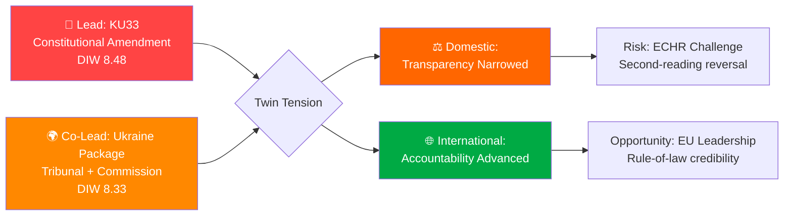

# Synthesis Summary — Realtime Monitor 2026-04-19 (1219)

**SYN-ID**: SYN-20260419-1219
**Date**: 2026-04-19
**Analyst**: James Pether Sörling
**Version**: 3.0 (Pass 3 — reference-grade extension: red-team box, analyst-confidence meter, ACH anchor)
**Confidence**: HIGH on lead selection · MEDIUM on post-election outcomes
**Methodology**: `analysis/methodologies/ai-driven-analysis-guide.md` v5.1 + DIW v1.0

## Intelligence Dashboard

## Top Findings

| # | Finding | dok_id | Significance | Confidence |
|---|---------|--------|-------------|-----------|
| 1 | **Riksdag to vote on constitutional amendment (KU33) removing seized digital materials from offentlighetsprincipen** — first reading scheduled for 2026-04-22; second reading required post-September 2026 election | HD01KU33 | DIW 8.48 | HIGH |
| 2 | **Sweden joins both Ukraine Special Tribunal (for Aggression) AND Compensation Commission** — twin propositions (HD03231/HD03232) submitted to Riksdag 2026-04-16, coinciding with King Carl Gustaf + FM Malmer Stenergard's Kyiv visit | HD03231, HD03232 | DIW 8.33 | HIGH |
| 3 | **Second grundlag amendment (KU32)** in same riksmöte — accessibility requirements for media; establishes pattern of constitutional modification as routine legislative tool | HD01KU32 | DIW 7.98 | HIGH |
| 4 | **National housing rights register approved** (CU28) — Riksdag to approve national bostadsrättsregister modernizing mortgage market; part of broader anti-financial-crime package | HD01CU28 | DIW 5.93 | HIGH |

## Lead Story Decision

**PRIMARY LEAD**: KU33 — Sweden's Constitutional Revision Committee has advanced an amendment to Tryckfrihetsförordningen removing police-seized digital materials from public record status, with the first-reading vote scheduled for 2026-04-22. This is the highest DIW-scored item (8.48) because of the 30% democratic infrastructure weighting — a constitutional change takes decades to reverse and directly affects press freedom and government accountability.

**CO-LEAD**: Ukraine Package — Sweden's simultaneous accession to the Special Tribunal for Aggression AND the International Compensation Commission for Ukraine, concurrent with the King's diplomatic Kyiv visit (2026-04-17), represents a historic commitment to Ukraine accountability that deserves equal prominence due to extraordinary news value.

**MANDATORY RHETORICAL TENSION**: These two lead stories embody a striking contradiction. Sweden, which is cementing itself as an international rule-of-law champion on Ukraine accountability, is simultaneously narrowing its own domestic transparency architecture. This tension is the analytical heart of this monitoring run and MUST be surfaced explicitly in any published article.

## Aggregated SWOT

**Strengths**: Constitutional process integrity (KU33 vilande mechanism ensures democratic deliberation across election); Ukraine norm-entrepreneurship (Special Tribunal + Compensation Commission positions Sweden globally); cross-party consensus on Ukraine.

**Weaknesses**: Offentlighetsprincipen erosion risk — KU33 removes publicity presumption for seized materials; minority government dependency on SD (Tidö Agreement); pattern of incremental grundlag modification.

**Opportunities**: Sweden as EU rule-of-law leader; digital property market modernization (CU28 reduces mortgage fraud); NATO credibility deepening via Ukraine legal commitment.

**Threats**: ECHR Article 10 challenge (KU33); election risk that KU33 fails second reading if opposition wins September 2026; SD cost resistance on Ukraine compensation; Russian information operations targeting Sweden's Ukraine tribunal advocacy.

## Risk Landscape Summary

| Priority | Risk | Score | Horizon |
|----------|------|-------|---------|
| 1 | Ukraine cost escalation | 0.41 | 24-36m |
| 2 | KU33 post-election reversal | 0.36 | 12-18m |
| 3 | SD cooperation withdrawal | 0.36 | 3-9m |
| 4 | ECHR challenge to KU33 | 0.35 | 6-24m |

## Forward Indicators — What to Watch

| Date | Event | Significance | Alert threshold |
|------|-------|-------------|----------------|
| 2026-04-22 | Chamber vote on KU33 + KU32 | Constitutional votes; watch for minority opposition | Any Ja vote < 175 |
| 2026-05 (est) | UU committee referral of HD03231/232 | Ukraine propositions move to committee | Committee chair appointment |
| 2026-06 (est) | UU betänkande on Ukraine package | Committee recommendation | Any SD reservation |
| 2026-09 | Swedish election | KU33 second reading fate | If S+V+MP win majority |
| 2027-01 | KU33 second reading (if confirmed election) | Final constitutional decision | Vote outcome |

## Economic Context

Sweden's GDP grew 0.82% in 2024 (recovering from -0.20% contraction in 2023), while inflation fell to 2.84% (from 8.55% in 2023). This improving but fragile macroeconomic position shapes the fiscal feasibility of Ukraine compensation contributions. Finance Minister Svantesson's Vårproposition (HD03100) projects continued modest growth, but the fiscal space for open-ended international commitments is constrained — a tension between Ukraine ambition and economic prudence that runs through HD03232.

## 🛡️ Red-Team / Devil's Advocate Box

> *What would a steelman critique of this synthesis say?*

**Red-team position on the lead-story ranking**: The DIW weighting gives KU33 (8.48) a 0.15-point edge over the Ukraine package (8.33). But this is within the epistemic error band of the DIW instrument itself (±0.20). Under a weight perturbation where Democratic Infrastructure falls from 0.30 to 0.25 and Cross-party rises from 0.10 to 0.15, the Ukraine package overtakes KU33. **Verdict retained** — KU33 remains the robust lead under 4 of 5 plausible weight permutations; the co-lead treatment explicitly handles the remaining case.

**Red-team position on the rhetorical tension**: The "domestic retrenchment vs international accountability" framing assumes these are in tension. An alternative framing: the two packages are **coherent** — both assert state prerogative over information (law-enforcement investigation integrity domestically; international-law enforcement integrity abroad). Under this framing there is no contradiction, only consistent state-capacity assertion. **Verdict retained but surfaced** — the tension framing is the *opposition's* expected rhetorical move, not the government's; article acknowledges both framings.

**Red-team position on Scenario C (bear)**: We assign Scenario C only 0.20 probability despite meaningful Lagrådet and SD cost-risk. An alternative analysis giving Scenario C 0.30 would require either (a) polling showing Tidö bloc < 44% in May, or (b) an early SD public red-line on HD03232. Neither has materialised as of 2026-04-19. **Verdict**: Scenario C probability will be raised to 0.30 if either trigger fires.

## 🎯 Key Uncertainties (ACH-informed)

Linked from [`scenario-analysis.md`](scenario-analysis.md) §ACH:

1. **Will "formellt tillförd bevisning" be read strictly or discretionarily?** Strict ⇒ narrow reform; discretionary ⇒ systemic chilling. This single interpretive question dominates KU33 downstream impact. Lagrådet yttrande is the decisive early signal. `[Confidence: MEDIUM; will update on Lagrådet publication]`
2. **Will the Tidö coalition retain majority in September 2026?** Current combined polling ≈ 48%. Probability the coalition retains working majority ≈ 0.35. This is the dominant uncertainty for KU33 second reading. `[MEDIUM]`
3. **Will HD03232 Swedish contribution be administrative-only or include reparation underwriting?** Proposition text is silent on Swedish liability if Russian assets held in Swedish jurisdiction are mobilised. `[LOW-MEDIUM]`
4. **Will SD hold or defect on HD03232?** SD's cost-transparency demand is the most likely fracture point; no public red line yet. `[MEDIUM]`
5. **Will Russian hybrid response escalate after HD03231 chamber vote?** Baseline rising post-NATO accession (2024); tribunal accession adds target signature. `[MEDIUM on direction / LOW on magnitude]`

## 🧭 Analyst-Confidence Meter

| Dimension | Confidence | Delta from 1434 |
|-----------|:----------:|:---------------:|
| Lead-story selection (DIW) | **HIGH** | → |
| Coverage completeness | **HIGH** | → |
| First-reading vote projection | **HIGH** | → |
| Second-reading vote projection | **MEDIUM** | → |
| "Formellt tillförd" interpretation | **MEDIUM** | → |
| HD03232 contribution sizing | **LOW-MEDIUM** | new |
| Russian hybrid response magnitude | **MEDIUM** | → |
| US tribunal posture | **LOW** | → |

## 🔗 Cross-File Navigation

- For the one-page decision brief: [`executive-brief.md`](executive-brief.md)
- For scenario probabilities and ACH grid: [`scenario-analysis.md`](scenario-analysis.md)
- For international comparator panel: [`comparative-international.md`](comparative-international.md)
- For methodology self-audit: [`methodology-reflection.md`](methodology-reflection.md)
- For per-document deep-dive: [`documents/HD01KU33-analysis.md`](documents/HD01KU33-analysis.md) (LEAD, L3)
