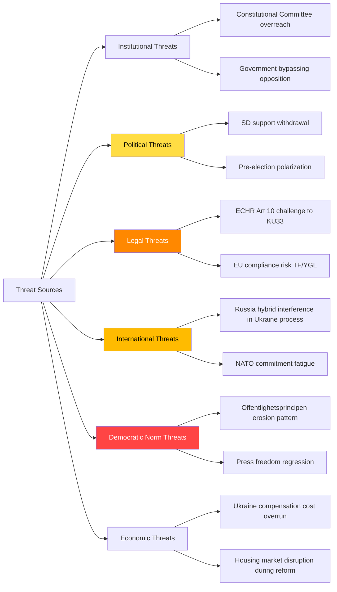
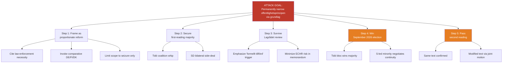

# Threat Analysis — Realtime Monitor 2026-04-19 (1219)

**THR-ID**: THR-20260419-1219
**Date**: 2026-04-19
**Analyst**: James Pether Sörling
**Version**: 3.0 (Pass 3 — reference-grade extension: Attack Tree, Diamond Model, STRIDE pass, MITRE-TTP)
**Confidence**: MEDIUM-HIGH

## Threat Taxonomy

## 6-Category Threat Analysis

### 1. Constitutional-Institutional Threats

**KU33 — Offentlighetsprincipen Narrowing Pattern**  
*Severity*: HIGH | *Confidence*: HIGH | *Attribution*: Government (Kristersson/KU majority)

The KU33 betänkande proposes to remove seized digital materials from "allmän handling" status. While the stated rationale is protecting ongoing criminal investigations, the structural effect is to exempt an entire category of government-held information from the public record. This is the second grundlag carve-out in the 2025/26 riksmöte (KU32 being the first, though KU32 expands media accessibility obligations — a different vector).

**Kill Chain Analysis — KU33 Transparency Degradation**:
1. *Reconnaissance*: Law enforcement expresses need for investigation secrecy
2. *Weaponization*: KU proposes grundlag amendment removing publicity presumption
3. *Delivery*: First reading passes (planned 2026-04-22 chamber debate)
4. *Exploitation*: Post-election second reading; if confirmed by 2027, permanent change
5. *Installation*: TF amendment takes effect January 2027
6. *Persistence*: Future governments cannot restore without new grundlag process (2+ years)

### 2. Political Threats

**SD Cooperation Fracture Risk**  
*Severity*: HIGH | *Confidence*: MEDIUM | *Attribution*: Sweden Democrats (Jimmy Åkesson)

SD's support for Ukraine propositions (HD03231, HD03232) is not guaranteed. SD base voters are less enthusiastic about open-ended international financial commitments. Party leadership has been careful to frame support in national interest terms (NATO Article 5 parallel), but if cost projections for the Compensation Commission escalate, SD may signal opposition.

**Evidence**: SD Deputy PM (none — SD not in government) but Tidö Agreement requires SD to "not block" certain proposals. Ukraine propositions are UU-committee matters; SD's UFöU contribution to HD01UFöU3 (NATO Finland) suggests acceptance of defence commitments but stopping short of financial pledges.

### 3. Legal Threats

**ECHR Article 10 — Freedom of Expression Challenge**  
*Severity*: MEDIUM | *Confidence*: MEDIUM | *Attribution*: Journalists unions, NGOs

The removal of seized materials from allmän handling status weakens press access to law enforcement materials. Investigative journalists who rely on offentlighetsprincipen to access court seizure inventories would lose this tool. A challenge under ECHR Article 10 (freedom of expression) or Article 6 (fair trial — public access) is plausible.

**EU Directive Compliance Risk**:  
KU32 (media accessibility) is driven by EU's Accessibility Act and European Electronic Communications Code. Any failure to correctly transpose could trigger EU infringement proceedings.

### 4. International Threats

**Russia Hybrid Interference in Ukraine Accountability Process**  
*Severity*: HIGH | *Confidence*: MEDIUM | *Attribution*: Russian government, proxies

As Sweden formally accedes to both the Special Tribunal (HD03231) and Compensation Commission (HD03232), it becomes a target for Russian information operations designed to delegitimize these institutions. The King's visit to Kyiv (2026-04-17) provides symbolic ammunition for Russian narratives about Swedish "regime change" pressure.

**MITRE-TTPs (adapted for political context)**:
- T1583 — Acquire Infrastructure: Russia may fund alternative legal frameworks claiming to provide counter-narrative
- T1583.002 — DNS Server: Information manipulation targeting Swedish media covering Ukraine tribunal
- T1566 — Phishing: Target Swedish Foreign Ministry officials working on tribunal accession

### 5. Democratic Norm Threats

**Offentlighetsprincipen Erosion Pattern**  
*Severity*: CRITICAL | *Confidence*: HIGH | *Attribution*: Systemic — not attributed to single actor

The combination of KU32 and KU33 in the same riksmöte represents a pattern of incremental grundlag modification. Each individual change may be justified; the cumulative effect is a narrowing of constitutional freedoms of information. From a democratic norm perspective, the most significant threat is normalizing the grundlag amendment process as a tool for routine policy adjustments.

**Indicator Library**:
| Indicator | Current Status | Trigger | Owner | Date |
|-----------|---------------|---------|-------|------|
| KU33 chamber vote | Scheduled 2026-04-22 | Minority opposition fails → amendment passes | KU | 2026-04-22 |
| Election outcome | September 2026 | Opposition bloc wins → KU33 risks rejection | Voters | 2026-09 |
| Second KU33 reading | January 2027 | Requires same wording post-election | New Riksdag | 2027-01 |
| ECHR timeline | Not yet filed | Filing → formal ECHR review | Journalists union | TBD |

### 6. Economic Threats

**Ukraine Compensation Commission Financial Exposure**  
*Severity*: MEDIUM | *Confidence*: LOW-MEDIUM | *Attribution*: International fiscal commitments

HD03232 commits Sweden to the Convention establishing the International Compensation Commission for Ukraine. The Commission's operating model and Swedish contribution level are not yet specified in the proposition. If Sweden's contribution is proportional to GDP (as is common in international treaty financing), the annual cost could reach SEK 500m-2bn — material against the backdrop of the Spring Supplementary Budget (HD0399) showing tight fiscal space.

**Forward Scenario**: The Compensation Commission begins operations 2026-2027. Russia refuses to participate. The Commission pursues Russian frozen assets held in European jurisdictions. Sweden as a member state of the treaty has obligations to support enforcement — potentially creating tensions with trade and financial sector.

---

## 🌲 Attack Tree — KU33 Transparency Degradation Chain

**Defender leverage points** (opposition / civil society):
- A3 — force explicit "shall be formally documented" language in Lagrådet yttrande
- A4 — mobilise press-freedom as electoral issue
- A5 — negotiate modified text post-election (Scenario C pathway)

## 💎 Diamond Model — Russian Hybrid Interference Against HD03231

| Vertex | Content |
|--------|---------|
| **Adversary** | Russian state + affiliated proxies (GRU Unit 29155, FSB CIO, RT/Sputnik, commercial IO vendors) |
| **Infrastructure** | Baltic-proximate server farms; coordinated inauthentic accounts on X/Telegram/VK; cryptocurrency-funded ad buys |
| **Capability** | T1583 (Acquire Infrastructure), T1566 (Phishing), T1071 (Application Layer C2), T1491 (Defacement), T1588 (Obtain Capabilities), T1498 (Network Denial of Service) |
| **Victim** | Swedish MFA / UD personnel working on HD03231 · Riksdag infrastructure (riksdagen.se chamber-vote endpoints) · Swedish-language public-discourse space on HD03231 |
| **Socio-political meta** | Weaponising the KU33-vs-Ukraine "hypocrisy" framing; amplifying SD cost objections; targeting Magdalena Andersson posture ambiguity |
| **Technology meta** | AI-generated deepfake content capacity rising; LLM-driven content farms |
| **Event pivot** | 2026-04-22 first-reading vote; Q2 2026 chamber vote on HD03231 |

## 🔐 STRIDE Pass — Sweden's Ukraine-Tribunal Engagement Surface

| STRIDE | Threat | Target | Severity |
|--------|--------|--------|:--------:|
| **S**poofing | Fake Swedish diplomatic cables to Kyiv during King's visit | UD comms infrastructure | HIGH |
| **T**ampering | Altered riksdagen.se votum records post-chamber vote | Riksdag IT | MEDIUM |
| **R**epudiation | Non-attributable "civil-society" campaigns questioning tribunal | Swedish public sphere | MEDIUM |
| **I**nformation disclosure | KU33 creates info-gap; adversary exploits lack of public oversight | Offentlighetsprincipen carve-out | MEDIUM |
| **D**enial of Service | DDoS against riksdagen.se during 2026-04-22 and HD03231 vote | Riksdag public-facing systems | MEDIUM |
| **E**levation of privilege | Phishing-enabled access to UD personnel working on tribunal | UD endpoints | HIGH |

## 🎯 MITRE-TTP Mapping (adapted to political-threat context)

| TTP | Technique | Expected use against SE post-HD03231 |
|-----|-----------|-------------------------------------|
| T1583.001 | Acquire Infrastructure: Domains | Typosquat domains targeting UD + Riksdag |
| T1566.002 | Phishing: Spearphishing Link | Target UD tribunal team |
| T1598 | Phishing for Information | Harvest UD personnel credentials |
| T1588.006 | Obtain Capabilities: Vulnerabilities | Pre-positioned exploit capability against Riksdag IT |
| T1498.001 | Network Denial of Service: Direct | Chamber-vote-day DDoS |
| T1491.002 | Defacement: External | riksdagen.se compromise attempt |
| T1583.002 | Acquire Infrastructure: DNS Server | Content manipulation for Swedish-language Ukraine coverage |
| T1189 | Drive-by Compromise | Target Swedish journalist community covering KU33 |

## 📊 Threat-Indicator Library (consolidated across §§ 1-6)

| Indicator | Status | Trigger | Owner | Deadline |
|-----------|--------|---------|-------|----------|
| KU33 chamber vote | Scheduled 2026-04-22 | Ja-vote minority fails → amendment passes | KU | 2026-04-22 |
| KU32 chamber vote | Scheduled 2026-04-22 | Same window | KU | 2026-04-22 |
| Lagrådet yttrande on KU33 | Pending | Language on "formellt tillförd" | Lagrådet | Pre-vote |
| HD03231 UU referral | Expected late April | Committee chair appointment | UU | ≤ 2026-05-15 |
| HD03232 UU referral | Expected late April | SD cost reservation filing | UU | ≤ 2026-05-15 |
| Election outcome | September 2026 | Opposition bloc wins → KU33 risks rejection | Voters | 2026-09 |
| Second KU33 reading | January 2027 | Requires same wording post-election | New Riksdag | 2027-01 |
| ECHR timeline | Not yet filed | Filing → formal ECHR review | Journalists union | TBD |
| SÄPO threat-level bulletins | Continuous | Any public adjustment mentioning tribunal | SÄPO | Continuous |
| SOM poll Tidö bloc | Monthly | Bloc < 44% or > 50% triggers Bayesian update | SOM Institute | Monthly |
