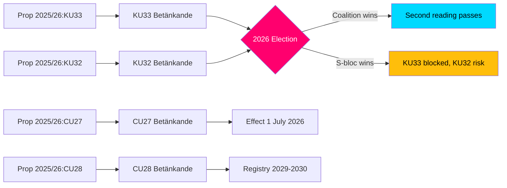

# Cross-Reference Map — Committee Reports 2026-04-20

**Map ID:** XRF-2026-04-20-CR001
**Analysis Date:** 2026-04-20
**Produced By:** news-committee-reports agentic workflow
**Overall Confidence:** HIGH

---

## Document Cross-References

### Policy Domain Links

| Document | Policy Domain | Cross-Referenced Documents | Connection Type |
|----------|---------------|---------------------------|-----------------|
| HD01KU33 | Constitutional/Security | HD01KU32 | Both are vilande grundlagsändringar — election-dependent |
| HD01KU32 | Constitutional/Media | HD01KU33 | Both are vilande grundlagsändringar — election-dependent |
| HD01CU27 | Housing/Civil Law | HD01CU28 | CU27 governs bostadsrätt conversions; CU28 creates registry for same |
| HD01CU28 | Housing/Civil Law | HD01CU27 | Registry enables CU27 anti-fraud enforcement |
| HD01CU22 | Civil Law/Welfare | HD01CU42 | Both are civil law reform; CU22 operative, CU42 deferred to SOU |
| HD01CU42 | Civil Law/Probate | HD01CU22 | Both are private law; CU42 deferred pending investigation |

### Legislative Pipeline Links

### Political Alignment Matrix

| Document | M | KD | L | SD | S | V | MP |
|----------|---|----|----|----|----|---|-----|
| KU33 (police secrecy) | ✅ | ✅ | ✅ | ✅ | ❌ | ❌ | ❌ |
| KU32 (digital radio) | ✅ | ✅ | ✅ | ✅ | ⚠️ | ⚠️ | ⚠️ |
| CU27 (bostadsrätt) | ✅ | ✅ | ✅ | ✅ | ❌ | ❌ | ❌ |
| CU28 (registry) | ✅ | ✅ | ✅ | ✅ | ⚠️ | ⚠️ | ⚠️ |
| CU22 (guardian) | ✅ | ✅ | ✅ | ✅ | ✅ | ✅ | ✅ |
| CU42 (estate) | ✅ | ✅ | ✅ | ✅ | ✅ | ✅ | ✅ |

Legend: ✅ Support, ❌ Oppose (reservation filed), ⚠️ Conditional/technical reservation

### Cross-Reference to Prior Batch (2026-04-17)

| Prior Document | Connection to 2026-04-20 Batch |
|----------------|--------------------------------|
| HD01MJU19 | Crime/security policy — thematic alignment with KU33 police register secrecy |
| HD01SfU20 | Social insurance — related to CU22's welfare protection framework |
| HD01SkU23 | Fiscal — EV charging related to transport infrastructure (TU16 context) |

---

## External Reference Links

| Reference | Relevance |
|-----------|-----------|
| EU Accessibility Act (2019/882) | KU32 implementation requirement |
| EU AML/CFT Directive | CU28 registry aligns with anti-money laundering obligations |
| ECRHR Article 10 | KU33 press freedom implications |
| Swedish Constitution (RF) Ch. 8 | Vilande process legal basis for KU33/KU32 |

---

**Cross-Reference Confidence:** HIGH [HIGH]
