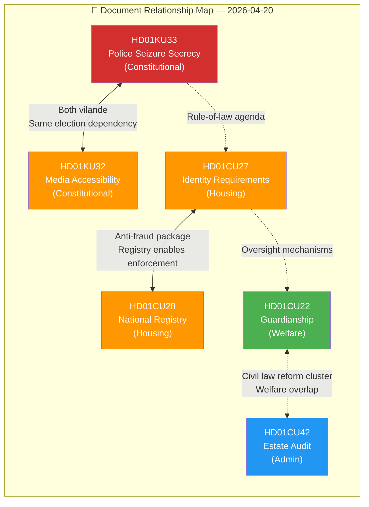
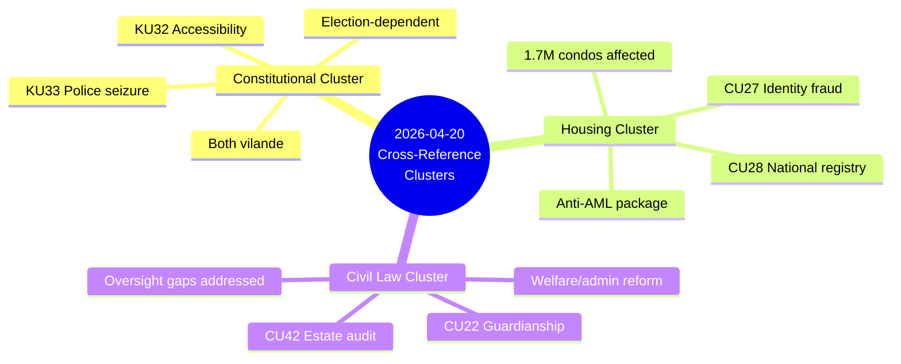
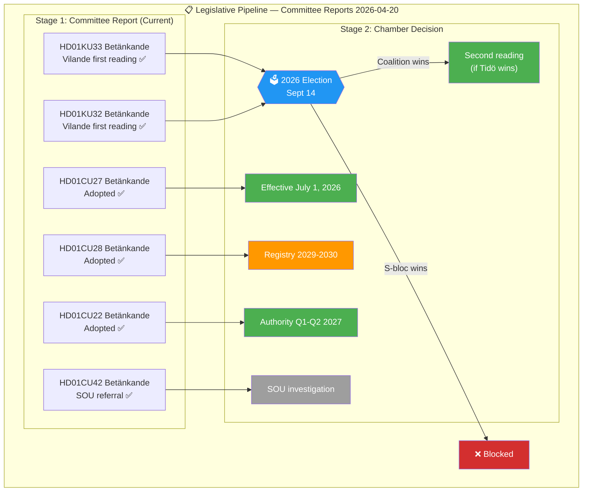

# Cross-Reference Map — Committee Reports 2026-04-20

  

<h2 align="center">🔗 Cross-Reference & Relationship Map</h2>

  <strong>Document Linkages, Policy Domain Clusters, and Legislative Pipeline</strong> 
  <em>Intra-Batch · Prior Batch · External References</em>

---

## 📋 Map Metadata

| Field | Value |
|-------|-------|
| **Map ID** | `XRF-2026-04-20-CR001` |
| **Map Date** | 2026-04-20 05:55 UTC |
| **Documents Mapped** | 6 betänkanden (HD01KU33, HD01CU27, HD01CU28, HD01KU32, HD01CU22, HD01CU42) |
| **Riksmöte** | 2025/26 |
| **Produced By** | `news-committee-reports` agentic workflow |
| **Overall Confidence** | 🟩HIGH |

---

## 📊 Document Cross-Reference Matrix

---

## 📑 Intra-Batch Cross-References

### Policy Domain Links

| Document | Policy Domain | Cross-Referenced Documents | Connection Type | Confidence |
|----------|---------------|---------------------------|-----------------|:----------:|
| HD01KU33 | Constitutional/Security | HD01KU32 | Both are vilande grundlagsändringar — election-dependent; same TF/YGL amendment process | 🟦VERY HIGH |
| HD01KU32 | Constitutional/Media | HD01KU33 | Both are vilande grundlagsändringar — shared electoral fate | 🟦VERY HIGH |
| HD01CU27 | Housing/Civil Law | HD01CU28 | CU27 governs bostadsrätt conversions and identity; CU28 creates registry for same market | 🟩HIGH |
| HD01CU28 | Housing/Civil Law | HD01CU27 | Registry enables CU27 anti-fraud enforcement via ownership verification | 🟩HIGH |
| HD01CU22 | Civil Law/Welfare | HD01CU42 | Both are civil law reform in CU committee; CU22 operative, CU42 deferred | 🟧MEDIUM |
| HD01CU42 | Civil Law/Probate | HD01CU22 | Both are private law; both respond to oversight gaps | 🟧MEDIUM |

### Thematic Clusters

---

## 📋 Legislative Pipeline Links

> **Note on proposition-stage nodes:** The underlying government propositions that preceded these betänkanden are not included as separate nodes because the specific proposition IDs (`Prop 2025/26:NN`) are not reliably linked from the betänkande payloads retrieved via `get_dokument_innehall`. Upstream proposition provenance is captured in each per-document analysis where the source was identified, and in the `data-download-manifest.md` MCP call trail.

---

## 🗳️ Political Alignment Matrix

| Document | M | KD | L | SD | S | V | MP | C |
|----------|:-:|:--:|:-:|:--:|:-:|:-:|:--:|:-:|
| HD01KU33 (police secrecy) | ✅ | ✅ | ✅ | ✅ | ❌ | ❌ | ❌ | ⚠️ |
| HD01KU32 (digital radio) | ✅ | ✅ | ✅ | ✅ | ⚠️ | ⚠️ | ⚠️ | ⚠️ |
| HD01CU27 (bostadsrätt) | ✅ | ✅ | ✅ | ✅ | ❌ | ❌ | ❌ | ⚠️ |
| HD01CU28 (registry) | ✅ | ✅ | ✅ | ✅ | ⚠️ | ⚠️ | ⚠️ | ⚠️ |
| HD01CU22 (guardian) | ✅ | ✅ | ✅ | ✅ | ✅ | ✅ | ✅ | ✅ |
| HD01CU42 (estate) | ✅ | ✅ | ✅ | ✅ | ✅ | ✅ | ✅ | ✅ |

**Legend:** ✅ Support | ❌ Oppose (reservation filed) | ⚠️ Conditional/technical reservation

**Key Insight:** Clear 4-way split:
1. **Full coalition support, full opposition:** KU33, CU27 (contentious)
2. **Full coalition support, technical opposition:** KU32, CU28 (broadly supported)
3. **Full cross-party support:** CU22, CU42 (consensus)

---

## 🔗 External Reference Links

| Reference | Relevance | Documents Affected | Confidence |
|-----------|-----------|-------------------|:----------:|
| **EU Accessibility Act (2019/882)** | EAA requires accessible media; KU32 enables compliance | HD01KU32 | 🟩HIGH |
| **EU AML/CFT Directive (2018/843)** | 5AMLD/6AMLD requires property ownership transparency | HD01CU27, HD01CU28 | 🟩HIGH |
| **ECHR Article 10** | Freedom of expression; KU33 press freedom implications | HD01KU33 | 🟧MEDIUM |
| **Swedish Constitution (RF) Ch. 8** | Vilande process legal basis (RF 8:14) | HD01KU33, HD01KU32 | 🟦VERY HIGH |
| **Tryckfrihetsförordningen (TF)** | Freedom of Press Act being amended | HD01KU33, HD01KU32 | 🟦VERY HIGH |
| **Yttrandefrihetsgrundlagen (YGL)** | Freedom of Expression Act being amended | HD01KU32 | 🟦VERY HIGH |
| **UN CRPD** | Convention on Rights of Persons with Disabilities | HD01CU22, HD01KU32 | 🟧MEDIUM |
| **GDPR (2016/679)** | Data protection for CU28 registry | HD01CU28 | 🟩HIGH |

---

## 📂 Prior Batch Cross-Reference

| Prior Document (2026-04-17) | Connection to 2026-04-20 Batch | Relationship Type |
|-----------------------------|--------------------------------|-------------------|
| HD01MJU19 | Crime/security policy — thematic alignment with KU33 police register secrecy | Thematic |
| HD01SfU20 | Social insurance — related to CU22's welfare protection framework | Policy domain |
| HD01SkU23 | Fiscal — EV charging related to transport infrastructure policy area | Weak thematic |
| HD01FiU31 | Budget — potential funding implications for CU28 registry IT | Resource dependency |

---

## 📊 Analysis File Cross-Reference

| Analysis File | References to | Key Cross-Reference |
|---------------|---------------|---------------------|
| [synthesis-summary.md](./synthesis-summary.md) | All 6 dok_ids | Document ranking, theme clusters |
| [risk-assessment.md](./risk-assessment.md) | KU33, CU27, CU28 | RSK-001 ↔ KU33; RSK-002 ↔ CU27; RSK-003 ↔ CU28 |
| [threat-analysis.md](./threat-analysis.md) | KU33, CU28 | TR-001 ↔ KU33; TR-002 ↔ CU28 |
| [stakeholder-perspectives.md](./stakeholder-perspectives.md) | All 6 dok_ids | Per-stakeholder per-document impact |
| [election-2026-analysis.md](./election-2026-analysis.md) | KU33, KU32, CU27 | Vilande election dependency; housing campaign |
| [swot-analysis.md](./swot-analysis.md) | All 6 dok_ids | SWOT elements by stakeholder |
| [significance-scoring.md](./significance-scoring.md) | All 6 dok_ids | 5-dimension scoring per document |
| [classification-results.md](./classification-results.md) | All 6 dok_ids | Sensitivity, urgency, scope classification |
| [forward-indicators.md](./forward-indicators.md) | All 6 dok_ids | Trigger events per document |

---

## ✅ Quality Self-Check Checklist

- [x] **Map Metadata complete:** ID, date, documents, riksmöte, produced by, confidence
- [x] **Document Relationship Map Mermaid:** All 6 documents with relationship arrows
- [x] **Intra-Batch Cross-References table:** Policy domain links with connection types
- [x] **Thematic Clusters mindmap:** 3 clusters visualised
- [x] **Legislative Pipeline Mermaid:** 3-stage pipeline with election dependency
- [x] **Political Alignment Matrix:** 8 parties × 6 documents
- [x] **External Reference Links:** 8 references with relevance
- [x] **Prior Batch Cross-Reference:** 4 prior documents linked
- [x] **Analysis File Cross-Reference:** 9 sibling files linked
- [x] **No placeholder text:** zero unfilled template markers

---

**Document Control:**  
- **File Path:** `analysis/daily/2026-04-20/committeeReports/cross-reference-map.md`  
- **Version:** 2.0 (elevated to reference-example quality)  
- **Map Date:** 2026-04-20 05:55 UTC  
- **Classification:** Public  
- **Owner:** Hack23 AB (Org.nr 5595347807)
