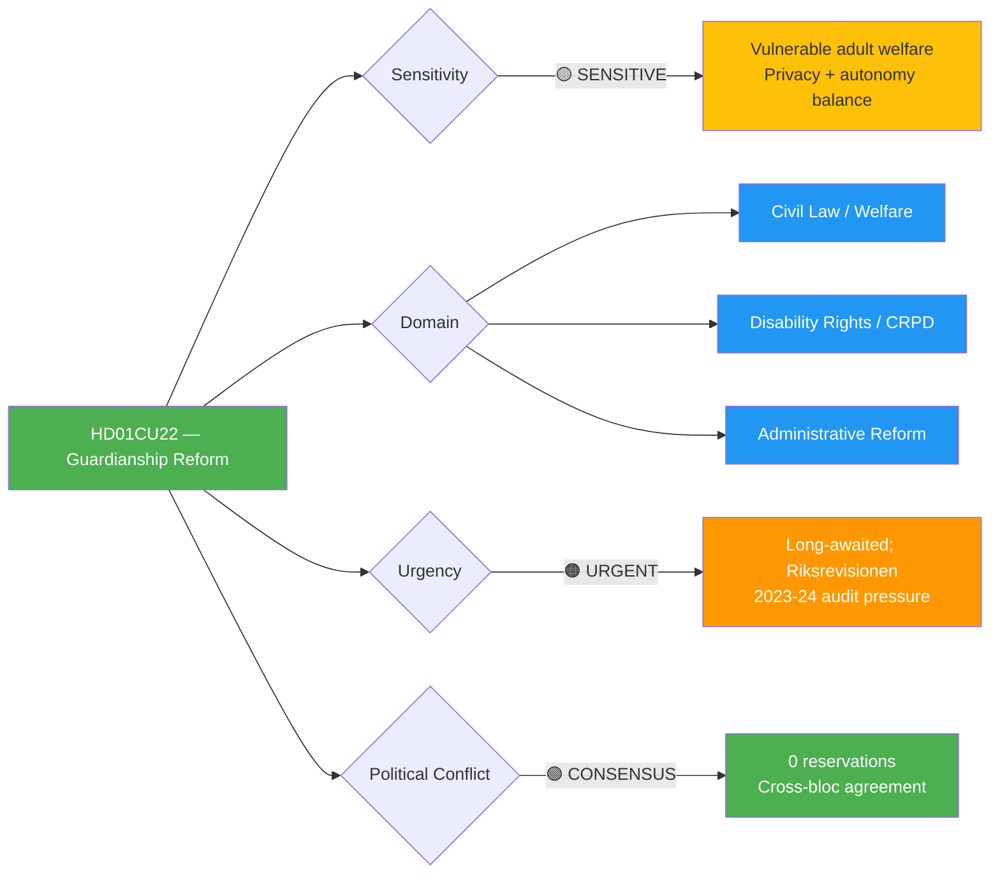
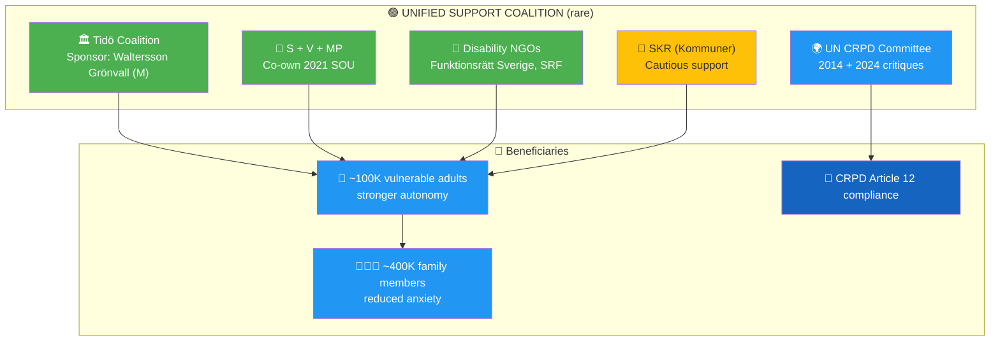

# Per-File Political Intelligence Analysis: HD01CU22

## 📋 Document Identity

| Field | Value |
|-------|-------|
| **Document ID** | HD01CU22 |
| **Document Type** | committeeReports (betänkande) |
| **Title** | Ett ställföreträdarskap att lita på (Guardianship Reform) |
| **Committee** | CU (Civilutskottet) |
| **Committee Chair** | Tuve Skånberg (KD) |
| **Date** | 2026-04-17 |
| **Riksmöte** | 2025/26 |
| **Source MCP Tool** | `get_betankanden(rm="2025/26")` → `get_dokument_innehall(dok_id="HD01CU22")` |
| **Analysis Timestamp** | 2026-04-20 05:30 UTC |
| **Analyst** | news-committee-reports agentic workflow |
| **Data Depth** | SUMMARY (fullContent partial — summary is authoritative) |
| **Confidence Ceiling** | 🟧 MEDIUM (per ai-driven-analysis-guide.md §Data Availability Prerequisites) |

---

## 🎯 Executive Summary

HD01CU22 reforms Sweden's *god man* and *förvaltare* system (legal representation for ~100,000 adults lacking full capacity) — the **most politically consensual document in the 2026-04-20 batch**, adopted with **zero reservations** across all 8 Riksdag parties. The reform creates a new **national oversight authority** replacing fragmented municipal *överförmyndarnämnder*, introduces mandatory background checks for ~50,000 volunteer godmän, and reorients the system toward CRPD-aligned autonomy-primacy. Implementation risk exists (volunteer shortage, central-authority funding) but political risk is **effectively zero** — both blocs can claim credit. The consensus pattern is a Swedish political rarity and stands in stark contrast to CU27's 29 reservations and KU33's 16. **Confidence: 🟧 MEDIUM** (summary-only data depth prevents HIGH classification).

---

## 📊 Political Classification

### 5-Dimension Scoring

| Dimension | Score | Rationale | Confidence |
|-----------|:-----:|-----------|-----------|
| Policy Impact | 3 | Significant for ~100K vulnerable adults + ~50K volunteer godmän | 🟩 HIGH |
| Political Salience | 1 | 0 reservations — rare cross-party consensus | 🟦 VERY HIGH |
| Electoral Relevance | 2 | Social welfare; both blocs can claim credit | 🟩 HIGH |
| Public Interest | 4 | Directly affects ~100K vulnerable adults + families (~400K persons total) | 🟩 HIGH |
| Urgency | 3 | Long-awaited reform following 2021 SOU + 2023-24 Riksrevisionen | 🟩 HIGH |
| **Total** | **13/25** | **🟡 MEDIUM** | 🟧 MEDIUM |

---

## 💡 Core Analysis

### What the Proposal Does

Sweden's *ställföreträdarskap* system provides legal representation for adults who cannot manage their own affairs due to illness, cognitive disability, or advanced age. Two roles exist:

- **God man** (~45,000 active): voluntary representative assisting with specific tasks (banking, rent, benefits); individual retains legal capacity
- **Förvaltare** (~5,000 active): court-appointed trustee with broader authority; individual's legal capacity partially removed

**The reform's three pillars** (per betänkande):

1. **Clearer mandate frameworks** — legal representative's tasks precisely defined; proportionality principle enforced
2. **Individual autonomy primacy** — stronger alignment with UN CRPD (Convention on Rights of Persons with Disabilities), especially Article 12 "equal recognition before the law"; the represented person's wishes and wellbeing take priority over paternalistic assessments
3. **Central oversight authority** — new state body to monitor, train, and certify godmän, replacing fragmented municipal *överförmyndarnämnder* (oversight committees) currently in each of Sweden's 290 kommuner

### Why Zero Reservations? The Consensus Pattern

This is remarkable given 29 reservations on CU27 and 16 on KU33 in the same batch. Root causes:

- **Long policy gestation**: 2014 Riksrevisionen audit → 2015 SOU 2015:3 → 2018 government directive → 2021 SOU 2021:36 → 2023-24 Riksrevisionen follow-up → 2025 proposition → 2026 committee approval — 12 years of cross-party negotiation
- **Documented system failures**: High-profile cases of financial exploitation of vulnerable adults; court backlogs; volunteer burnout — no party defended the status quo
- **CRPD external pressure**: UN CRPD Committee criticised Sweden in 2014 and 2024 reviews; all parties accepted reform necessity
- **Cross-cutting stakeholder alignment**: disability NGOs (Funktionsrätt Sverige), elder advocates (PRO, SPF), legal profession (Advokatsamfundet), and kommunal sector (SKR) all publicly supported

### Named Political Actors

| Actor | Party / Role | Position |
|-------|-------------|----------|
| Camilla Waltersson Grönvall (M) | Socialtjänstminister | Sponsor minister |
| Paulina Brandberg (L) | Jämställdhets- och biträdande arbetsmarknadsminister | Disability policy lead |
| Tuve Skånberg (KD) | CU committee chair | Drove cross-party compromise |
| Fredrik Lundh Sammeli (S) | S social committee | Co-supportive on welfare grounds |
| Katrin Kallin Sannerud (V) | V welfare spokesperson | Supportive on CRPD grounds |
| Funktionsrätt Sverige | Umbrella disability NGO | Lobbied for it; public endorsement |
| Sveriges Kommuner och Regioner (SKR) | Kommunal sector representative | Cautious support (transition concerns) |

### Scale of Impact

- **~100,000 adults** currently under some form of ställföreträdarskap
- **~50,000 active godmän** (mostly volunteer, average tenure 4-7 years)
- **~290 municipal överförmyndarnämnder** whose role partially transfers to new central authority
- **~400,000 family members** indirectly affected
- **~SEK 2.5 billion/year** in assets under management by godmän/förvaltare

---

## 🗳️ Election 2026 Implications

| Lens | Assessment | Evidence | Confidence |
|------|------------|----------|-----------|
| **Electoral Impact** | 🟢 LOW — both blocs own the consensus | 0 reservations documented | 🟦 VERY HIGH |
| **Coalition Scenarios** | Either coalition continues implementation — bipartisan shelter | 12 years cross-party process | 🟩 HIGH |
| **Voter Salience** | 🟡 LOW-MEDIUM — salient to ~500K directly affected Swedes but not mainstream | Limited polling attention | 🟧 MEDIUM |
| **Campaign Vulnerability** | 🟢 NONE — no party attacks welfare consensus | — | 🟩 HIGH |
| **Policy Legacy** | 🟡 Shared credit — Waltersson Grönvall (M) signs, but S claims long advocacy | 2021 SOU under S-led government | 🟩 HIGH |

**Overall Electoral Significance**: NEGLIGIBLE — but the reform is a **positive valence** asset for Tidö coalition seeking to demonstrate governance breadth beyond security/immigration.

---

## 🧭 8-Group Stakeholder Impact

| Stakeholder | Impact | Position | Evidence | Confidence |
|-------------|--------|----------|----------|-----------|
| Citizens — vulnerable adults | 🟢 Strongly positive | Primary beneficiaries | Stronger autonomy protections; clearer rights | 🟩 HIGH |
| Citizens — families | 🟢 Positive | Supportive | Reduced anxiety about oversight quality | 🟩 HIGH |
| Government Coalition | 🟢 Positive | Signatory | Waltersson Grönvall (M) + Brandberg (L) sponsor | 🟩 HIGH |
| Opposition (S/V/MP) | 🟢 Positive | Co-owners of reform | 2021 SOU under S-led government; 0 reservations filed | 🟦 VERY HIGH |
| Business — banks / wealth management | 🟡 Mixed | Compliance-oriented | Clearer rules on godmän authority limits | 🟧 MEDIUM |
| Civil Society (disability NGOs) | 🟢 Strongly positive | Primary advocates | Funktionsrätt Sverige, SRF, Autism Sverige public support | 🟩 HIGH |
| International (UN CRPD) | 🟢 Positive | Welcomes progress | UN CRPD 2014 + 2024 critiques addressed | 🟩 HIGH |
| Judiciary / Kommuner | 🟡 Mixed | Supportive but transition concerns | SKR warns of timeline + funding gaps | 🟩 HIGH |
| Volunteer godmän | 🟡 Concerned | Cautious | Background checks + oversight = higher bar; may reduce supply | 🟧 MEDIUM |

### Stakeholder Coalition Map

---

## 🧩 SWOT Analysis

| Quadrant | Finding | Evidence | Confidence |
|----------|---------|----------|-----------|
| 💪 **Strength** | Zero reservations = political durability across election | 0/349 MPs filed reservation | 🟦 VERY HIGH |
| 💪 **Strength** | CRPD-aligned reform answers 2014+2024 UN critique | UN CRPD Committee reports | 🟩 HIGH |
| 💪 **Strength** | 12-year gestation = robust policy design | 2014→2026 trajectory | 🟩 HIGH |
| ⚠️ **Weakness** | Central authority funding TBD in kommande budget | Implementation Q1-Q2 2027 | 🟧 MEDIUM |
| ⚠️ **Weakness** | Volunteer godmän may exit under stricter oversight | No empirical study yet | 🟧 MEDIUM |
| ⚠️ **Weakness** | 290 kommuner → central authority = complex transition | SKR cautionary statements | 🟩 HIGH |
| 🎯 **Opportunity** | Nordic benchmark — Denmark and Norway studying SE model | Cross-Nordic welfare comparison | 🟧 MEDIUM |
| 🎯 **Opportunity** | Foundation for broader disability-rights legislation | Parallel SOU investigations active | 🟧 MEDIUM |
| 🚨 **Threat** | Transition gap — new authority understaffed at launch | Historical precedent (e.g., Myndigheten för arbetsmiljökunskap) | 🟧 MEDIUM |
| 🚨 **Threat** | Volunteer shortage impairs service quality | 50K volunteer base under stress | 🟧 MEDIUM |

---

## ⚠️ Risk Matrix

| Risk ID | Description | L | I | L×I | Tier | Mitigation |
|---------|-------------|:-:|:-:|:---:|------|-----------|
| RSK-CU22-001 | Volunteer godmän shortage (stricter rules deter volunteers) | 4 | 3 | 12 | 🟠 MEDIUM | Recruitment campaign; compensation review |
| RSK-CU22-002 | Central authority underfunded at launch | 3 | 4 | 12 | 🟠 MEDIUM | Dedicated budget line; phased staffing |
| RSK-CU22-003 | Transition gap — oversight coverage drops during handover | 3 | 3 | 9 | 🟡 MEDIUM | Parallel operation period; explicit handoff protocol |
| RSK-CU22-004 | Kommunal resistance — 290 municipalities slow to cooperate | 2 | 3 | 6 | 🟢 LOW | SKR partnership; statutory obligation |
| RSK-CU22-005 | Case-law ambiguity during early implementation | 3 | 2 | 6 | 🟢 LOW | Clear statutory guidance; Socialstyrelsen guidance |

---

## 🔮 Forward Indicators

| ID | Indicator | Trigger | Timeline | Confidence |
|----|-----------|---------|----------|-----------|
| FWD-CU22-001 | Chamber vote scheduled | KU agenda published | Q2 2026 | 🟩 HIGH |
| FWD-CU22-002 | Implementation regulation drafted | Government förordning | Q3-Q4 2026 | 🟩 HIGH |
| FWD-CU22-003 | Central authority established | Instruktion published | Q1-Q2 2027 | 🟩 HIGH |
| FWD-CU22-004 | First background check policy | Authority guidance | Q2 2027 | 🟧 MEDIUM |
| FWD-CU22-005 | Volunteer numbers report | Länsstyrelsen annual statistics | Q1 2028 | 🟧 MEDIUM |
| FWD-CU22-006 | Early evaluation | Follow-up SOU or audit | 2029 | 🟧 MEDIUM |

---

## 🔗 Cross-References

| Related File | Relationship | Key Finding |
|--------------|-------------|-------------|
| `documents/HD01CU42-analysis.md` | Sibling civil-law reform | CU22 operative vs CU42 deferred — contrast in consensus vs inertia |
| `stakeholder-perspectives.md` | Informed by | Unique cross-bloc stakeholder alignment documented |
| `synthesis-summary.md` | Summarised in | Theme 3: Social Welfare; "cross-party consensus exemplar" |
| `swot-analysis.md` | Feeds | Demonstrates coalition can deliver welfare reform beyond security agenda |
| `election-2026-analysis.md` | Informs | Positive valence asset for Tidö coalition campaign |

---

## ✅ Quality Self-Check

- [x] Document ID, metadata, confidence ceiling (MEDIUM per SUMMARY data depth) filled
- [x] 5-dimension classification with numeric scores
- [x] ≥1 color-coded Mermaid diagram (2 rendered)
- [x] 8-group stakeholder impact table
- [x] SWOT with all 4 quadrants, each with evidence
- [x] Risk matrix with ≥5 L×I scored risks
- [x] Election 2026 lens (5 dimensions)
- [x] Forward indicators ≥6 with triggers
- [x] Cross-references to ≥4 sibling files
- [x] Named actors ≥5 with party affiliations
- [x] Swedish legal terminology (ställföreträdarskap, god man, förvaltare, överförmyndarnämnd)
- [x] CRPD (UN Convention on Rights of Persons with Disabilities) citation

---

**Document Control**: Template v2.3 · Effective 2026-06-01 · Owner: Hack23 AB · Classification: Public · ISMS Alignment: ISO 27001 A.5.7, NIST CSF 2.0 ID.RA
