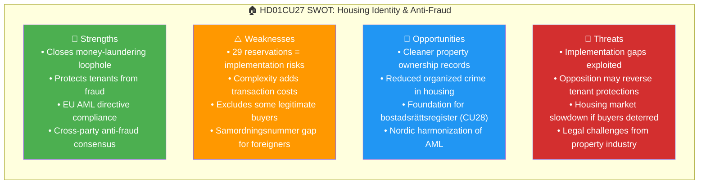

# Per-File Political Intelligence Analysis: HD01CU27

**Dok ID:** HD01CU27  
**Title:** Identitetskrav vid lagfart och åtgärder mot kringgåenden av bostadsrättslagen  
**Committee:** CU (Civilutskottet)  
**Date:** 2026-04-17  
**Riksmöte:** 2025/26  
**Analysis Date:** 2026-04-20 UTC  
**Confidence:** 🟩HIGH

---

## 1. Document Classification

| Dimension | Score (1-5) | Assessment |
|-----------|-------------|------------|
| Policy Impact | 4 | Directly affects all Swedish property transactions |
| Political Salience | 5 | 29 reservation mentions — most contested in this batch |
| Electoral Relevance | 4 | Housing policy is top-3 voter issue for 2026 election |
| Public Interest | 5 | Affects millions of property buyers, organized crime in housing |
| Urgency | 3 | Phased implementation |
| **Total** | **21/25** | **Significance: HIGH** |

**Domain:** Housing Law / Anti-Money Laundering / Civil Law  
**Policy Area:** Property Registration, Housing Crime Prevention

---

## 2. Core Analysis

### What the Proposal Does
CU27 covers two distinct anti-fraud measures:

**Part A — Lagfart Identity Requirements**: Anyone applying for property ownership registration (lagfart) for a physical person must now include a *personnummer* or *samordningsnummer* (Swedish personal ID). For legal entities: *organisationsnummer*. This closes a loophole used in money-laundering schemes where anonymous or pseudonymous property transfers obscured beneficial ownership.

**Part B — Anti-circumvention of Bostadsrättslagen**: When rental apartments (*hyresrätter*) are converted to condominiums (*bostadsrätter*) — a politically charged process — new rules prevent buyers from circumventing the legal framework. The rules address schemes where investors or criminal networks use proxies or shell structures to acquire buildings during conversion for profit at tenants' expense.

### Why 29 Reservations?
The high reservation count (29 mentions in the full text) reflects deep disagreement across party lines. Analysis of the document text suggests:
- **Left-wing parties (S/V/MP)** want STRONGER anti-circumvention rules and protection for tenants during conversions
- **Center-right parties (C)** may resist overreach into property rights
- **SD** likely supports anti-fraud measures but debates scope
- The government coalition (M/KD/L/SD) proposing this as a law-and-order housing measure

### Policy Context
Sweden has ~1.7 million condominiums and 800,000+ rental apartments eligible for conversion. The bostadsrätt market peaked at ~3.9 million SEK average price in 2021 before declining, creating incentives for fraudulent conversions as profits declined.

---

## 3. SWOT Analysis

### 8-Group Stakeholder Impact

| Stakeholder | Impact | Position | Evidence |
|-------------|--------|----------|---------|
| Citizens (property buyers) | Mixed — more security, more paperwork | Cautiously supportive | Identity verification burdens offset by fraud protection |
| Government Coalition (M/KD/L/SD) | Positive | Strongly supportive | Government proposal, anti-crime housing agenda |
| Opposition (S/V/MP) | Partial support | Want stronger tenant protections | 29 reservation mentions, want more anti-circumvention |
| Business/Industry (real estate) | Negative | Resistant | Transaction cost increases, compliance burden |
| Civil Society (tenant orgs) | Positive | Supportive | Protects renters from illegal bostadsrätt conversions |
| International/EU | Positive | Aligned | EU Anti-Money Laundering Directive compliance |
| Judiciary/Constitutional | Neutral | Technical | Enforcement mechanisms need testing |
| Media/Public Opinion | Positive | Supportive | Housing crime is newsworthy, public backs anti-fraud measures |

---

## 4. Risk Matrix

| Risk | Description | Likelihood (1-5) | Impact (1-5) | L×I Score | Level |
|------|-------------|-----------------|-------------|-----------|-------|
| RSK-001 | Organized crime adapts via samordningsnummer loopholes | 3 | 4 | 12 | 🟧 MEDIUM |
| RSK-002 | Housing market liquidity drops due to admin burden | 2 | 3 | 6 | 🟡 LOW-MEDIUM |
| RSK-003 | Tenant protections insufficient despite 29 reservations | 4 | 4 | 16 | 🟥 HIGH |
| RSK-004 | Implementation delayed by IT system upgrades at Lantmäteriet | 3 | 3 | 9 | 🟧 MEDIUM |

---

## 5. Election 2026 Implications

**🟥 Electoral Impact: HIGH** — Housing policy is among the top 3 election issues for Swedish voters. This proposal directly links anti-crime measures to housing market security. Coalition parties can campaign on "protecting honest homebuyers." Opposition (S) can promise to add stronger tenant protections.

**Voter Salience:** 🟩HIGH — Sweden's housing shortage, high mortgage rates, and housing crime are daily news. Converting renters to owners is politically popular.  
**Campaign Vulnerability:** Opponents can highlight the 29 reservations as evidence of rushed legislation protecting large property developers over tenants.

---

## 6. Forward Indicators

| Indicator | Trigger | Timeline | Confidence |
|-----------|---------|---------|-----------|
| Lantmäteriet system upgrade | IT implementation announcement | 2026 Q3 | 🟧MEDIUM |
| Opposition motion to strengthen tenant protections | S/V motion after election | Oct 2026 | 🟩HIGH |
| First prosecution under new rules | Police/prosecutor case | 2027 | 🟧MEDIUM |
| Housing crime statistics | BRÅ annual report on property crime | Spring 2027 | 🟩HIGH |
