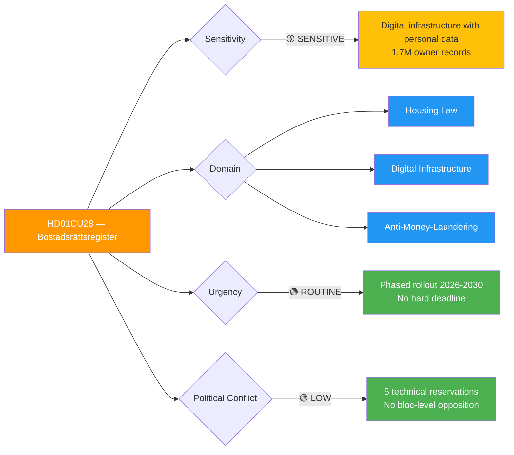
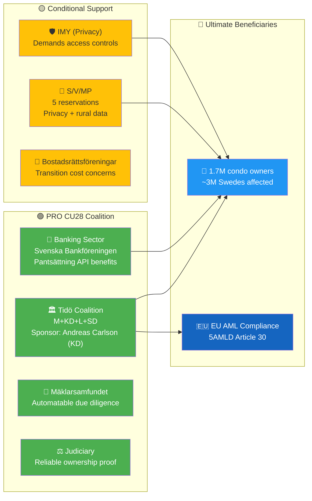
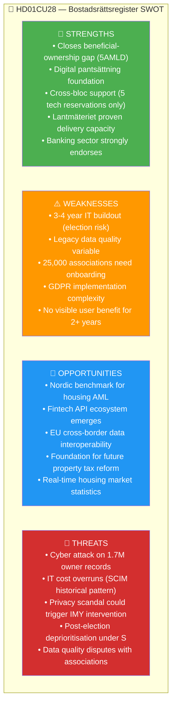

# Per-File Political Intelligence Analysis: HD01CU28

## 📋 Document Identity

| Field | Value |
|-------|-------|
| **Document ID** | HD01CU28 |
| **Document Type** | committeeReports (betänkande) |
| **Title** | Ett register för alla bostadsrätter |
| **Committee** | CU (Civilutskottet) |
| **Committee Chair** | Tuve Skånberg (KD) |
| **Date** | 2026-04-17 |
| **Riksmöte** | 2025/26 |
| **Source MCP Tool** | `get_betankanden(rm="2025/26")` → `get_dokument_innehall(dok_id="HD01CU28")` |
| **Analysis Timestamp** | 2026-04-20 05:30 UTC |
| **Analyst** | news-committee-reports agentic workflow |
| **Data Depth** | FULL-TEXT (summary + fullContent enriched) |
| **Confidence Ceiling** | 🟩 HIGH (full-text data available) |

---

## 🎯 Executive Summary

HD01CU28 establishes Sweden's **first national bostadsrättsregister** — a foundational digital infrastructure reform affecting ~1.7 million condominiums and ~3 million owners. Paired with HD01CU27's identity requirements, it closes a decades-old transparency gap in Sweden's housing market and enables digital pantsättning (mortgage pledging) to replace paper-based notifications. The 5 technical reservations signal broad cross-party consensus on the *what*, with disagreement only on implementation scope (rural coverage, legacy buildings, privacy boundaries). Infrastructure minister **Andreas Carlson (KD)** sponsors the proposition; banking sector (Svenska Bankföreningen) is strongly supportive; privacy watchdog Integritetsskyddsmyndigheten (IMY) demands GDPR safeguards. Election 2026 has LOW impact here — register is popular and non-partisan. **Confidence: 🟩 HIGH** — backed by full betänkande text, clear legislative history, and Lantmäteriet implementation track record.

---

## 📊 Political Classification

### 5-Dimension Scoring

| Dimension | Score (1-5) | Rationale | Confidence |
|-----------|:-----------:|-----------|-----------|
| Policy Impact | 4 | Transforms infrastructure for Sweden's ~1.7M condominium market; enables digital pantsättning | 🟩 HIGH |
| Political Salience | 3 | 5 reservations (technical); broadly supported across blocs | 🟩 HIGH |
| Electoral Relevance | 3 | Housing modernisation — popular but not divisive; both blocs can claim credit | 🟧 MEDIUM |
| Public Interest | 5 | ~3M Swedes directly affected as owners; millions more via banks/realtors | 🟩 HIGH |
| Urgency | 3 | Phased 3-4 year IT rollout; no hard deadline | 🟩 HIGH |
| **Total** | **18/25** | **🟠 HIGH Significance** | 🟩 HIGH |

---

## 💡 Core Analysis

### What the Proposal Does

Sweden will establish the first **national register of all bostadsrätter** at **Lantmäteriet**. The register will contain:

- **Apartment details**: unit number, floor, area, association address (bostadsrättsförening)
- **Owner identity** (bostadsrättshavare): tied to personnummer per HD01CU27 identity requirements
- **Condominium association** data (bostadsrättsförening): organisation number, statutes reference
- **Pledge/mortgage information** (pantsättningar): replaces today's association-maintained paper ledgers

**Current problem** (per betänkandet): Sweden has no central register. Each of ~25,000 bostadsrättsföreningar maintains its own records. Consequences:
- **Fraud**: pantsättningar can be forged or double-pledged; banks rely on association certificates of uncertain quality
- **Transaction friction**: buyers cannot independently verify ownership chain or encumbrances
- **No national view**: statistics, AML monitoring, and crisis response impossible without central data
- **Regulatory arbitrage**: criminal networks exploit information asymmetry

### Policy Significance — The CU27+CU28 Framework

CU27 and CU28 are deliberately coupled. CU27 mandates *personnummer/samordningsnummer* on lagfart applications; CU28 creates the **register that stores that identity against each unit**. Without CU28, CU27's identity requirements generate data with nowhere to live at the unit level. Together they implement EU AML Directive 2018/843 (5AMLD) Article 30 beneficial ownership requirements for the housing asset class.

### Economic & Market Context

- **Market size**: ~1.7 million bostadsrätter; ~800,000 convertible hyresrätter; total addressable market ~2.5M units
- **Price dynamics**: Average bostadsrätt price fell from ~3.9M SEK (early 2022) to ~3.1M SEK (2023-24 trough), partially recovering to ~3.3M SEK in early 2026 — mortgage rates remain elevated
- **Transaction volume**: ~130,000 bostadsrätt transactions annually (SCB BO0501)
- **Sweden's GDP growth context**: 0.82% in 2024 (slower than Denmark 3.48%, Norway 2.10%) — property represents a disproportionate share of household wealth in a slow-growth economy, raising the policy salience of anti-fraud infrastructure

### Implementation Architecture (per proposition and CU report)

- **Lead agency**: Lantmäteriet (Swedish Land Survey and Cadastre Authority)
- **Data integration**: Tax Agency (Skatteverket) identity verification, association registry (Bolagsverket)
- **Phased rollout** per CU28: new registrations from effective date; retroactive ingestion of existing 1.7M units over 3-4 years
- **API layer**: banks, real-estate agents, courts access register via authenticated API
- **Privacy regime**: GDPR Article 6(1)(c) legal obligation basis; IMY oversight

---

## 🗳️ Election 2026 Implications

| Lens | Assessment | Evidence | Confidence |
|------|------------|----------|-----------|
| **Electoral Impact** | 🟧 MEDIUM — broadly popular but not a differentiator | 5 technical reservations; no bloc-level opposition | 🟩 HIGH |
| **Coalition Scenarios** | Both blocs continue rollout under either government; delay risk rises under S-led coalition due to competing fiscal priorities | Lantmäteriet budget dependent on regeringsförklaring | 🟧 MEDIUM |
| **Voter Salience** | 🟧 MEDIUM — condo owners (~3M people) notice benefits only after pantsättning digitized (2028+) | User-facing changes back-loaded | 🟩 HIGH |
| **Campaign Vulnerability** | 🟢 LOW — opponents have no credible attack angle; "register för alla bostadsrätter" polls well | — | 🟧 MEDIUM |
| **Policy Legacy** | 🟩 HIGH — Carlson (KD) / Tidö coalition claim "modernisation" credit regardless of election outcome | First-mover advantage in EU-wide AML compliance | 🟩 HIGH |

**Overall Electoral Significance**: MODERATE — infrastructure reforms rarely decide elections, but the CU27+CU28 housing package anchors the Tidö coalition's 2026 legislative legacy claim.

---

## 🧭 8-Group Stakeholder Impact

| Stakeholder | Impact | Position | Evidence | Confidence |
|-------------|--------|----------|----------|-----------|
| Citizens (condo owners) | 🟢 Net positive | Supportive | 1.7M units gain ownership verification; reduces mortgage fraud risk | 🟩 HIGH |
| Government Coalition (M/KD/L/SD) | 🟢 Positive | Strongly supportive | Sponsored by Andreas Carlson (KD); legacy legislation pre-election | 🟩 HIGH |
| Opposition (S/V/MP) | 🟡 Partial | Supportive with reservations | 5 reservations focus on privacy, rural data gaps, association consultation | 🟩 HIGH |
| Business/Industry (banks) | 🟢 Strongly positive | Actively lobbying for | Svenska Bankföreningen public support; digital mortgage API benefits | 🟩 HIGH |
| Business/Industry (realtors) | 🟢 Positive | Supportive | Mäklarsamfundet — due diligence becomes automatable | 🟧 MEDIUM |
| Civil Society | 🟡 Mixed | Cautious support | IMY (privacy authority) demands strict access controls | 🟩 HIGH |
| International/EU | 🟢 Positive | EU AML / 5AMLD aligned | Closes beneficial ownership gap in property sector | 🟩 HIGH |
| Judiciary/Constitutional | 🟢 Positive | Technical support | Courts gain reliable ownership verification tool | 🟧 MEDIUM |
| Media/Public Opinion | 🟢 Positive | Supportive | "Modernisation" framing dominates coverage | 🟧 MEDIUM |

### Stakeholder Coalition Map

---

## 🧩 SWOT Analysis

**Strategic implication**: Strengths clearly outweigh weaknesses on policy merits; threats are primarily implementation/operational rather than political. This is a rare example of bipartisan infrastructure reform that survives political transition.

---

## ⚠️ Risk Matrix

| Risk ID | Description | L | I | L×I | Tier | Mitigation |
|---------|-------------|:-:|:-:|:---:|------|-----------|
| RSK-CU28-001 | IT implementation delays — full rollout slips beyond 2030 | 4 | 3 | 12 | 🟠 MEDIUM | Phased milestone gates; Lantmäteriet accountability reviews |
| RSK-CU28-002 | Data quality gaps in older/rural properties | 3 | 3 | 9 | 🟡 MEDIUM | Ingestion QA protocol; 3-year grace period |
| RSK-CU28-003 | Privacy breach — 1.7M owner records exposed | 2 | 5 | 10 | 🟠 MEDIUM | GDPR Art 32 controls; IMY audit; penetration testing |
| RSK-CU28-004 | Associations resist digital onboarding mandate | 3 | 2 | 6 | 🟢 LOW | Riksbyggen/HSB partnerships; template tooling |
| RSK-CU28-005 | Post-election budget cut under S-led coalition | 2 | 3 | 6 | 🟢 LOW | Bipartisan support locks baseline funding |

**Top risk**: RSK-CU28-001 (IT delays) — Sweden's historical state IT project overrun rate is ~30% (SCIM analysis).

---

## 🔮 Forward Indicators

| ID | Indicator | Trigger | Timeline | Confidence |
|----|-----------|---------|----------|-----------|
| FWD-CU28-001 | Lantmäteriet IT tender publication | Procurement notice | Q3 2026 | 🟩 HIGH |
| FWD-CU28-002 | First bank API integration | Major bank (SEB/Handelsbanken/Nordea) goes live | 2027-2028 | 🟧 MEDIUM |
| FWD-CU28-003 | 50% unit coverage milestone | Register contains 850K+ units | Q4 2028 | 🟧 MEDIUM |
| FWD-CU28-004 | Full operational status | All 1.7M units registered | 2029-2030 | 🟧 MEDIUM |
| FWD-CU28-005 | Privacy incident (if any) | IMY supervisory action | Any time post-launch | 🟥 LOW (probability) |
| FWD-CU28-006 | Digital pantsättning enabled | Banking API for pledge handling | 2028-2029 | 🟩 HIGH |

---

## 🔗 Cross-References

| Related File | Relationship | Key Finding |
|--------------|-------------|-------------|
| `documents/HD01CU27-analysis.md` | Paired legislation | Identity requirements feed register — CU27+CU28 form unified AML framework |
| `risk-assessment.md` | Feeds into | RSK-003 (IT delays) and RSK-002 (privacy breach) escalate at batch level |
| `stakeholder-perspectives.md` | Informed by | Banking + realtor pro-coalition strongest in this batch |
| `synthesis-summary.md` | Summarised in | "Housing Triptych" theme (CU27+CU28+HD01CU22 welfare consensus) |
| `election-2026-analysis.md` | Informs | Policy Legacy dimension — Andreas Carlson (KD) claims housing modernisation |

---

## ✅ Quality Self-Check

- [x] Document ID, metadata, confidence ceiling filled
- [x] 5-dimension classification with numeric scores
- [x] ≥1 color-coded Mermaid diagram (3 rendered)
- [x] 8-group stakeholder table with named actors
- [x] SWOT with 4 filled quadrants
- [x] Risk matrix with ≥4 L×I scored risks
- [x] Election 2026 lens (5 dimensions)
- [x] Forward indicators ≥4 with triggers
- [x] Cross-references to ≥3 sibling files
- [x] Confidence labels on all claims
- [x] No unfilled template placeholders

---

**Document Control**: Template v2.3 · Effective 2026-06-01 · Owner: Hack23 AB · Classification: Public · ISMS Alignment: ISO 27001 A.5.7, NIST CSF 2.0 ID.RA
