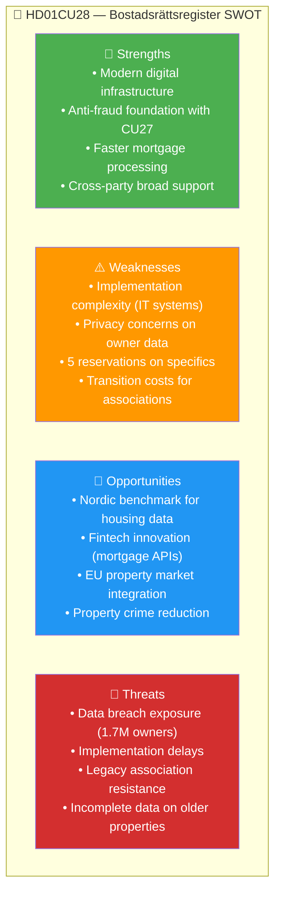

# Per-File Political Intelligence Analysis: HD01CU28

**Dok ID:** HD01CU28  
**Title:** Ett register för alla bostadsrätter  
**Committee:** CU (Civilutskottet)  
**Date:** 2026-04-17  
**Riksmöte:** 2025/26  
**Analysis Date:** 2026-04-20 UTC  
**Confidence:** 🟩HIGH

---

## 1. Document Classification

| Dimension | Score (1-5) | Assessment |
|-----------|-------------|------------|
| Policy Impact | 4 | Transforms infrastructure for Sweden's ~1.7M condominium market |
| Political Salience | 3 | 5 reservations; broadly supported with technical objections |
| Electoral Relevance | 3 | Housing modernisation; less divisive than CU27 |
| Public Interest | 5 | Directly affects ~1.7 million condo owners + market transparency |
| Urgency | 3 | Phased rollout expected |
| **Total** | **18/25** | **Significance: HIGH** |

**Domain:** Housing Law / Digital Infrastructure / Civil Law  
**Policy Area:** Property Registration, Housing Market Modernisation

---

## 2. Core Analysis

### What the Proposal Does
Sweden will establish the first **national register of all bostadsrätter** (condominiums). The register will contain:
- Apartment details (unit number, floor, area, association address)
- Owner identity (*bostadsrättshavare*)
- Condominium association details (*bostadsrättsförening*)
- Pledge/mortgage information (*pantsättningar*)

**Current problem**: Sweden lacks a central register. Each bostadsrättsförening (association) maintains its own records, leading to:
- Errors and fraud in mortgage/pledge handling
- Difficulty verifying ownership in transactions
- No standardised national view of Sweden's condominium stock

### Policy Significance
This is a foundational infrastructure reform. Combined with CU27 (identity requirements), it creates a comprehensive anti-fraud framework for Sweden's housing market. The register enables:
1. Digital mortgage processing (replacing paper-based pledge notifications)
2. Real-time ownership verification by banks, buyers, and courts
3. Statistics on Sweden's 1.7 million condominium units
4. Consumer protection — buyers can verify ownership chain before purchase

### Economic Context
Sweden has among Europe's highest condominium ownership rates relative to population. Average bostadsrätt price fell from ~3.9M SEK in early 2022 to ~3.1M SEK in 2023-24, partly due to rising mortgage rates. Improved market transparency through a national register could partially restore buyer confidence.

---

## 3. SWOT Analysis

---

## 4. Risk Matrix

| Risk | Description | Likelihood (1-5) | Impact (1-5) | L×I Score | Level |
|------|-------------|-----------------|-------------|-----------|-------|
| RSK-001 | IT implementation delays (3+ years for full rollout) | 4 | 3 | 12 | 🟧 MEDIUM |
| RSK-002 | Data quality gaps in older properties / rural areas | 3 | 3 | 9 | 🟧 MEDIUM |
| RSK-003 | Privacy breach of 1.7M owner records | 2 | 5 | 10 | 🟧 MEDIUM |
| RSK-004 | Associations resist digital registration mandate | 3 | 2 | 6 | 🟡 LOW |

---

## 5. Election 2026 Implications

**🟧 Electoral Impact: MEDIUM** — Register reform is broadly popular and non-partisan. Both blocs can claim credit. Unlikely to be a major campaign differentiator.  
**Voter Salience:** 🟧MEDIUM — Condo owners (1.7M+ units, ~3M people) will notice benefits. Banks and realtors strongly supportive.

---

## 6. Forward Indicators

| Indicator | Trigger | Timeline | Confidence |
|-----------|---------|---------|-----------|
| Lantmäteriet pilot announcement | IT project kickoff | 2026 Q3-Q4 | 🟩HIGH |
| First bank integration | Major bank adopts register API | 2027-2028 | 🟧MEDIUM |
| Full register operational | All 1.7M units registered | 2028-2030 | 🟧MEDIUM |
