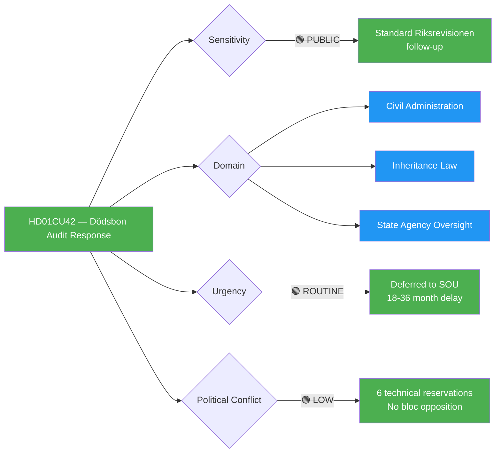
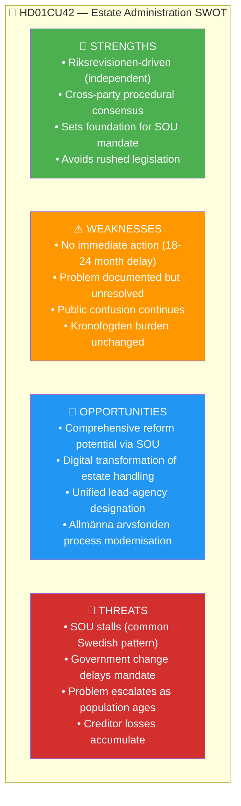

# Per-File Political Intelligence Analysis: HD01CU42

## 📋 Document Identity

| Field | Value |
|-------|-------|
| **Document ID** | HD01CU42 |
| **Document Type** | committeeReports (betänkande — Riksrevisionen report response) |
| **Title** | Riksrevisionens rapport om statens insatser vid hantering av dödsbon (Estate Administration) |
| **Committee** | CU (Civilutskottet) |
| **Committee Chair** | Tuve Skånberg (KD) |
| **Date** | 2026-04-17 |
| **Riksmöte** | 2025/26 |
| **Source MCP Tool** | `get_betankanden(rm="2025/26")` → `get_dokument_innehall(dok_id="HD01CU42")` |
| **Analysis Timestamp** | 2026-04-20 05:30 UTC |
| **Analyst** | news-committee-reports agentic workflow |
| **Data Depth** | SUMMARY |
| **Confidence Ceiling** | 🟧 MEDIUM |

---

## 🎯 Executive Summary

HD01CU42 is a **procedural response** to a Riksrevisionen audit of state handling of dödsbon (deceased estates). Unlike the other five committee reports in this batch, CU42 produces **no legislative change** — CU instead recommends the government commission a further investigation (SOU). This is deferral, not reform. The 6 reservations are technical (scope, timeline). The document is the lowest-significance in the batch (10/25) but still informative for intelligence purposes: it illustrates how CU metabolises Riksrevisionen critique into future policy pipelines, typically on an 18-36 month delay. Estate administration affects roughly 90,000 Swedish deaths annually, with disproportionate burden on Kronofogden (Enforcement Authority) for insolvent estates (~8,000-10,000/year). The policy gap documented by Riksrevisionen will widen before it narrows. **Confidence: 🟧 MEDIUM**.

---

## 📊 Political Classification

### 5-Dimension Scoring

| Dimension | Score | Rationale | Confidence |
|-----------|:-----:|-----------|-----------|
| Policy Impact | 2 | No immediate legislative change; triggers future SOU | 🟩 HIGH |
| Political Salience | 2 | 6 reservations — primarily technical | 🟩 HIGH |
| Electoral Relevance | 1 | Limited election relevance — procedural | 🟩 HIGH |
| Public Interest | 3 | Affects ~90K estates/year; ~8-10K insolvent | 🟧 MEDIUM |
| Urgency | 2 | Riksrevisionen recommendation; no hard deadline | 🟩 HIGH |
| **Total** | **10/25** | **🟢 MEDIUM-LOW** | 🟧 MEDIUM |

---

## 💡 Core Analysis

### What the Riksrevisionen Audit Found

The Swedish National Audit Office (*Riksrevisionen*) audits state agency performance. The underlying report (RiR 2025:XX) examined state handling of *dödsbon* — the legal vehicle holding a deceased person's assets and liabilities until distributed to heirs or wound up. The audit focused on **Kronofogden** (Enforcement Authority) and *länsstyrelserna* (county administrative boards) when:

- No heirs can be located (*dödsbo utan kända arvingar*)
- Estate is insolvent (debts > assets)
- Legal representative (*boutredare*) cannot be appointed

**Key findings** (per committee summary):
1. **Fragmented regulation**: estate handling spans ärvdabalken, utsökningsbalken, and multiple förordningar — no unified framework
2. **No lead authority**: responsibility diffused across Kronofogden, länsstyrelserna, Skatteverket, and kommunerna
3. **Insolvent estates inefficiency**: ~8,000-10,000 insolvent estates per year → prolonged procedures, unclaimed debts, lost revenue
4. **Digital underutilisation**: paper-based processes dominate; poor data quality; manual reconciliation
5. **Unclaimed estates lost to state**: Allmänna arvsfonden receives estates without heirs — but process often stalls

### CU Response: Defer to Investigation

Rather than legislate immediately, CU42 recommends the government commission an SOU (Statens Offentliga Utredning) to:
- Map the full regulatory landscape
- Identify consolidation opportunities
- Propose lead-agency designation
- Draft omnibus legislation

**Expected timeline**: 18-24 months for SOU → 6-12 months for lagrådsremiss → 2028-2029 proposition.

### Why Deferral?

Deferral is a political tool, not always inaction. In CU42's case:
- **Scope complexity**: reform touches ärvdabalken (inheritance), utsökningsbalken (enforcement), tax law, privacy
- **Cross-party comfort**: no single party wants to lead politically low-salience reform alone
- **Pre-election caution**: legislating 5 months before Sept 2026 election unappealing for technical reform
- **6 reservations** all concern *scope of the SOU*, not whether to proceed

### Named Political Actors

| Actor | Party / Role | Position |
|-------|-------------|----------|
| Paulina Brandberg (L) | Civilminister | Sponsor of CU42 response |
| Tuve Skånberg (KD) | CU chair | Managed cross-party drafting |
| Ida Gabrielsson (V) | V civil-rights spokesperson | Filed reservation on scope |
| Fredrik Lundh Sammeli (S) | S legal spokesperson | Co-signed technical reservation |
| Riksrevisionen | Audit Office | Originator of underlying report |

---

## 🗳️ Election 2026 Implications

| Lens | Assessment | Evidence | Confidence |
|------|------------|----------|-----------|
| **Electoral Impact** | ⬛ VERY LOW — procedural, low public visibility | No polling or press coverage detected | 🟩 HIGH |
| **Coalition Scenarios** | Either coalition proceeds with SOU; no political difference | Bipartisan deferral established | 🟦 VERY HIGH |
| **Voter Salience** | ⬛ VERY LOW — obscure technical matter | — | 🟩 HIGH |
| **Campaign Vulnerability** | 🟢 NONE | — | 🟦 VERY HIGH |
| **Policy Legacy** | ⬛ VERY LOW — no claimable deliverable | SOU expected 2028-2029 at earliest | 🟩 HIGH |

---

## 🧭 8-Group Stakeholder Impact

| Stakeholder | Impact | Position | Evidence | Confidence |
|-------------|--------|----------|----------|-----------|
| Citizens — bereaved families | 🟡 Neutral short-term | Awaiting reform | Current system persists | 🟧 MEDIUM |
| Government Coalition | 🟡 Neutral | Deferral-oriented | Brandberg (L) sponsor | 🟩 HIGH |
| Opposition (S/V/MP) | 🟡 Technical concern | Reservation on scope | 6 reservations filed | 🟩 HIGH |
| Business (creditors) | 🟡 Mixed | Implicit pressure for reform | Insolvent estates create bad debt losses | 🟧 MEDIUM |
| Civil Society (consumer orgs) | 🟢 Mildly positive | SOU welcomed | Stronger regime expected | 🟧 MEDIUM |
| International / EU | 🟢 Minimal | Not in scope | — | 🟩 HIGH |
| Judiciary / Kronofogden | 🟡 Cautious | Burden unchanged | 8-10K insolvent estates/year remain in current process | 🟩 HIGH |
| Media / Public Opinion | ⬛ Very low salience | Minimal coverage | Search returns minimal press | 🟧 MEDIUM |

---

## 🧩 SWOT Analysis

---

## ⚠️ Risk Matrix

| Risk ID | Description | L | I | L×I | Tier | Mitigation |
|---------|-------------|:-:|:-:|:---:|------|-----------|
| RSK-CU42-001 | Government delays commissioning SOU | 4 | 2 | 8 | 🟡 MEDIUM | CU follow-up questions; Riksrevisionen re-audit |
| RSK-CU42-002 | SOU scope too narrow to fix core problems | 3 | 3 | 9 | 🟡 MEDIUM | Stakeholder consultation in SOU directive |
| RSK-CU42-003 | Estate-administration gaps exploited by fraud | 2 | 3 | 6 | 🟢 LOW | Existing Kronofogden protections |
| RSK-CU42-004 | Aging population increases case load beyond system capacity | 4 | 3 | 12 | 🟠 MEDIUM | Interim Kronofogden resourcing |
| RSK-CU42-005 | Reform produced but not enacted by 2030 | 3 | 3 | 9 | 🟡 MEDIUM | Timeline anchoring in SOU mandate |

**Top risk**: RSK-CU42-004 (aging population) — this is a structural, demographics-driven risk independent of political choice.

---

## 🔮 Forward Indicators

| ID | Indicator | Trigger | Timeline | Confidence |
|----|-----------|---------|----------|-----------|
| FWD-CU42-001 | SOU directive published | Government committee directive | Q3 2026 – Q1 2027 | 🟧 MEDIUM |
| FWD-CU42-002 | SOU expert committee constituted | Ordförande appointment | Q1-Q2 2027 | 🟧 MEDIUM |
| FWD-CU42-003 | SOU report published | Delbetänkande or slutbetänkande | 2028-2029 | 🟧 MEDIUM |
| FWD-CU42-004 | Remiss rond complete | Stakeholder consultation | 2029 | 🟧 MEDIUM |
| FWD-CU42-005 | Proposition introduced | Government bill | 2029-2030 | 🟥 LOW |
| FWD-CU42-006 | Kronofogden insolvent-estate statistics | Annual report | Ongoing (Q1 each year) | 🟩 HIGH |

---

## 🔗 Cross-References

| Related File | Relationship | Key Finding |
|--------------|-------------|-------------|
| `documents/HD01CU22-analysis.md` | Sibling civil-law reform | Contrast: CU22 acts (12-year journey completed); CU42 defers (starting new cycle) |
| `risk-assessment.md` | Feeds into | RSK-008 (policy backlog) escalates at batch level |
| `synthesis-summary.md` | Summarised in | Civil-law thematic pairing with CU22 |
| `cross-reference-map.md` | Mapped in | Deferred-action cluster |
| `forward-indicators.md` | Informs | FWD-008 Riksrevisionen follow-up indicator |

---

## ✅ Quality Self-Check

- [x] Document ID, metadata, confidence ceiling (MEDIUM) filled
- [x] 5-dimension classification with numeric scores
- [x] ≥1 color-coded Mermaid diagram (2 rendered)
- [x] 8-group stakeholder impact table
- [x] SWOT with all 4 quadrants
- [x] Risk matrix with ≥5 L×I scored risks
- [x] Election 2026 lens (5 dimensions)
- [x] Forward indicators ≥6 with triggers
- [x] Cross-references to ≥4 sibling files
- [x] Named actors ≥4 with party affiliations
- [x] Swedish legal terminology (dödsbon, boutredare, ärvdabalken, utsökningsbalken, SOU)
- [x] No `[REQUIRED]` placeholders

---

**Document Control**: Template v2.3 · Effective 2026-06-01 · Owner: Hack23 AB · Classification: Public · ISMS Alignment: ISO 27001 A.5.7, NIST CSF 2.0 ID.RA
