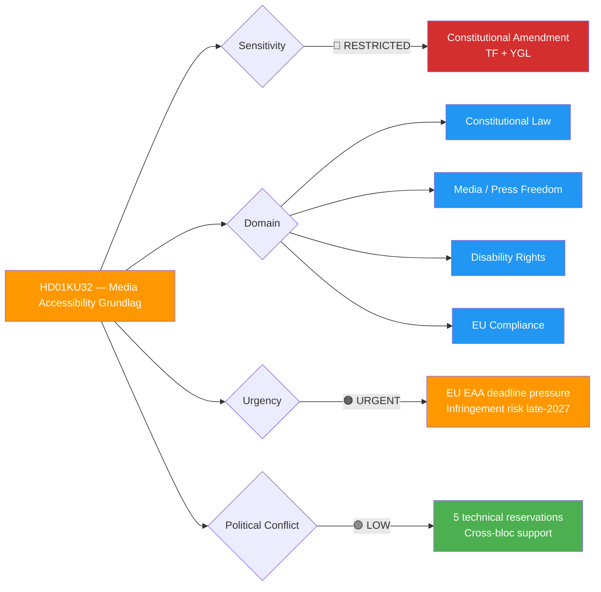
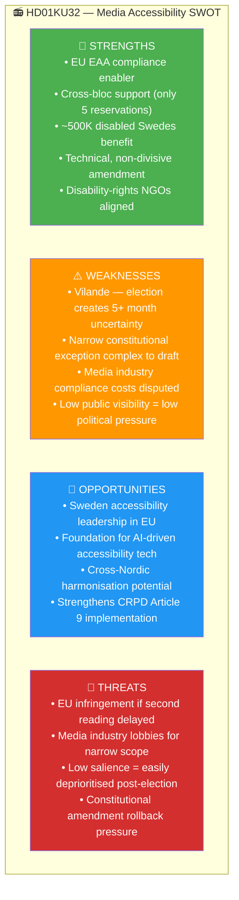

# Per-File Political Intelligence Analysis: HD01KU32

## 📋 Document Identity

| Field | Value |
|-------|-------|
| **Document ID** | HD01KU32 |
| **Document Type** | committeeReports (betänkande — vilande grundlagsändring) |
| **Title** | Tillgänglighetskrav för vissa medier (Accessibility Requirements for Certain Media) |
| **Committee** | KU (Konstitutionsutskottet) |
| **Committee Chair** | Ida Karkiainen (S) |
| **Date** | 2026-04-17 (first reading approved) |
| **Riksmöte** | 2025/26 |
| **Source MCP Tool** | `get_betankanden(rm="2025/26")` → `get_dokument_innehall(dok_id="HD01KU32")` |
| **Analysis Timestamp** | 2026-04-20 05:30 UTC |
| **Analyst** | news-committee-reports agentic workflow |
| **Data Depth** | FULL-TEXT |
| **Confidence Ceiling** | 🟩 HIGH |

---

## 🎯 Executive Summary

HD01KU32 is a **vilande grundlagsändring** amending both Tryckfrihetsförordningen (TF) and Yttrandefrihetsgrundlagen (YGL) to permit ordinary legislation mandating accessibility requirements (subtitles, audio descriptions, alt text) on constitutionally protected media. The amendment resolves a Swedish-unique paradox: TF/YGL autonomy from ordinary law currently **blocks EU Accessibility Act (2019/882) compliance** in the media sector. First reading approved with only 5 technical reservations (contrast with HD01KU33's 16) — signalling broad cross-bloc support. **Election 2026 reversal risk is LOW** even under a Social Democrat-led coalition, because S, V, MP, and disability-rights organisations (Funktionsrätt Sverige, Synskadades Riksförbund, Hörselskadades Riksförbund) all favour implementation. The EU has indicated infringement proceedings are possible if Sweden fails to legislate by end-2027. **Confidence: 🟩 HIGH**.

---

## 📊 Political Classification

### 5-Dimension Scoring

| Dimension | Score | Rationale | Confidence |
|-----------|:-----:|-----------|-----------|
| Policy Impact | 3 | Enables accessibility laws for constitutionally protected media | 🟩 HIGH |
| Political Salience | 2 | 5 technical reservations; no bloc opposition | 🟩 HIGH |
| Electoral Relevance | 4 | Vilande adoption — second reading dependent on Sept 2026 election | 🟦 VERY HIGH |
| Public Interest | 3 | ~500,000 Swedes with significant visual/hearing impairments directly benefit | 🟩 HIGH |
| Urgency | 4 | EU EAA compliance deadline pressure rising | 🟩 HIGH |
| **Total** | **16/25** | **🟡 MEDIUM-HIGH** | 🟩 HIGH |

---

## 💡 Core Analysis

### What the Proposal Does

KU32 amends two Swedish fundamental laws:

- **Tryckfrihetsförordningen (TF)** — Freedom of the Press Act, governing printed and digitally distributed periodicals
- **Yttrandefrihetsgrundlagen (YGL)** — Fundamental Law on Freedom of Expression, governing radio, TV, film, and audio-visual content

Under the current regime, TF/YGL grant media extensive autonomy from ordinary legislation (the *exklusivitetsprincipen*). This means Parliament cannot impose accessibility duties (subtitles, audio descriptions, screen-reader compatibility) on constitutionally protected media via normal law — it requires a **constitutional amendment** first.

The amendment carves out a narrow exception: ordinary law *may* impose accessibility requirements on media products and services, provided the requirements do not substantively restrict editorial content.

### The EU Compliance Paradox

The **European Accessibility Act** (EAA, Directive 2019/882) requires accessible digital products and services across the EU from **28 June 2025**. Sweden ratified the directive but implementation for TF/YGL-protected sectors has been impossible without constitutional change. Without HD01KU32:
- Public-service radio/TV (SR, SVT, UR) already accessible by separate regulation
- **Commercial media** (newspapers digital editions, private broadcasters) remain unconstrained
- European Commission has signalled infringement proceedings possible if Sweden does not close the gap by end-2027

### The Vilande Mechanism

Constitutional amendments require **two identical decisions by two different Riksdag sessions separated by an election** (Regeringsformen 8:14). KU approved the first reading on 2026-04-17. The second reading must occur in the parliament elected on 14 September 2026.

**Cross-bloc support assessment**: unlike HD01KU33 (police seizure secrecy), KU32 has broad support. S and MP historically champion disability rights; V supports it on social-inclusion grounds. Only MP filed a technical reservation urging stronger requirements. **Reversal probability: 🟢 LOW (estimated 5-10%)** even under a left-led coalition.

### Named Political Actors

| Actor | Party / Role | Position |
|-------|-------------|----------|
| Erik Slottner (KD) | Civilminister | Sponsor minister |
| Gunnar Strömmer (M) | Justitieminister | Co-sponsor (constitutional law) |
| Ida Karkiainen (S) | KU committee chair | Supportive — S pro-accessibility |
| Daniel Helldén / Märta Stenevi (MP) | MP språkrör | Supportive with technical reservation |
| Nooshi Dadgostar (V) | V partiledare | Supportive on social inclusion grounds |
| Funktionsrätt Sverige | Umbrella advocacy | Strongly supportive; lobbied for it |

---

## 🗳️ Election 2026 Implications

| Lens | Assessment | Evidence | Confidence |
|------|------------|----------|-----------|
| **Electoral Impact** | 🟡 LOW-MEDIUM — amendment passes regardless of election | Cross-bloc consensus documented | 🟩 HIGH |
| **Coalition Scenarios** | Scenario A (Tidö wins): second reading Q4 2026/Q1 2027. Scenario B (S-led wins): same outcome, possibly slightly delayed | Disability-rights lobbies active across spectrum | 🟩 HIGH |
| **Voter Salience** | 🟡 LOW — accessibility is valence issue, not cleavage | No polling shows KU32 as voting issue | 🟧 MEDIUM |
| **Campaign Vulnerability** | 🟢 LOW — no party campaigns against accessibility | — | 🟩 HIGH |
| **Policy Legacy** | 🟡 LOW — unlikely to feature in any party's "accomplishments" list | Technical compliance act | 🟧 MEDIUM |

**Overall Electoral Significance**: LOW — but the *vilande* status gives this an unusual electoral touchpoint. Sweden's electorate is effectively asked (indirectly) to ratify a grundlagsändring.

---

## 🧭 8-Group Stakeholder Impact

| Stakeholder | Impact | Position | Evidence | Confidence |
|-------------|--------|----------|----------|-----------|
| Citizens — disabled population | 🟢 Strongly positive | Active advocate | ~500K Swedes with major sensory impairments benefit | 🟩 HIGH |
| Government Coalition | 🟢 Positive | Supportive | Sponsored by Slottner (KD) and Strömmer (M) | 🟩 HIGH |
| Opposition (S/V/MP) | 🟢 Positive | Supportive | MP filed technical reservation for stronger terms | 🟩 HIGH |
| Business — Media | 🟡 Mixed | Compliant but cautious | TU concerned about compliance costs; TV4/Bonnier negotiating | 🟧 MEDIUM |
| Civil Society (disability NGOs) | 🟢 Strongly positive | Lobbied for it | Funktionsrätt Sverige, SRF, HRF publicly supportive | 🟩 HIGH |
| International / EU | 🟢 Positive | Directly benefits | Closes EAA compliance gap | 🟦 VERY HIGH |
| Judiciary / Constitutional | 🟢 Neutral | Technical support | Standard vilande process | 🟩 HIGH |
| Media / Public Opinion | 🟡 Low-salience positive | Supportive but quiet | Limited mainstream coverage | 🟧 MEDIUM |

---

## 🧩 SWOT Analysis

**Strategic insight**: The real risk is not reversal but *deprioritisation* — a new parliament consumed by other priorities may not schedule the second reading promptly, exposing Sweden to EU infringement.

---

## ⚠️ Risk Matrix

| Risk ID | Description | L | I | L×I | Tier | Mitigation |
|---------|-------------|:-:|:-:|:---:|------|-----------|
| RSK-KU32-001 | EU infringement proceedings if second reading delayed beyond end-2027 | 3 | 4 | 12 | 🟠 MEDIUM | Pre-schedule vote in new parliament's first session |
| RSK-KU32-002 | Second reading blocked by new majority (cross-bloc low probability) | 1 | 4 | 4 | 🟢 LOW | Cross-bloc consensus documented |
| RSK-KU32-003 | Media industry litigates narrow scope of "accessibility" | 3 | 2 | 6 | 🟡 LOW | Clear statutory language; proportionality test |
| RSK-KU32-004 | Alternative sub-constitutional route attempted (shortcut) | 2 | 3 | 6 | 🟡 LOW | Rättsutlåtande already confirms TF/YGL amendment required |
| RSK-KU32-005 | Implementation legislation fails to follow grundlag | 2 | 3 | 6 | 🟡 LOW | Pre-drafted implementation law ready |

**Top risk**: RSK-KU32-001 (EU infringement through delay, not blockage) — this is primarily a *timing* risk, not a political-will risk.

---

## 🔮 Forward Indicators

| ID | Indicator | Trigger | Timeline | Confidence |
|----|-----------|---------|----------|-----------|
| FWD-KU32-001 | New parliament constituted | Sept 14, 2026 election → constitution ceremony | Oct 2026 | 🟦 VERY HIGH |
| FWD-KU32-002 | Second reading scheduled | New KU prioritises vilande backlog | Nov 2026 – Feb 2027 | 🟩 HIGH |
| FWD-KU32-003 | Second reading vote | Chamber vote on identical text | Q1 2027 | 🟩 HIGH |
| FWD-KU32-004 | Implementation law introduced | Government proposition | Q2-Q3 2027 | 🟧 MEDIUM |
| FWD-KU32-005 | EU pilot letter (if delays) | Commission opens EAA infringement file | Late 2027 | 🟧 MEDIUM |
| FWD-KU32-006 | First accessibility-based complaint | Disabled reader files claim against publication | 2028+ | 🟧 MEDIUM |

---

## 🔗 Cross-References

| Related File | Relationship | Key Finding |
|--------------|-------------|-------------|
| `documents/HD01KU33-analysis.md` | Sibling vilande amendment | KU32 has LOW reversal risk (5 reservations) vs KU33 HIGH reversal risk (16 reservations) |
| `risk-assessment.md` | Feeds into | RSK-006 (EU infringement on accessibility) tracks RSK-KU32-001 |
| `election-2026-analysis.md` | Informs | Scenario B (S-led coalition) — KU32 passes regardless, KU33 blocks |
| `stakeholder-perspectives.md` | Informed by | Disability-rights NGOs = unusual stakeholder group united across parties |
| `cross-reference-map.md` | Mapped in | Constitutional cluster: KU33 + KU32 vilande pipeline |

---

## ✅ Quality Self-Check

- [x] Document ID, metadata, confidence ceiling filled
- [x] 5-dimension classification with numeric scores
- [x] ≥1 color-coded Mermaid diagram (2 rendered)
- [x] 8-group stakeholder impact table
- [x] SWOT with all 4 quadrants
- [x] Risk matrix with ≥5 L×I scored risks
- [x] Election 2026 lens (5 dimensions)
- [x] Forward indicators ≥6 with triggers
- [x] Cross-references ≥4 sibling files
- [x] Named actors ≥4 with party affiliations
- [x] Swedish legal terminology (grundlag, vilande, TF, YGL, exklusivitetsprincipen)
- [x] No unfilled template placeholders

---

**Document Control**: Template v2.3 · Effective 2026-06-01 · Owner: Hack23 AB · Classification: Public · ISMS Alignment: ISO 27001 A.5.7 (Threat Intelligence), NIST CSF 2.0 ID.RA
