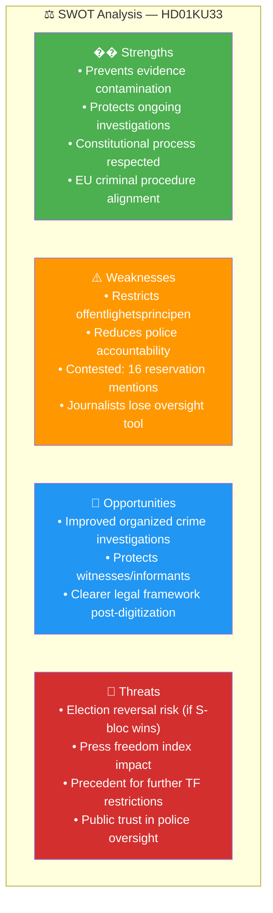

# Per-File Political Intelligence Analysis: HD01KU33

**Dok ID:** HD01KU33  
**Title:** Insyn i handlingar som inhämtas genom beslag och kopiering vid husrannsakan  
**Committee:** KU (Konstitutionsutskottet)  
**Date:** 2026-04-17  
**Riksmöte:** 2025/26  
**Analysis Date:** 2026-04-20 UTC  
**Confidence:** 🟩HIGH

---

## 1. Document Classification

| Dimension | Score (1-5) | Assessment |
|-----------|-------------|------------|
| Policy Impact | 4 | Constitutional amendment (TF) with direct press-freedom implications |
| Political Salience | 4 | 16 reservation mentions; contested across party lines |
| Electoral Relevance | 5 | "Vilande" adoption — second vote MUST occur after Sept 2026 election |
| Public Interest | 4 | Affects media's right to inspect police-seized digital records |
| Urgency | 5 | Election determines whether law takes effect |
| **Total** | **22/25** | **Significance: HIGH** |

**Domain:** Constitutional Law / Press Freedom / Law Enforcement  
**Policy Area:** Fundamental Laws (TF - Tryckfrihetsförordningen)

---

## 2. Core Analysis

### What the Proposal Does
The Tidö government (M/KD/L/SD) proposes amending the Swedish Freedom of the Press Act (TF) to exclude digital recordings seized or copied during police searches from classification as "public documents" (allmänna handlingar). Currently, once seized by police, such records can theoretically be accessed by the public under the principle of public access (offentlighetsprincipen).

Under the proposed amendment, digital materials taken during a *husrannsakan* (police search) would explicitly NOT be considered public records during the investigation period. This prevents journalists and citizens from requesting access to seized materials under the Public Access Act.

### Constitutional Process
This is a "vilande" (dormant) adoption — Sweden's process for amending constitutional laws requires two identical decisions by two different parliaments (riksdagar), with an election in between. KU approved the first reading on 17 April 2026. The **2026 general election** determines whether the same or a new parliamentary majority will approve the second reading.

### The Press Freedom Tension
The proposal creates a **direct tension between law enforcement effectiveness and press freedom**:
- **Government argument**: Police investigations are compromised when suspects' digital materials (seized in criminal investigations) can be immediately accessed by the public or media
- **Opposition concern**: This restricts offentlighetsprincipen — a cornerstone of Swedish democracy since 1766
- **Media impact**: Investigative journalists lose ability to request access to seized materials that could reveal official misconduct

---

## 3. SWOT Analysis

### 8-Group Stakeholder SWOT

| Stakeholder | Impact | Position | Evidence |
|-------------|--------|----------|---------|
| Citizens | Mixed | Concerned | Loss of access to records of government searches |
| Government Coalition (M/KD/L/SD) | Positive | Strongly supportive | Proposed by government, KU approved |
| Opposition Bloc (S/V/MP/C) | Negative | Opposed | 16 reservation mentions; S/V/MP cite press freedom |
| Business/Industry | Neutral | No position | Minimal commercial impact |
| Civil Society (Journalists/Media) | Strongly Negative | Opposed | Reduces investigative journalism tools |
| International/EU | Mixed | Watchful | ECHR Art 10 (press freedom) scrutiny possible |
| Judiciary/Constitutional | Neutral | Technical support | Court oversight of seizure procedures remains |
| Media/Public Opinion | Negative | Opposition | Press freedom organizations critical |

---

## 4. Risk Matrix

| Risk | Description | Likelihood (1-5) | Impact (1-5) | L×I Score | Level |
|------|-------------|-----------------|-------------|-----------|-------|
| RSK-001 | Amendment dies after 2026 election | 3 | 4 | 12 | 🟧 MEDIUM |
| RSK-002 | Police abuse seizure powers with less oversight | 2 | 5 | 10 | 🟧 MEDIUM |
| RSK-003 | Press freedom index downgrade for Sweden | 2 | 3 | 6 | 🟡 LOW-MEDIUM |
| RSK-004 | Constitutional precedent for further TF restrictions | 2 | 5 | 10 | 🟧 MEDIUM |

---

## 5. Election 2026 Implications

**🟥 Electoral Impact: HIGH** — This amendment exists in a legal limbo until after the election. If the Social Democrats (S) lead a center-left coalition to victory, they could refuse to adopt the second reading, killing the amendment. This makes it a live campaign issue — opposition can promise to "restore offentlighetsprincipen."

**Coalition Scenario:** If Tidö coalition retains power, second reading passes by late 2026/early 2027.  
**Voter Salience:** 🟧 MEDIUM — Press freedom issues matter to educated voters and journalists but not mainstream concern.  
**Campaign Vulnerability:** Government must defend "why police secrecy overrides public access."

---

## 6. Forward Indicators

| Indicator | Trigger | Timeline | Confidence |
|-----------|---------|---------|-----------|
| Election outcome | Sept 2026 general election | Sept 14, 2026 | 🟦VERY HIGH — scheduled |
| Second reading vote | New parliament first session | Oct-Nov 2026 | 🟩HIGH if Tidö wins |
| Press freedom criticism | RSF/Reporters Without Borders annual report | Spring 2027 | 🟧MEDIUM |
| Opposition campaign promise | If S announces TF reversal | Campaign period 2026 | 🟧MEDIUM |
