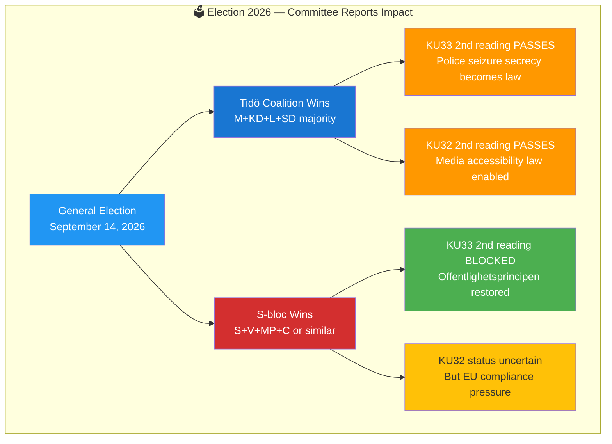

# Election 2026 Analysis — Committee Reports 2026-04-20

**Analysis ID:** ELEC-2026-04-20-CR001  
**Date:** 2026-04-20 UTC  
**Confidence:** 🟩HIGH

---

## Election 2026 Strategic Overview

## Electoral Impact Assessment

| Document | Electoral Relevance | Salience to Voters | Campaign Vulnerability |
|----------|--------------------|--------------------|----------------------|
| HD01KU33 | 🟩HIGH — vilande, election decides fate | 🟧MEDIUM — press freedom matters to informed voters | Government: "Police need modern tools"; Opposition: "Offentlighetsprincipen at risk" |
| HD01CU27 | 🟩HIGH — housing policy top-3 issue | 🟩HIGH — housing affects millions | Government: "Anti-crime housing"; Opposition: "Insufficient tenant protections" |
| HD01CU28 | 🟧MEDIUM — popular infrastructure reform | 🟧MEDIUM — 1.7M condo owners benefit | Broadly popular, minor opposition |
| HD01KU32 | 🟧MEDIUM — EU compliance / disability | 🟡LOW-MEDIUM — accessibility but vilande | Broad consensus, low campaign value |
| HD01CU22 | 🟡LOW | 🟡LOW | Zero reservations = no political conflict |
| HD01CU42 | ⬛VERY LOW | ⬛VERY LOW | Administrative; no campaign angle |

## Coalition Scenarios

### Scenario A: Tidö Coalition Retains Power (M/KD/L/SD)
**Probability:** 🟧MEDIUM (current polling: M+SD+KD+L ~47-49%)
- KU33 and KU32 both pass second reading by Q1 2027
- CU27 implementation proceeds; no new tenant protection additions
- CU28 register fully funded and prioritised
- Government claims "largest housing reform decade"

### Scenario B: Social Democrat-led Coalition Wins
**Probability:** 🟧MEDIUM (S+MP+V+possible C ~48-52% in some polls)
- **KU33 blocked**: S pledges to restore offentlighetsprincipen for seized documents
- **CU27 amended**: Stronger tenant protections added via new legislation
- **CU22 continues**: Broad consensus, new government maintains reform
- **KU32**: EU compliance pressure likely forces adoption regardless

## Key Electoral Narratives Emerging

1. **"Grundlagsvalrörelsen"** (The Constitutional Election): For the first time in decades, two fundamental law amendments are contingent on election outcome. This gives the 2026 election an unusual constitutional dimension.

2. **Housing as a Battleground**: CU27's 29 reservations signal that housing anti-fraud policy will be a major 2026 campaign theme — all parties have differentiated positions.

3. **Consensus Governance**: CU22's zero reservations demonstrate that welfare reforms can achieve genuine cross-party agreement, providing positive policy-making contrast to polarised housing debates.

## Confidence Labels Summary

- Constitutional amendments (KU33/KU32) election dependency: 🟦VERY HIGH
- Housing reform (CU27/CU28) as campaign issue: 🟩HIGH
- Specific coalition scenarios: 🟧MEDIUM (polling margins within ±3%)
- Policy outcomes under each scenario: 🟩HIGH
