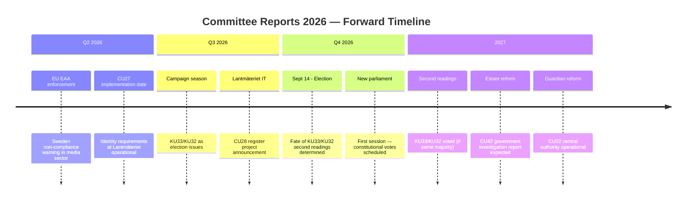

# Forward Indicators — Committee Reports 2026-04-20

**Analysis ID:** FWD-2026-04-20-CR001  
**Date:** 2026-04-20 UTC  
**Confidence:** 🟩HIGH

---

## Critical Forward Indicators

## Indicator Register

| ID | Indicator | Trigger Event | Expected Timeline | Confidence | Source Document |
|----|-----------|--------------|-------------------|------------|----------------|
| FWD-001 | KU33 second reading vote | New parliament constituted after Sept 2026 election | Oct-Nov 2026 | 🟦VERY HIGH | HD01KU33 |
| FWD-002 | KU32 second reading vote | Same parliament session | Oct-Nov 2026 | 🟦VERY HIGH | HD01KU32 |
| FWD-003 | Opposition pledge on KU33 reversal | S party manifesto publication | June-Aug 2026 | 🟩HIGH | HD01KU33 |
| FWD-004 | CU27 Lantmäteriet system update | IT project kickoff announcement | Q3 2026 | 🟧MEDIUM | HD01CU27 |
| FWD-005 | CU28 bostadsrättsregister IT tender | Lantmäteriet procurement | Q3-Q4 2026 | 🟧MEDIUM | HD01CU28 |
| FWD-006 | First prosecution under CU27 | Police/prosecutor case with identity requirement | Q4 2026-Q2 2027 | 🟧MEDIUM | HD01CU27 |
| FWD-007 | Guardianship central authority established | CU22 implementation regulation | Q1-Q2 2027 | 🟩HIGH | HD01CU22 |
| FWD-008 | Riksrevisionen follow-up on estate reform | Government investigation report | 2027 | 🟧MEDIUM | HD01CU42 |
| FWD-009 | EU infringement warning if KU32 blocked | European Commission EAA enforcement | Late 2027 | 🟧MEDIUM | HD01KU32 |
| FWD-010 | BRÅ housing crime statistics | Annual report on property crime | Spring 2027 | 🟩HIGH | HD01CU27/CU28 |

## Early Warning Signals

**Signal 1 — Press Freedom Response**: If Swedish press freedom index (RSF Reporters Without Borders) shows decline in 2027 annual report, this confirms KU33's impact. Watch: Sweden ranking in 2026 interim indicators.

**Signal 2 — Housing Market Response**: If bostadsrätt transaction volumes decline post-CU27 implementation (increased friction from identity requirements), this signals economic impact. Watch: Valueguard HOX Sweden index monthly readings.

**Signal 3 — Guardian Volunteer Numbers**: If the number of registered "godmän" declines 10%+ after CU22 implementation, this signals shortage risk for CU22 central authority. Watch: Länsstyrelsen annual statistics.
