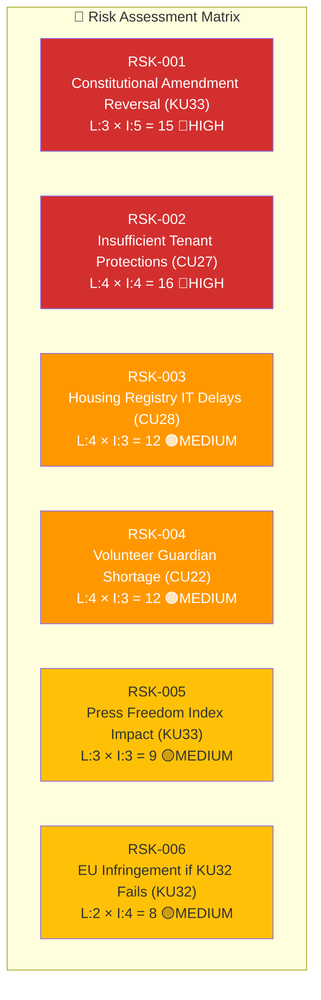

# Risk Assessment — Committee Reports 2026-04-20

**Analysis ID:** RSK-2026-04-20-CR001  
**Date:** 2026-04-20 UTC  
**Confidence:** 🟩HIGH

---

## Risk Heat Map

## Risk Register

| Risk ID | Title | Source | L | I | L×I | Level | Mitigation |
|---------|-------|--------|---|---|-----|-------|-----------|
| RSK-001 | KU33 constitutional reversal after election | KU33 | 3 | 5 | 15 | 🔴 HIGH | Tidö coalition retention in election |
| RSK-002 | CU27 tenant protections inadequate | CU27 | 4 | 4 | 16 | 🔴 HIGH | Parliament monitoring; opposition amendment proposals |
| RSK-003 | CU28 register IT implementation delays | CU28 | 4 | 3 | 12 | 🟠 MEDIUM | Lantmäteriet IT procurement planning |
| RSK-004 | Volunteer godmän shortage under CU22 | CU22 | 4 | 3 | 12 | 🟠 MEDIUM | Recruitment campaign; salary considerations |
| RSK-005 | Sweden press freedom index downgrade | KU33 | 3 | 3 | 9 | 🟡 MEDIUM | Government communication on law enforcement necessity |
| RSK-006 | EU infringement on accessibility if KU32 fails | KU32 | 2 | 4 | 8 | 🟡 MEDIUM | Alternative legislative route if TF amendment fails |

## Overall Risk Level: 🟠 MEDIUM-HIGH

Primary risk driver: RSK-001 (constitutional amendment election-dependency) — this is structurally unavoidable and represents a HIGH risk that entire regulatory framework may shift post-election.

Secondary driver: RSK-002 (tenant protections in housing) — reflects deep political disagreement embedded in CU27's 29 reservations.
