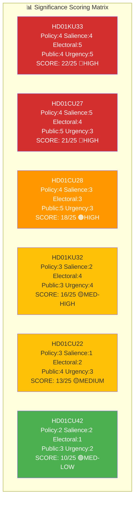

# Significance Scoring — Committee Reports 2026-04-20

**Analysis ID:** SIG-2026-04-20-CR001  
**Date:** 2026-04-20 UTC  
**Riksmöte:** 2025/26  
**Confidence:** 🟩HIGH

---

## Significance Matrix

## Detailed Scoring Table

| Dok ID | Committee | Policy Impact | Political Salience | Electoral Relevance | Public Interest | Urgency | Total | Level |
|--------|-----------|--------------|-------------------|--------------------|-----------------|---------|----|-------|
| HD01KU33 | KU | 4 | 4 | 5 | 4 | 5 | 22 | 🔴 HIGH |
| HD01CU27 | CU | 4 | 5 | 4 | 5 | 3 | 21 | 🔴 HIGH |
| HD01CU28 | CU | 4 | 3 | 3 | 5 | 3 | 18 | 🟠 HIGH |
| HD01KU32 | KU | 3 | 2 | 4 | 3 | 4 | 16 | 🟡 MED-HIGH |
| HD01CU22 | CU | 3 | 1 | 2 | 4 | 3 | 13 | 🟡 MEDIUM |
| HD01CU42 | CU | 2 | 2 | 1 | 3 | 2 | 10 | 🟢 MED-LOW |

## Key Significance Drivers

- **HD01KU33** scores maximum urgency (5) because the 2026 election is a hard deadline — without a second reading, the constitutional amendment dies
- **HD01CU27** scores maximum salience (5) with 29 reservation mentions, indicating a highly contested political process; maximum public interest (5) because Sweden's housing market affects millions
- **HD01CU28** scores maximum public interest (5) — 1.7 million condo owners directly affected
- **HD01KU32** has elevated electoral relevance because it is also "vilande" (election-dependent)
- **HD01CU22** has minimal salience (1) — zero reservations, rare legislative consensus
