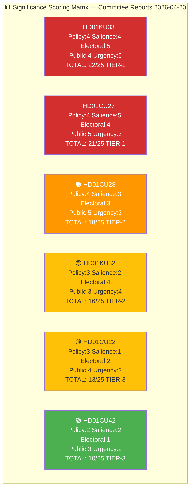
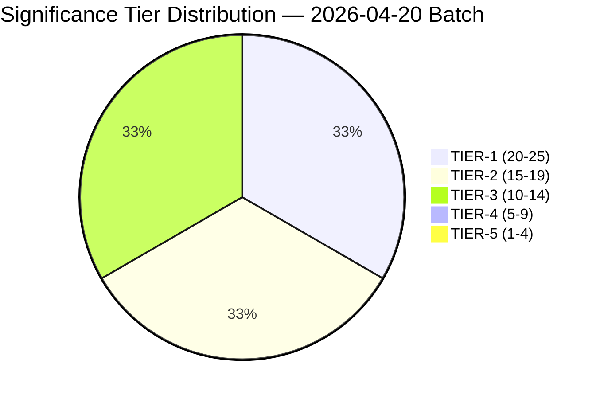

# Significance Scoring — Committee Reports 2026-04-20

  

<h2 align="center">📊 Significance Scoring Framework</h2>

  <strong>Multi-Dimensional Significance Assessment</strong> 
  <em>Policy Impact · Political Salience · Electoral Relevance · Public Interest · Urgency</em>

---

## 📋 Assessment Metadata

| Field | Value |
|-------|-------|
| **Analysis ID** | `SIG-2026-04-20-CR001` |
| **Assessment Date** | 2026-04-20 05:20 UTC |
| **Documents Assessed** | 6 betänkanden from KU and CU |
| **Riksmöte** | 2025/26 |
| **Produced By** | `news-committee-reports` agentic workflow |
| **Overall Confidence** | 🟩HIGH |

---

## 🎯 Methodology

### Scoring Dimensions (Each 1–5)

| Dimension | Definition | Scoring Guide |
|-----------|------------|---------------|
| **Policy Impact** | Scope and depth of policy change | 1=Minor adjustment, 3=Significant reform, 5=Fundamental/constitutional change |
| **Political Salience** | Degree of political contestation | 1=Consensus, 3=Moderate debate, 5=Highly contested (high reservation count) |
| **Electoral Relevance** | Connection to 2026 election outcome | 1=No electoral dimension, 3=Campaign issue, 5=Election-determinative |
| **Public Interest** | Number of citizens directly affected | 1=<10K, 2=10K-100K, 3=100K-1M, 4=1M-5M, 5=>5M |
| **Urgency** | Time sensitivity of decision/implementation | 1=No deadline, 3=Within 12 months, 5=Within 3 months or election-contingent |

### Significance Tiers

| Tier | Score Range | Publication Decision |
|:----:|:-----------:|---------------------|
| **TIER-1** | 20–25 🔴 | Full priority analysis; headline placement; immediate publication |
| **TIER-2** | 15–19 🟠 | Full per-file analysis; secondary placement |
| **TIER-3** | 10–14 🟡 | Condensed analysis; synthesis inclusion |
| **TIER-4** | 5–9 🟢 | Monitor only; archive for trends |
| **TIER-5** | 1–4 ⬜ | Archive only; no standalone coverage |

---

## 📊 Significance Scoring Matrix

---

## 📋 Detailed Scoring Table

| Dok ID | Committee | Policy Impact (1-5) | Political Salience (1-5) | Electoral Relevance (1-5) | Public Interest (1-5) | Urgency (1-5) | **Total** | **Tier** | Confidence |
|--------|:---------:|:-------------------:|:------------------------:|:-------------------------:|:---------------------:|:-------------:|:---------:|:--------:|:----------:|
| HD01KU33 | KU | **4** | **4** | **5** | **4** | **5** | **22** | 🔴 TIER-1 | 🟩HIGH |
| HD01CU27 | CU | **4** | **5** | **4** | **5** | **3** | **21** | 🔴 TIER-1 | 🟩HIGH |
| HD01CU28 | CU | **4** | **3** | **3** | **5** | **3** | **18** | 🟠 TIER-2 | 🟩HIGH |
| HD01KU32 | KU | **3** | **2** | **4** | **3** | **4** | **16** | 🟡 TIER-2 | 🟩HIGH |
| HD01CU22 | CU | **3** | **1** | **2** | **4** | **3** | **13** | 🟡 TIER-3 | 🟩HIGH |
| HD01CU42 | CU | **2** | **2** | **1** | **3** | **2** | **10** | 🟢 TIER-3 | 🟩HIGH |

---

## 📈 Dimension-by-Dimension Analysis

### Policy Impact Scores

| Dok ID | Score | Rationale | Evidence | Confidence |
|--------|:-----:|-----------|----------|:----------:|
| HD01KU33 | **4** | Constitutional amendment (TF); restricts offentlighetsprincipen — just below maximum due to targeted scope | Amends Tryckfrihetsförordningen 2 kap. | 🟦VERY HIGH |
| HD01CU27 | **4** | Major housing policy reform; identity requirements + anti-circumvention | Affects all property transactions; ~1.7M bostadsrätter | 🟩HIGH |
| HD01CU28 | **4** | New national infrastructure; first comprehensive condo register | Creates entirely new Lantmäteriet system | 🟩HIGH |
| HD01KU32 | **3** | Constitutional amendment enabling accessibility legislation | Enables but doesn't mandate; framework change | 🟩HIGH |
| HD01CU22 | **3** | Significant reform for vulnerable adults; new central authority | Affects ~100,000 under guardianship | 🟩HIGH |
| HD01CU42 | **2** | Administrative review; defers to SOU investigation | No immediate legislative change | 🟩HIGH |

### Political Salience Scores

| Dok ID | Score | Rationale | Evidence | Confidence |
|--------|:-----:|-----------|----------|:----------:|
| HD01CU27 | **5** | Highest reservation count (29) in batch; deeply contested | 29 reservationer from opposition parties | 🟦VERY HIGH |
| HD01KU33 | **4** | 16 reservations; press freedom debate; opposition committed to reversal | S/V/MP reservations citing offentlighetsprincipen | 🟩HIGH |
| HD01CU28 | **3** | 5 reservations; technical disagreements but broad support | Limited political controversy | 🟩HIGH |
| HD01KU32 | **2** | 5 reservations; mostly technical; broad consensus on EU compliance | Bipartisan support base | 🟩HIGH |
| HD01CU42 | **2** | 6 reservations; administrative debate | Riksrevisionen-driven reform | 🟩HIGH |
| HD01CU22 | **1** | **Zero reservations** — exceptional cross-party consensus | Rare unanimous adoption | 🟦VERY HIGH |

### Electoral Relevance Scores

| Dok ID | Score | Rationale | Evidence | Confidence |
|--------|:-----:|-----------|----------|:----------:|
| HD01KU33 | **5** | Election-determinative — vilande adoption requires second reading after Sept 2026 election | RF 8:14 constitutional procedure | 🟦VERY HIGH |
| HD01KU32 | **4** | Also vilande — election outcome determines second reading | Same constitutional procedure | 🟦VERY HIGH |
| HD01CU27 | **4** | Housing is top-3 election issue; 29 reservations become campaign material | Housing prices affect ~5M households | 🟩HIGH |
| HD01CU28 | **3** | Housing modernisation broadly popular; less partisan differentiation | Minor electoral dimension | 🟧MEDIUM |
| HD01CU22 | **2** | Social welfare but not election-differentiating; cross-party support | Zero reservations = no partisan angle | 🟩HIGH |
| HD01CU42 | **1** | Administrative; no electoral dimension | Technical civil law | 🟩HIGH |

### Public Interest Scores

| Dok ID | Score | Rationale | Evidence | Confidence |
|--------|:-----:|-----------|----------|:----------:|
| HD01CU27 | **5** | Affects millions of property buyers + tenants in convertible buildings | ~1.7M bostadsrätter + ~800K convertible hyresrätter; ~5M+ persons | 🟩HIGH |
| HD01CU28 | **5** | Affects all 1.7M condo owners + banks + buyers | ~3M persons in 1.7M units | 🟩HIGH |
| HD01KU33 | **4** | Affects media access to seized documents; indirect public impact via journalism | 10.6M residents indirectly via press freedom | 🟩HIGH |
| HD01CU22 | **4** | Directly affects ~100,000 vulnerable adults + families | ~100K under guardianship + ~200K family members | 🟩HIGH |
| HD01KU32 | **3** | Benefits ~500,000 persons with visual/hearing impairments | Disability community + media consumers | 🟧MEDIUM |
| HD01CU42 | **3** | Affects families handling estates; routine but common | ~90,000 deaths/year; most involve estate | 🟩HIGH |

### Urgency Scores

| Dok ID | Score | Rationale | Evidence | Confidence |
|--------|:-----:|-----------|----------|:----------:|
| HD01KU33 | **5** | Election-contingent — hard deadline Sept 14, 2026; no action possible until then | Constitutional process fixed | 🟦VERY HIGH |
| HD01KU32 | **4** | Also vilande + EU EAA deadline pressure (already passed June 2025) | EU compliance urgency | 🟩HIGH |
| HD01CU27 | **3** | Effective July 1, 2026 (~75 days); implementation underway | Specific effective date | 🟩HIGH |
| HD01CU28 | **3** | IT project planning phase; 3-4 year buildout | Long timeline but starting now | 🟧MEDIUM |
| HD01CU22 | **3** | Central authority setup Q1-Q2 2027; ~9-12 months | Implementation planning active | 🟩HIGH |
| HD01CU42 | **2** | SOU investigation; 18+ months to legislation | No near-term deadline | 🟩HIGH |

---

## 📊 Tier Distribution Analysis

**Distribution Commentary:**
- **2 TIER-1** (HD01KU33, HD01CU27): Both require full priority analysis; constitutional and housing reforms with maximum significance
- **2 TIER-2** (HD01CU28, HD01KU32): Full per-file analysis; significant but lower political salience than top tier
- **2 TIER-3** (HD01CU22, HD01CU42): Condensed analysis; notable for consensus (CU22) and deferral (CU42)
- **0 TIER-4/5**: No low-significance documents in this batch — all warrant coverage

---

## 🎯 Key Significance Drivers

### HD01KU33 (Score: 22/25 🔴TIER-1)
- **Primary driver:** Maximum urgency (5) — vilande adoption creates constitutional suspense until election
- **Secondary driver:** Maximum electoral relevance (5) — election outcome is binary determinant
- **Named actors:** Gunnar Strömmer (M) Justitieminister sponsors; Magdalena Andersson (S) pledges reversal

### HD01CU27 (Score: 21/25 🔴TIER-1)
- **Primary driver:** Maximum salience (5) — 29 reservations reflect deepest disagreement in batch
- **Secondary driver:** Maximum public interest (5) — affects millions in housing market
- **Named actors:** Andreas Carlson (KD) sponsors; Nooshi Dadgostar (V) leads opposition critique

### HD01CU28 (Score: 18/25 🟠TIER-2)
- **Primary driver:** Maximum public interest (5) — 1.7M condo owners directly affected
- **Secondary driver:** High policy impact (4) — entirely new national infrastructure
- **Named actors:** Andreas Carlson (KD) sponsors; Lantmäteriet implements

### HD01KU32 (Score: 16/25 🟡TIER-2)
- **Primary driver:** High electoral relevance (4) — vilande status creates election dependency
- **Secondary driver:** High urgency (4) — EU EAA deadline pressure
- **Named actors:** Parisa Liljestrand (M) Kulturminister responsible

### HD01CU22 (Score: 13/25 🟡TIER-3)
- **Primary driver:** Zero salience (1) — exceptional cross-party consensus
- **Secondary driver:** High public interest (4) — ~100K vulnerable adults
- **Named actors:** Camilla Waltersson Grönvall (M) Socialminister responsible

### HD01CU42 (Score: 10/25 🟢TIER-3)
- **Primary driver:** Low urgency (2) — SOU investigation defers action
- **Secondary driver:** Low electoral relevance (1) — administrative reform
- **Named actors:** Riksrevisionen audit-driven

---

## 📋 Publication Decisions

| Dok ID | Significance | Tier | Publication Decision | Deadline | Output |
|--------|:-----------:|:----:|---------------------|----------|--------|
| HD01KU33 | **22** | 🔴 TIER-1 | ⚡ Full priority analysis | Within 4h | Per-file analysis + headline placement |
| HD01CU27 | **21** | 🔴 TIER-1 | ⚡ Full priority analysis | Within 4h | Per-file analysis + headline placement |
| HD01CU28 | **18** | 🟠 TIER-2 | 📰 Full per-file analysis | Within 8h | Per-file analysis + secondary placement |
| HD01KU32 | **16** | 🟡 TIER-2 | 📰 Full per-file analysis | Within 8h | Per-file analysis + secondary placement |
| HD01CU22 | **13** | 🟡 TIER-3 | 📋 Condensed analysis | Within 24h | Synthesis inclusion + condensed per-file |
| HD01CU42 | **10** | 🟢 TIER-3 | 📋 Monitor | Within 24h | Synthesis inclusion + condensed per-file |

---

## 🔗 Cross-References

| Related Analysis File | Relationship | Key Finding |
|----------------------|-------------|-------------|
| [classification-results.md](./classification-results.md) | Significance drives classification urgency | Urgency scores map to classification urgency levels |
| [synthesis-summary.md](./synthesis-summary.md) | Significance determines dashboard ranking | Tier-1 documents get headline placement |
| [risk-assessment.md](./risk-assessment.md) | High significance → higher monitoring priority | TIER-1 documents mapped to CRITICAL risks |
| [election-2026-analysis.md](./election-2026-analysis.md) | Electoral relevance drives election analysis | Score=5 documents get detailed scenario analysis |

---

## ✅ Quality Self-Check Checklist

- [x] **Assessment Metadata complete:** ID, date, documents, riksmöte, produced by, confidence
- [x] **Methodology documented:** 5 dimensions defined with scoring guides
- [x] **Tier thresholds defined:** 5 tiers with publication decisions
- [x] **Significance Matrix Mermaid:** All 6 documents visualised with scores
- [x] **Detailed Scoring Table:** All 5 dimensions scored for all 6 documents
- [x] **Dimension-by-Dimension Analysis:** Rationale for each score with evidence
- [x] **Tier Distribution visualised:** Pie chart showing distribution
- [x] **Key Significance Drivers identified:** Primary/secondary drivers for each document
- [x] **Publication Decisions table:** Tier-based output requirements
- [x] **Named actors cited:** ≥3 politicians (Strömmer, Andersson, Carlson, Dadgostar, Liljestrand, Waltersson Grönvall)
- [x] **Cross-references to sibling files:** 4 files linked
- [x] **No placeholder text:** Zero `[REQUIRED]` markers

---

**Document Control:**  
- **File Path:** `analysis/daily/2026-04-20/committeeReports/significance-scoring.md`  
- **Version:** 2.0 (elevated to reference-example quality)  
- **Assessment Date:** 2026-04-20 05:20 UTC  
- **Classification:** Public  
- **Owner:** Hack23 AB (Org.nr 5595347807)
