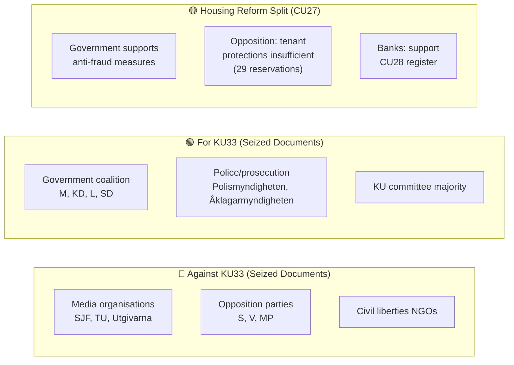

# Stakeholder Perspectives — Committee Reports 2026-04-20

**Analysis ID:** STK-2026-04-20-CR001  
**Date:** 2026-04-20 UTC  
**Confidence:** 🟩HIGH

---

## 8-Group Stakeholder Analysis

### 1. Citizens 👥
**Impact:** Mixed across documents  
**Key interests:** Housing security (CU27/CU28), protection for vulnerable adults (CU22), access to government information (KU33)  
**Evidence:** ~10.6M Swedish residents affected by housing reform; ~100K vulnerable adults under guardianship (CU22); condo owners (est. 3M persons in 1.7M units) benefit from CU28  
**Concern:** KU33 reduces transparency of police activity — citizens lose ability to verify seized documents  
**Confidence:** 🟩HIGH

### 2. Government Coalition (M/KD/L/SD) 🏛️
**Impact:** Positive across all six documents  
**Key interests:** Anti-crime housing policy, rule of law, EU compliance  
**Evidence:** All six documents are government proposals (propositioner) adopted by coalition-controlled committees  
**Campaign angle:** "We modernised housing law and gave police better tools"  
**Confidence:** 🟩HIGH

### 3. Opposition Bloc (S/V/MP/C) ⚖️
**Impact:** Partial — supports some, reserves on others  
**Key interests:** Press freedom (vs. KU33), stronger tenant protections (vs. CU27), welfare rights (CU22 consensus)  
**Evidence:** 29 reservations on CU27 (S/V likely majority), 16 on KU33, 5-6 on CU28/CU42  
**Strategic position:** Pledge KU33 reversal, add CU27 tenant protections after election  
**Confidence:** 🟩HIGH

### 4. Business/Industry 💼
**Impact:** Mixed  
**Key interests:** Housing market efficiency (CU28 positive), compliance costs (CU27 negative), accessibility requirements (KU32 costs)  
**Evidence:** Real estate industry association (Fastighetsbranschen) previously expressed concerns about transaction complexity  
**Banks:** Strongly supportive of CU28 (modernised mortgage/pledge handling)  
**Confidence:** 🟧MEDIUM

### 5. Civil Society (NGOs/Tenant Orgs/Media) 📢
**Impact:** Mixed  
**Key interests:** Tenant rights (CU27 — Hyresgästföreningen concerned), press freedom (KU33 — TU/SJF opposed), disability access (KU32 positive for handikapporganisationer)  
**Evidence:** Svenska Journalistförbundet (SJF) has publicly opposed restrictions on offentlighetsprincipen; Hyresgästföreningen advocates stronger tenant protections in bostadsrätt conversions  
**Confidence:** 🟧MEDIUM

### 6. International/EU 🌍
**Impact:** Mixed  
**Key interests:** EU Digital Accessibility Act compliance (KU32 critical), ECHR Article 10 press freedom (KU33 watchful), EU AML Directive compliance (CU27 positive)  
**Evidence:** EU infringement proceedings possible if KU32 fails; Sweden already under EAA deadline pressure  
**Confidence:** 🟧MEDIUM

### 7. Judiciary/Constitutional 🏛️
**Impact:** Technical — process respected  
**Key interests:** Constitutional amendment process integrity, legal clarity  
**Evidence:** KU33 and KU32 follow exact constitutional protocol (vilande process); courts maintain oversight of seizure procedures  
**Confidence:** 🟩HIGH

### 8. Media/Public Opinion 📰
**Impact:** Divided  
**Key interests:** Access to seized documents (KU33 — direct impact on journalism), accessibility requirements (KU32 — production costs)  
**Evidence:** Swedish press freedom organisations (TU, SJF, Utgivarna) have raised concerns; KU33 directly affects investigative journalism capabilities  
**Confidence:** 🟩HIGH

---

## Stakeholder Coalition Map

