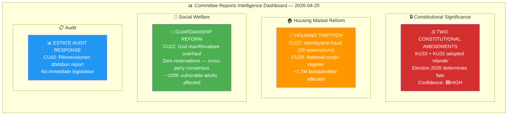
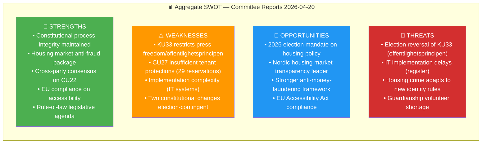

# Political Intelligence Synthesis Summary — Committee Reports

**Synthesis ID:** SYN-2026-04-20-CR001  
**Analysis Date:** 2026-04-20 05:10 UTC  
**Documents Analyzed:** 6  
**Analysis Period:** 2026-04-17 (latest committee decisions, 1 business day lookback)  
**Produced By:** news-committee-reports agentic workflow  
**Overall Confidence:** HIGH  
**Riksmöte:** 2025/26

---

## Data Quality Assessment

| Metric | Value |
|--------|-------|
| Documents with full text (fullContent present) | 5 of 6 |
| Documents with summary only | 1 of 6 (HD01CU22) |
| Documents metadata-only | 0 of 6 |
| Maximum permissible confidence | HIGH |
| Data enrichment method | download-parliamentary-data enrichment (5 docs enriched) |

---

## Intelligence Dashboard

---

## Document Significance Ranking

| Rank | Dok ID | Committee | Title (English) | Score | Significance |
|------|--------|-----------|----------------|-------|-------------|
| 1 | HD01KU33 | KU | Seized Documents Excluded from Public Records | 22/25 | 🔴 HIGH |
| 2 | HD01CU27 | CU | Property Identity Requirements & Anti-circumvention | 21/25 | 🔴 HIGH |
| 3 | HD01CU28 | CU | National Condominium Register | 18/25 | 🟠 HIGH |
| 4 | HD01KU32 | KU | Media Accessibility Requirements (Constitutional) | 16/25 | 🟡 MEDIUM-HIGH |
| 5 | HD01CU22 | CU | Guardianship Reform | 13/25 | 🟡 MEDIUM |
| 6 | HD01CU42 | CU | Estate Handling Audit Response | 10/25 | 🟢 MEDIUM-LOW |

---

## Cross-Document Patterns & Themes

### Theme 1: Constitutional Amendment Dependency on 2026 Election
**🟩HIGH CONFIDENCE** — Both KU33 and KU32 are "vilande" adoptions, meaning they are constitutionally incomplete until the *same* text is voted on again by the next parliament. The September 2026 general election is the decisive moment. If the Tidö coalition (M/KD/L/SD) retains power, both amendments proceed. If a Social Democrat-led coalition wins, they could block the second readings:

- **KU33** (police seizure secrecy): S/V/MP have strong incentives to reverse — offentlighetsprincipen is a Social Democratic core value
- **KU32** (media accessibility): Bipartisan support — reversal risk LOW even if left wins

This is the most significant finding: **two constitutional amendments hang on the 2026 election outcome**.

### Theme 2: Housing Market Reform Package
**🟩HIGH CONFIDENCE** — CU27 and CU28 form a coordinated housing market modernisation:
- CU28 creates the registry infrastructure (national condo register)
- CU27 mandates identity verification for all property transactions

Together these represent Sweden's most significant housing administration reform since the 1990s. The 29 reservations on CU27 indicate deep disagreement about scope — the coalition pushed through a version the opposition considers insufficient in tenant protections.

### Theme 3: Rule of Law & Anti-Crime Focus
**🟩HIGH CONFIDENCE** — Four of six documents address crime prevention, oversight, or rule of law:
- KU33: Police investigative tools
- CU27: Anti-money-laundering in housing
- CU22: Preventing exploitation of vulnerable adults
- CU42: Improving state oversight of estate handling

This is consistent with the Tidö government's security-focused legislative agenda.

---

## Aggregate SWOT

---

## Risk Interconnections

The highest compound risk is the **Constitutional Amendment Chain Risk**:
1. If election produces left-of-centre majority → KU33 second reading blocked
2. This reverses the police seizure exclusion → police investigations more transparent again
3. But it also signals a broader shift on fundamental law reform → KU32 may also be blocked
4. This compounds: EU infringement risk rises for accessibility requirements (KU32)

The **Housing Reform Fragility Risk** is secondary:
- CU27 passes with 29 reservations → opposition may challenge implementation
- CU28 (register) implementation requires 3-5 year IT project → vulnerable to cost overruns and political de-prioritization

---

## Forward Intelligence Calendar

| Date | Event | Relevance | Confidence |
|------|-------|-----------|-----------|
| June 2025–2026 | EU EAA enforcement → Sweden non-compliance in media | KU32 urgency | 🟩HIGH |
| Sept 14, 2026 | **Swedish General Election** | KU33/KU32 second reading fate | 🟦VERY HIGH |
| Oct-Nov 2026 | New parliament formed | Second reading vote window opens | 🟩HIGH |
| Q3 2026 | Lantmäteriet announces CU28 IT project | Register implementation start | 🟧MEDIUM |
| Q4 2026 | CU27 identity requirements effective date | First prosecutions under new rules possible | 🟧MEDIUM |
| Spring 2027 | Riksrevisionen follow-up on CU42 recommendations | Estate administration reform progress | 🟧MEDIUM |

---

## Recommended Titles & Meta Descriptions

**EN Title:** "Sweden's Constitutional Crossroads: Two Fundamental Law Amendments Hang on 2026 Election"  
**EN Alt Title:** "Riksdag Approves Housing Anti-Fraud Package and Police Evidence Secrecy in Constitutional Amendment Wave"  
**EN Meta:** "Sweden's Riksdag adopted two constitutional amendments on seized documents and media accessibility — both contingent on the 2026 election — alongside a landmark national condominium register and identity requirements for property purchases."

**SV Title:** "Riksdagen antar vilande grundlagsändringar — valet 2026 avgör om de träder i kraft"  
**SV Alt:** "Riksdagen inrättar bostadsrättsregister och skärper identitetskrav — men KU33 och KU32 väntar på valutslag"  
**SV Meta:** "Riksdagen har antagit grundlagsändringar om beslagtagna handlingar och medietillgänglighet som vilande — båda kräver nytt riksdagsbeslut efter valet 2026. Dessutom inrättas ett nytt bostadsrättsregister."
