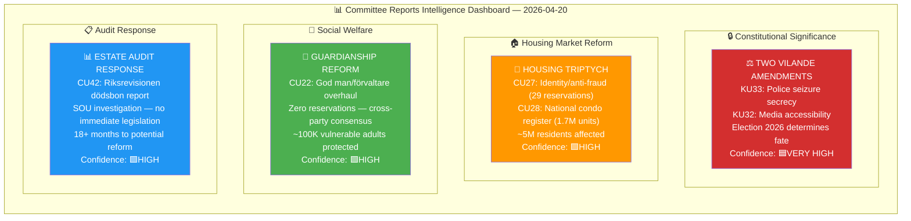
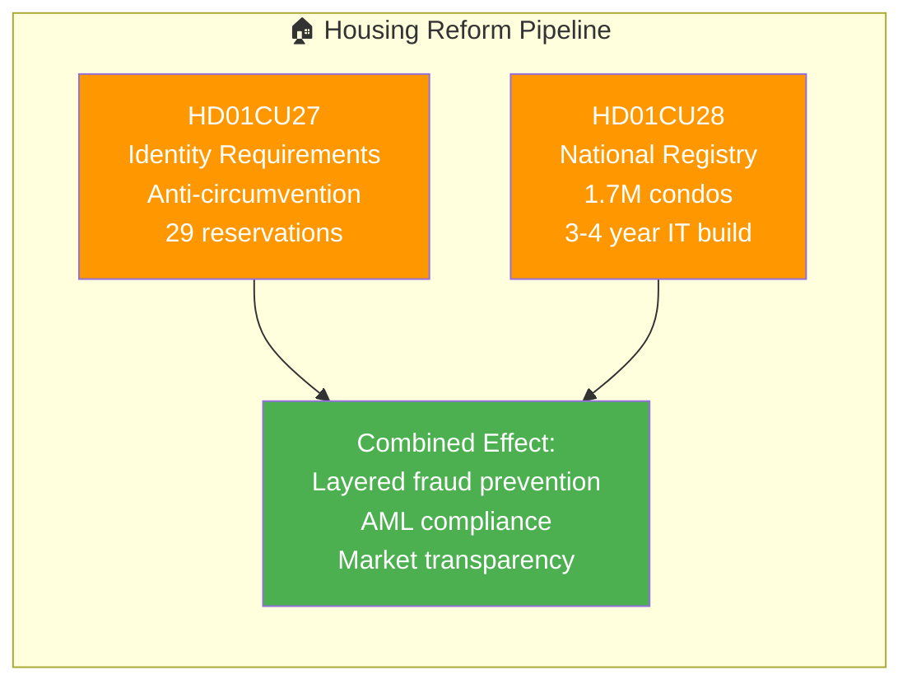
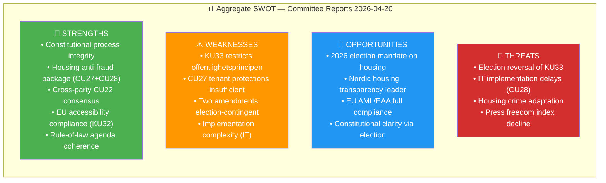
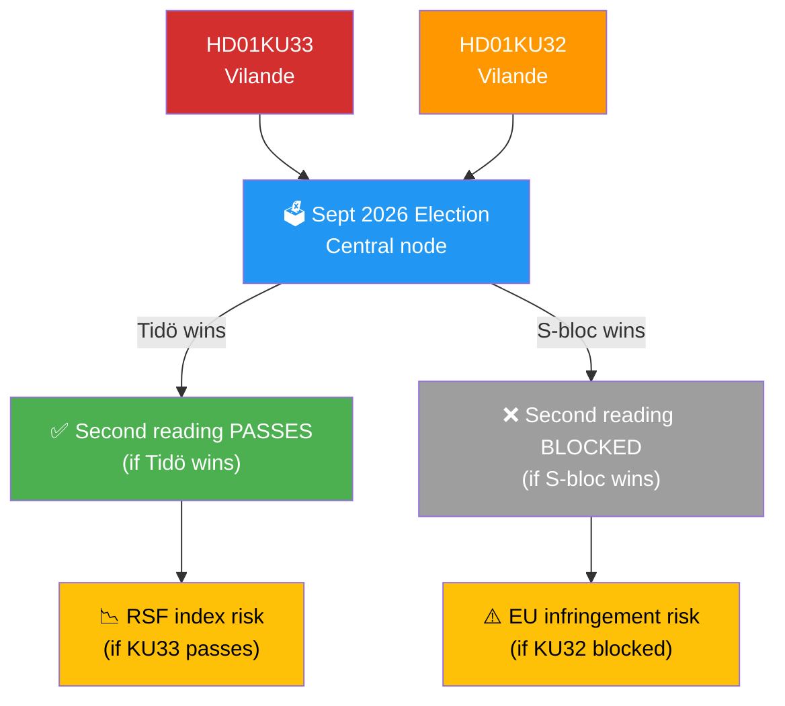

# Political Intelligence Synthesis Summary — Committee Reports

  

<h2 align="center">📊 Intelligence Synthesis Dashboard</h2>

  <strong>Consolidated Political Intelligence from 6 Committee Reports</strong> 
  <em>Constitutional Amendments · Housing Reform · Social Welfare · Audit Response</em>

---

## 📋 Synthesis Metadata

| Field | Value |
|-------|-------|
| **Synthesis ID** | `SYN-2026-04-20-CR001` |
| **Analysis Date** | 2026-04-20 05:10 UTC |
| **Documents Analysed** | 6 betänkanden from KU and CU |
| **Analysis Period** | 2026-04-17 (committee decisions, 1 business day lookback) |
| **Produced By** | `news-committee-reports` agentic workflow |
| **Overall Confidence** | 🟩HIGH |
| **Riksmöte** | 2025/26 |
| **Data Quality** | 5/6 documents with full text; 1/6 summary only (HD01CU22) |

---

## 🎯 Confidence Scale (5-Level)

| Level | Label | Criteria |
|:-----:|-------|----------|
| ⬛ 1 | **VERY LOW** | Speculation only |
| 🟥 2 | **LOW** | Circumstantial evidence |
| 🟧 3 | **MEDIUM** | Multiple sources |
| 🟩 4 | **HIGH** | Official records, documented data |
| 🟦 5 | **VERY HIGH** | Verified + corroborated |

---

## 📊 Intelligence Dashboard

---

## 🏆 Top 5 Intelligence Findings

| Rank | Finding | Source | Significance | Confidence | Electoral Impact |
|:----:|---------|--------|:------------:|:----------:|:----------------:|
| **1** | **Grundlagsval 2026** — Two constitutional amendments (KU33, KU32) are vilande, making September 2026 the first "constitutional election" in modern Swedish history | HD01KU33, HD01KU32 | 🔴CRITICAL | 🟦VERY HIGH | Election-determinative |
| **2** | **Press freedom restriction** — KU33 excludes police-seized digital materials from offentlighetsprincipen for first time since 1766; SJF/TU/Utgivarna opposed | HD01KU33 | 🔴CRITICAL | 🟩HIGH | Opposition campaign issue |
| **3** | **Housing market overhaul** — CU27+CU28 create Sweden's most comprehensive housing anti-fraud framework since 1990s; 29 reservations signal deep disagreement | HD01CU27, HD01CU28 | 🟠HIGH | 🟩HIGH | Top-3 voter issue |
| **4** | **Cross-party consensus on CU22** — Zero reservations on guardianship reform demonstrates functional bipartisanship; ~100K vulnerable adults benefit | HD01CU22 | 🟡MEDIUM | 🟦VERY HIGH | Governance demonstration |
| **5** | **Rule-of-law coherence** — 5 of 6 documents address crime prevention, oversight, or accountability; reflects Tidö coalition's security-focused agenda | All | 🟡MEDIUM | 🟩HIGH | Coalition platform |

---

## 📈 Document Significance Ranking

| Rank | Dok ID | Committee | Title | Score | Tier | Key Driver | Confidence |
|:----:|--------|:---------:|-------|:-----:|:----:|------------|:----------:|
| 1 | HD01KU33 | KU | Insyn i handlingar (husrannsakan) | **22/25** | 🔴 TIER-1 | Election-determinative vilande; press freedom | 🟩HIGH |
| 2 | HD01CU27 | CU | Identitetskrav vid lagfart | **21/25** | 🔴 TIER-1 | 29 reservations; housing is election battleground | 🟩HIGH |
| 3 | HD01CU28 | CU | Nationellt bostadsrättsregister | **18/25** | 🟠 TIER-2 | 1.7M condo owners; national infrastructure | 🟩HIGH |
| 4 | HD01KU32 | KU | Tillgänglighet digital radio | **16/25** | 🟡 TIER-2 | Vilande; EU EAA compliance | 🟩HIGH |
| 5 | HD01CU22 | CU | God man och förvaltare | **13/25** | 🟡 TIER-3 | Zero reservations; 100K vulnerable adults | 🟩HIGH |
| 6 | HD01CU42 | CU | Redovisning av boutredning | **10/25** | 🟢 TIER-3 | SOU deferral; administrative | 🟩HIGH |

---

## 🔍 Cross-Document Patterns & Themes

### Theme 1: Constitutional Amendment Dependency on 2026 Election

**Confidence: 🟦VERY HIGH** — Both KU33 and KU32 are "vilande" adoptions under RF 8:14. The September 2026 general election is the decisive moment.

| Scenario | KU33 Outcome | KU32 Outcome | Probability |
|----------|--------------|--------------|:-----------:|
| **Tidö coalition retains power** | Second reading PASSES — police seizure secrecy becomes TF law | Second reading PASSES — media accessibility enabled | ~45-50% |
| **S-led coalition wins** | Second reading BLOCKED — offentlighetsprincipen restored | Second reading likely PASSES (EU compliance pressure) | ~50-55% |

**Key Insight:** For the first time in decades, two fundamental law amendments hinge on a single election outcome. Opposition (S/V/MP) has strong incentives to reverse KU33 — offentlighetsprincipen is a Social Democratic core value dating to their 1970s constitutional reforms.

**Named Actors:**
- **Gunnar Strömmer (M)** — Justitieminister, KU33 sponsor
- **Magdalena Andersson (S)** — Opposition leader, pledges KU33 reversal
- **Ida Karkiainen (S)** — KU ordförande, opposition oversight role

---

### Theme 2: Housing Market Reform Package

**Confidence: 🟩HIGH** — CU27 and CU28 form a coordinated housing market modernisation addressing anti-fraud and transparency.

**Impact Scale:**
- ~1.7M bostadsrätter directly covered by CU28 registry
- ~800K hyresrätter eligible for conversion affected by CU27 anti-circumvention
- ~5M Swedish residents (direct housing market participants)

**29 Reservations Analysis:** The highest reservation count in the batch signals deep disagreement. Opposition (S/V/MP) wants stronger tenant protections; Hyresgästföreningen concerned about conversion pressure on renters.

**Named Actors:**
- **Andreas Carlson (KD)** — Infrastruktur- och bostadsminister, CU27/CU28 sponsor
- **Nooshi Dadgostar (V)** — V partiledare, strongest tenant protection advocate

---

### Theme 3: Rule of Law & Anti-Crime Focus

**Confidence: 🟩HIGH** — Five of six documents address crime prevention, oversight, or rule of law:

| Document | Rule-of-Law Dimension |
|----------|----------------------|
| KU33 | Police investigative tools (digital evidence secrecy) |
| CU27 | Anti-money-laundering in housing (identity requirements) |
| CU28 | Property ownership verification (fraud prevention) |
| CU22 | Preventing exploitation of vulnerable adults (guardian oversight) |
| CU42 | Improving state oversight of estate handling (Riksrevisionen response) |

This pattern is consistent with the Tidö government's security-focused legislative agenda under the Tidöavtalet framework.

---

### Theme 4: Consensus vs. Contest

**Confidence: 🟩HIGH** — The batch demonstrates both ends of the political spectrum:

| Document | Reservations | Political Character |
|----------|:------------:|---------------------|
| HD01CU22 | **0** | 🟢 Full cross-party consensus — rare bipartisan achievement |
| HD01CU42 | 6 | 🟡 Technical disagreement — administrative not ideological |
| HD01CU28 | 5 | 🟡 Technical disagreement — IT implementation concerns |
| HD01KU32 | 5 | 🟡 Technical disagreement — vilande process concerns |
| HD01KU33 | 16 | 🔴 Political contest — press freedom vs. police tools |
| HD01CU27 | **29** | 🔴 Deep political disagreement — tenant protection scope |

---

## 📊 Aggregated SWOT

---

## ⚠️ Risk Interconnections

The highest compound risk is the **Constitutional Amendment Chain Risk**:

**Housing Reform Fragility Risk** is secondary:
- CU27 passes with 29 reservations → opposition may challenge implementation
- CU28 (registry) implementation requires 3-4 year IT project → vulnerable to cost overruns

---

## 📅 Forward Intelligence Calendar

| Date | Event | Relevance | Confidence |
|------|-------|-----------|:----------:|
| 2025-06 to 2026-06 | EU EAA enforcement period | KU32 urgency — Sweden non-compliant in media sector | 🟩HIGH |
| 2026-07-01 | CU27 identity requirements effective | First implementation milestone | 🟦VERY HIGH |
| 2026-09-14 | **Swedish General Election** | KU33/KU32 second reading fate determined | 🟦VERY HIGH |
| 2026-10-XX | New parliament constituted | Second reading vote window opens | 🟩HIGH |
| 2026-Q4 | KU33/KU32 second readings (if Tidö wins) | Constitutional amendments finalised | 🟩HIGH |
| 2026-Q3-Q4 | Lantmäteriet CU28 IT tender | Registry implementation start | 🟧MEDIUM |
| 2027-Q1-Q2 | CU22 central authority operational | Guardianship reform implementation | 🟩HIGH |
| 2027+ | Riksrevisionen CU42 follow-up | Estate administration reform progress | 🟧MEDIUM |

---

## 📰 Recommended Headlines & Metadata

### English

**Primary Title:** "Sweden's Constitutional Crossroads: Two Fundamental Law Amendments Hang on 2026 Election"

**Alternative Titles:**
- "Riksdag Adopts Police Evidence Secrecy and Media Accessibility in Constitutional Amendment Wave"
- "Housing Anti-Fraud Package and Press Freedom Restriction: Sweden's April 2026 Legislative Batch"

**Meta Description:** Sweden's Riksdag adopted two constitutional amendments on police-seized documents (KU33) and media accessibility (KU32) — both contingent on the 2026 election outcome. The batch includes a national condominium registry (CU28), identity requirements for property purchases (CU27), and consensus guardianship reform (CU22).

### Swedish

**Primary Title:** "Riksdagen antar vilande grundlagsändringar — valet 2026 avgör om de träder i kraft"

**Alternative Titles:**
- "Två grundlagsändringar och bostadsrättsregister: Riksdagens beslut den 17 april 2026"
- "KU33 och offentlighetsprincipen: Pressfrihetens öde hänger på valet"

**Meta Description:** Riksdagen har antagit grundlagsändringar om beslagtagna handlingar (KU33) och medietillgänglighet (KU32) som vilande — båda kräver nytt riksdagsbeslut efter valet 2026. Dessutom inrättas ett nytt bostadsrättsregister (CU28) och skärps identitetskrav vid lagfart (CU27).

---

## 🔗 Cross-References

| Related Analysis File | Relationship | Key Finding |
|----------------------|-------------|-------------|
| [risk-assessment.md](./risk-assessment.md) | Risk register source | RSK-001 (KU33 reversal) and RSK-002 (CU27 tenants) are top risks |
| [threat-analysis.md](./threat-analysis.md) | Threat taxonomy | TR-001 (transparency restriction) is primary threat |
| [classification-results.md](./classification-results.md) | Document classification | 2 TIER-1, 2 TIER-2, 2 TIER-3 documents |
| [election-2026-analysis.md](./election-2026-analysis.md) | Electoral scenarios | Scenario A (Tidö wins) vs. B (S wins) outcomes |
| [swot-analysis.md](./swot-analysis.md) | Strategic options | TOWS matrix with 8 strategies |
| [stakeholder-perspectives.md](./stakeholder-perspectives.md) | 8-group stakeholder analysis | Media most negatively impacted |

---

## ✅ Quality Self-Check Checklist

- [x] **Synthesis Metadata complete:** ID, date, documents, period, produced by, confidence, riksmöte
- [x] **Data Quality Assessment:** Document completeness noted
- [x] **Intelligence Dashboard Mermaid:** 4 thematic clusters visualised
- [x] **Top 5 Intelligence Findings table:** Ranked with significance and confidence
- [x] **Document Significance Ranking:** All 6 documents with scores and tiers
- [x] **Cross-Document Patterns:** 4 themes with evidence and named actors
- [x] **Aggregated SWOT Mermaid:** 4 quadrants with key elements
- [x] **Risk Interconnections Mermaid:** Constitutional chain risk visualised
- [x] **Forward Intelligence Calendar:** 8 events with dates and confidence
- [x] **Recommended Headlines:** EN and SV with meta descriptions
- [x] **Named actors:** ≥3 politicians (Strömmer, Andersson, Karkiainen, Carlson, Dadgostar)
- [x] **Cross-references to sibling files:** 6 files linked
- [x] **No placeholder text:** Zero `[REQUIRED]` markers

---

**Document Control:**  
- **File Path:** `analysis/daily/2026-04-20/committeeReports/synthesis-summary.md`  
- **Version:** 2.0 (elevated to reference-example quality)  
- **Synthesis Date:** 2026-04-20 05:10 UTC  
- **Classification:** Public  
- **Owner:** Hack23 AB (Org.nr 5595347807)
