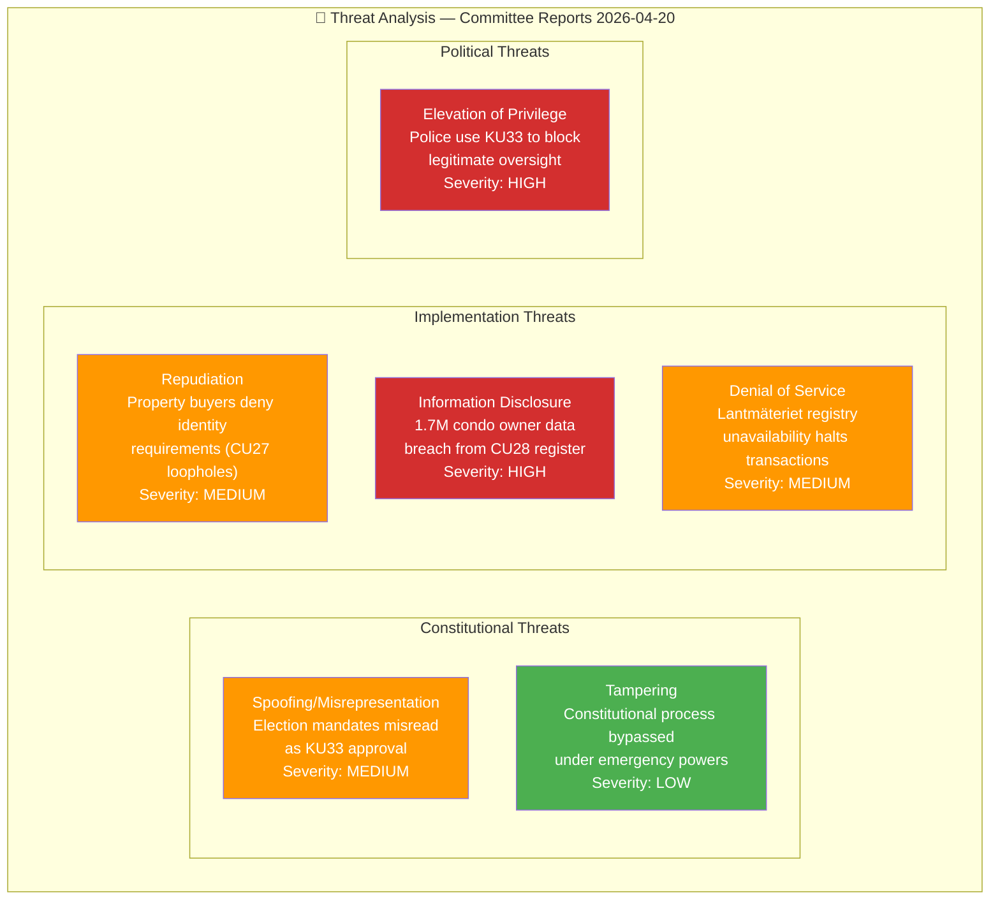

# Threat Analysis — Committee Reports 2026-04-20

**Analysis ID:** THR-2026-04-20-CR001  
**Date:** 2026-04-20 UTC  
**Overall Threat Level:** 🟧 MEDIUM  
**Confidence:** 🟩HIGH

---

## STRIDE Threat Model

## Threat Register

| Threat ID | Type | Description | Source | Severity | Mitigation |
|-----------|------|-------------|--------|----------|-----------|
| THR-001 | Power abuse | Police use KU33 exclusion to shield misconduct investigations | HD01KU33 | 🔴 HIGH | JO (Justitieombudsmannen) oversight; court review of seizures |
| THR-002 | Data breach | National condo register compromised, exposing 1.7M owners | HD01CU28 | 🔴 HIGH | GDPR-compliant register design; Datainspektionen oversight |
| THR-003 | Organized crime adaptation | Money launderers find new routes beyond identity requirements | HD01CU27 | 🟠 MEDIUM | Continuous anti-AML updates; FI (Finansinspektionen) monitoring |
| THR-004 | Volunteer exploitation | Bad actors become "godmän" before CU22 oversight centralises | HD01CU22 | 🟠 MEDIUM | Background check requirements; transition oversight |
| THR-005 | EU penalty | Sweden fined for KU32 non-compliance if election kills second reading | HD01KU32 | 🟡 MEDIUM | Alternative legislative routes identified |

## Overall Threat Assessment

**Dominant threat**: THR-001 (police misconduct shielding via KU33) — MEDIUM likelihood but HIGH severity. Sweden's JO provides key mitigation but this is structurally new territory.

**Data threat**: THR-002 (condo register breach) — implementation-phase risk; requires GDPR privacy-by-design architecture.

**Confidence near HIGH** for constitutional threat assessment based on constitutional law expertise and historical precedent from similar TF amendments.
