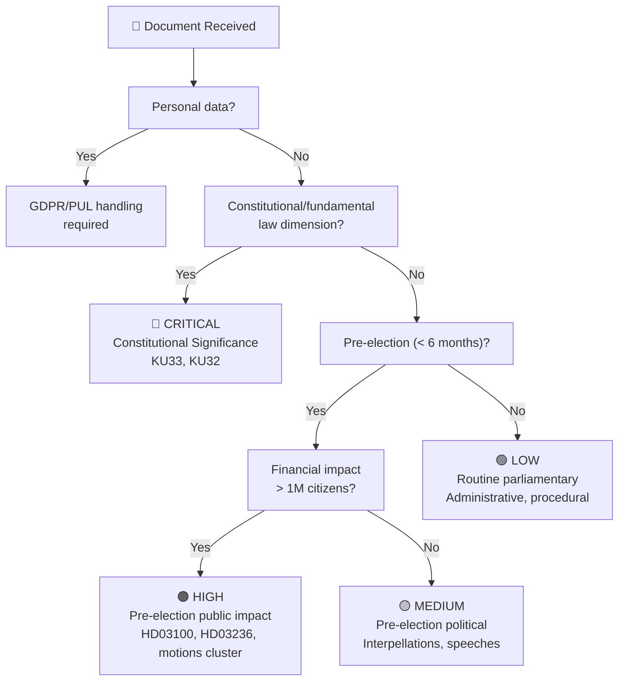
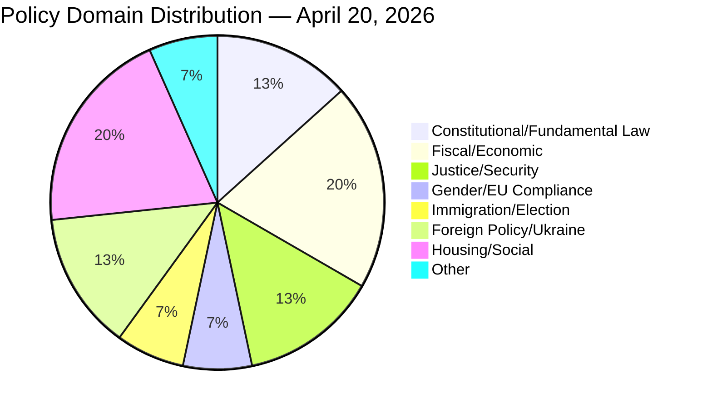

# Classification Results — Evening Analysis 2026-04-20

**Classification ID**: `CLS-2026-04-20-EA001`  
**Classification Date**: 2026-04-20 18:39 UTC  
**Framework**: Political Intelligence Classification — Sensitivity / Domain / Urgency / Significance  
**Confidence**: 🟩 HIGH

---

## Sensitivity Decision Tree

---

## Per-Document Classification Table

| dok_id | Title (abbreviated) | Sensitivity | Domain | Urgency | Significance |
|--------|---------------------|:-----------:|--------|:-------:|:------------:|
| HD01KU33 | Police seizure secrecy amendment (vilande) | 🔴 CRITICAL | Constitutional/Press Freedom | ⚡ IMMEDIATE | 24/25 |
| HD03100 | Spring Economic Bill 2026 | 🔴 CRITICAL | Fiscal Policy/Election | ⚡ IMMEDIATE | 25/25 |
| HD01KU32 | Media accessibility amendment (vilande) | 🔴 CRITICAL | Constitutional/EU Compliance | ⚡ IMMEDIATE | 22/25 |
| frs 2025/26:437 | EU Pay Transparency interpellation | 🟠 HIGH | Gender Policy/EU Compliance | ⚡ IMMEDIATE | 23/25 |
| Opposition motions (21) | Immigration counter-motions S+V+MP+C | 🟠 HIGH | Immigration/Election | ⚡ IMMEDIATE | 23/25 |
| HD03236 | Fuel tax cut amendment budget | 🟠 HIGH | Fiscal/Consumer | ⚡ IMMEDIATE | 22/25 |
| HD03237 | Police authority expansion | 🟠 HIGH | Justice/Security | 🔥 HIGH | 20/25 |
| HD01CU22 | Guardianship (god man/förvaltare) reform | 🟡 MEDIUM | Social Welfare | 🔥 HIGH | 18/25 |
| HD01CU27 | Housing anti-fraud measures | 🟡 MEDIUM | Housing Policy | 📋 STANDARD | 19/25 |
| HD01CU28 | National condominium register | 🟡 MEDIUM | Housing Policy | 📋 STANDARD | 17/25 |
| prop.202526231 | Ukraine aggression tribunal accession | 🟡 MEDIUM | Foreign Policy/Security | 🔥 HIGH | 16/25 |
| prop.202526232 | Ukraine compensation commission | 🟡 MEDIUM | Foreign Policy/Security | 🔥 HIGH | 16/25 |
| frs 2025/26:435 | Bernadotte/Israel interpellation | 🟡 MEDIUM | Diplomatic/Historical | ⚡ IMMEDIATE | 16/25 |
| frs 2025/26:434 | Carlson infrastructure interpellation | 🟡 MEDIUM | Infrastructure/Housing | 🔥 HIGH | 18/25 |
| SOU 2026:27 | Sustainability reporting relaxation | 🟢 LOW | Corporate Governance | 📋 STANDARD | 11/25 |

---

## Domain Classification Summary

---

## Urgency Assessment

| Level | Documents | Rationale |
|-------|-----------|-----------|
| ⚡ IMMEDIATE (< 48h) | KU33, KU32, HD03100, frs 2025/26:437, motions cluster, HD03236, frs 2025/26:435 | Pre-election, constitutional, EU compliance |
| 🔥 HIGH (< 1 week) | prop.202526231/232, frs 2025/26:434, HD01CU22, HD03237 | Policy implementation, accountability hearings |
| 📋 STANDARD (< 1 month) | HD01CU27, HD01CU28, SOU 2026:27 | Administrative, consultative processes |

---

## Publication Decision

**Publish**: ✅ YES — IMMEDIATE  
**Classification Clearance**: All documents sourced from official public Riksdag/Regering records  
**GDPR Status**: No personal data processed beyond public officials in public roles  
**Sensitivity Override**: Constitutional dimension warrants immediate publication in public interest
