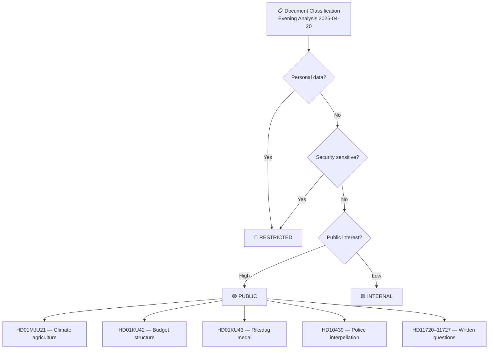

# Classification Results — Evening Analysis 2026-04-20

**CLS ID**: `CLS-2026-04-20-EVE001`
**Analysis Date**: 2026-04-20 17:36 UTC

---

## Sensitivity Decision Tree

---

## Per-Document Classification Table

| Dok ID | Type | Sensitivity | Policy Domain | Urgency | Significance | Publication |
|--------|------|:-----------:|---------------|:-------:|:------------:|:-----------:|
| HD01KU42 | bet (KU) | 🟢 PUBLIC | Constitutional/Fiscal | 🟡 MEDIUM | 🟠 HIGH | PUBLISH |
| HD01KU43 | bet (KU) | 🟢 PUBLIC | Constitutional/Ceremonial | 🟢 LOW | 🟢 LOW | MENTION |
| HD01MJU21 | bet (MJU) | 🟢 PUBLIC | Environment/Agriculture | 🟠 HIGH | 🟠 HIGH | PUBLISH |
| HD10439 | ip (S→M) | 🟢 PUBLIC | Security/Police | 🟠 HIGH | 🟠 HIGH | PUBLISH |
| HD11720 | fr (C→L) | 🟢 PUBLIC | Environment/Industry | 🟢 LOW | 🟢 LOW | CONTEXT |
| HD11721 | fr (C→KD) | 🟢 PUBLIC | Rural Development | 🟢 LOW | 🟢 LOW | CONTEXT |
| HD11722 | fr (S→KD-Infrastructure) | 🟢 PUBLIC | Infrastructure/Civil Society | 🟡 MEDIUM | 🟡 MEDIUM | CONTEXT |
| HD11723 | fr (SD→Industry) | 🟢 PUBLIC | Transport/Technology | 🟢 LOW | 🟢 LOW | CONTEXT |
| HD11724 | fr (S→KD-Infrastructure) | 🟢 PUBLIC | Transport Safety | 🟡 MEDIUM | 🟡 MEDIUM | CONTEXT |
| HD11725 | fr (S→Energy) | 🟢 PUBLIC | Energy/Environment | 🟡 MEDIUM | 🟡 MEDIUM | CONTEXT |
| HD11726 | fr (S→Education) | 🟢 PUBLIC | Constitutional/Education | 🟠 HIGH | 🟡 MEDIUM | INCLUDE |
| HD11727 | fr (S→Justice) | 🟢 PUBLIC | Justice/Administration | 🟡 MEDIUM | 🟢 LOW | CONTEXT |

---

## Domain Classification

| Policy Domain | Documents | Weight | Election Relevance |
|---------------|:---------:|:------:|:-----------------:|
| Environment/Climate | HD01MJU21, HD11720, HD11725 | 🔴 HIGH | 🔴 HIGH |
| Security/Justice/Police | HD10439, HD11727 | 🟠 HIGH | 🟠 HIGH |
| Constitutional | HD01KU42, HD01KU43, HD11726 | 🟠 HIGH | 🟦 VERY HIGH |
| Infrastructure/Transport | HD11722, HD11723, HD11724 | 🟡 MEDIUM | 🟡 MEDIUM |
| Rural/Agriculture/Energy | HD11721, HD11725 | 🟡 MEDIUM | 🟡 MEDIUM |

## Urgency Classification

**Critical (respond within 24h)**: None
**High (respond within 48–72h)**: HD10439, HD01MJU21
**Medium (respond within 7 days)**: HD01KU42, HD11726, HD11722, HD11724, HD11725
**Low (routine response)**: HD01KU43, HD11720, HD11721, HD11723, HD11727
