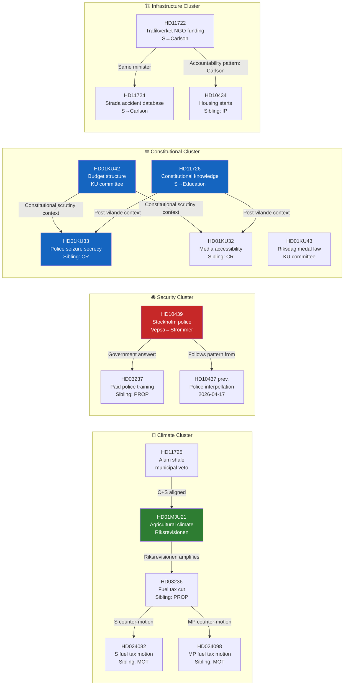

# Cross-Reference Map — Evening Analysis 2026-04-20

**XRF ID**: `XRF-2026-04-20-EVE001`
**Analysis Date**: 2026-04-20 17:39 UTC

---

## Document Relationship Graph

---

## Cross-Reference Table

| This Document | Related Document | Relationship | Source | Type |
|---------------|-----------------|--------------|--------|------|
| HD01MJU21 | HD03236 | MJU21 finding amplifies HD03236 climate hypocrisy | Sibling: PROP | Policy compound |
| HD01MJU21 | HD024082 | S motion (Damberg) cites same climate concern | Sibling: MOT | Opposition alignment |
| HD01MJU21 | HD024098 | MP motion (Alm Ericson) cites same climate concern | Sibling: MOT | Opposition alignment |
| HD10439 | HD03237 | HD03237 is government's structural answer to HD10439 gap | Sibling: PROP | Policy response |
| HD10439 | HD10437 | Previous S police interpellation (April 17); same minister | Sibling: IP | Escalation pattern |
| HD01KU42 | HD03100 | Spring Economic Bill — KU42 debates appropriation structure against which HD03100 operates | Sibling: PROP | Constitutional link |
| HD11726 | HD01KU33 | Constitutional knowledge question directly follows vilande passage of KU33 | Sibling: CR | Temporal link |
| HD11726 | HD01KU32 | Constitutional knowledge question directly follows vilande passage of KU32 | Sibling: CR | Temporal link |
| HD11722 | HD11724 | Both filed by Ödebrink (S), both target Minister Carlson's infrastructure portfolio | Same day | Coordinated questions |
| HD11725 | HD024082 | Alum shale question + S's fuel tax motion = C+S environmental alignment | Sibling: MOT | Coalition rehearsal |

---

## Thematic Clusters

### Cluster A: Climate-Accountability Compound
**Confidence**: 🟩HIGH | **Electoral Weight**: 🔴CRITICAL

Connects: MJU21 (Riksrevisionen) ↔ HD03236 (fuel tax) ↔ MOT024082+98 (S+MP counter-motions) ↔ HD11725 (alum shale)

This cluster represents the most structurally damaging accountability compound for the government. Three independently-sourced challenges to climate credibility, with an independent constitutional body (Riksrevisionen) as the primary anchor.

### Cluster B: Police Security Debate
**Confidence**: 🟩HIGH | **Electoral Weight**: 🔴HIGH

Connects: HD10439 (new IP) ↔ HD10437 (previous IP) ↔ HD03237 (paid training)

The police security debate has been running since April 15. HD10439 adds Stockholm specificity — from "national police numbers" to "where are the police in Stockholm?"

### Cluster C: Constitutional Awareness Chain
**Confidence**: 🟩HIGH | **Electoral Weight**: 🟠HIGH

Connects: KU33+KU32 vilande ↔ KU42 budget scrutiny ↔ HD11726 constitutional knowledge

The constitutional awareness chain creates a coherent pre-election narrative: government is changing the constitution (KU33/KU32), managing the fiscal framework (KU42), but not educating citizens about what the constitution is (HD11726).

### Cluster D: Infrastructure Carlson Accountability
**Confidence**: 🟩HIGH | **Electoral Weight**: 🟠MEDIUM

Connects: HD11722 ↔ HD11724 ↔ IP434 (sibling interpellation on housing starts)

S is maintaining consistent pressure on Infrastructure Minister Carlson across multiple parliamentary instruments. Written questions, interpellations — the approach is multi-layered.
