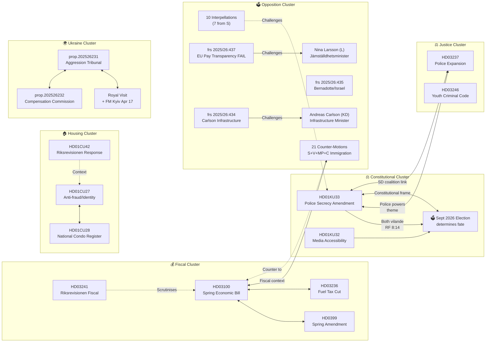

# Cross-Reference Map — Evening Analysis 2026-04-20

**Reference ID**: `XRF-2026-04-20-EA001`  
**Analysis Date**: 2026-04-20 18:40 UTC  
**Scope**: Cross-references across all article types produced today  
**Confidence**: 🟩 HIGH

---

## Document Relationship Graph

---

## Cross-Article Type References

| Source Article | Referenced by Evening | Nature of Link |
|---------------|----------------------|----------------|
| committeeReports/synthesis-summary.md | Evening synthesis | KU33/KU32 constitutional dimension; housing triptych |
| propositions/synthesis-summary.md | Evening synthesis | Spring Economic Bill narrative; pre-election fiscal package |
| interpellations/synthesis-summary.md | Evening synthesis | Gender equality attack; Carlson infrastructure; Bernadotte |
| motions/synthesis-summary.md | Evening synthesis | 21-motion opposition coordination; immigration battleground |

---

## Policy Continuity Chains

| Chain | Documents | Significance |
|-------|-----------|-------------|
| **Fiscal credibility chain** | HD03100 → HD0399 → HD03236 → HD03241 → FiU hearings | Spring Bill establishes macro narrative; Riksrevisionen scrutinises; amendment budgets deliver relief |
| **Constitutional rights chain** | KU33 vilande → Election Sept 2026 → Second reading Q4 2026 → If passes: press freedom restricted | Election literally determines constitutional framework |
| **Opposition accountability chain** | frs 2025/26:434 (Carlson) → frs 2025/26:437 (Larsson) → frs 2025/26:438 (Larsson) → motions cluster | S building systematic multi-minister accountability case |
| **Ukraine solidarity chain** | prop.202526231 → prop.202526232 → Royal visit → NATO credibility | Sweden active ally; justice/accountability framework |
| **Gender equality failure chain** | frs 2025/26:437 → EU directive withdrawal → infringement risk → Larsson exposed | EU law + political accountability combine |

---

## Citation Table (Sibling Workflows)

| dok_id | Analyzed in | Used in Evening | Cross-reference value |
|--------|------------|-----------------|----------------------|
| HD01KU33 | committeeReports | YES | Highest significance; constitutional election |
| HD01KU32 | committeeReports | YES | EU compliance + constitutional |
| HD03100 | propositions | YES | Electoral anchor; fiscal credibility |
| HD03236 | propositions | YES | Fuel tax cut; electoral relief timing |
| frs 2025/26:437 | interpellations | YES | EU Pay Transparency failure |
| frs 2025/26:435 | interpellations | YES | Bernadotte; April 30 deadline |
| frs 2025/26:434 | interpellations | YES | Carlson accountability |
| 21 motions | motions | YES | Opposition coordination |
