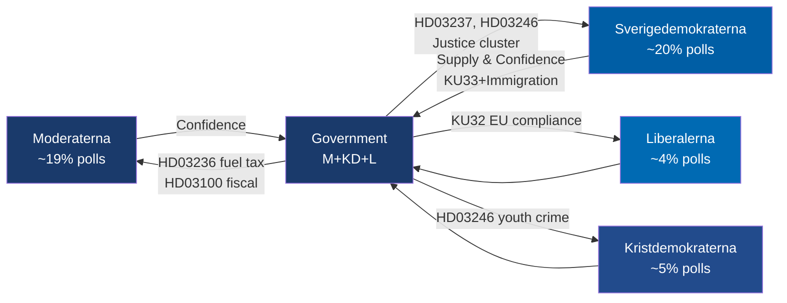

# Risk Assessment — Evening Analysis 2026-04-20

**Risk Assessment ID**: `RSK-2026-04-20-EA001`  
**Assessment Date**: 2026-04-20 18:37 UTC  
**Overall Risk Level**: 🔴 HIGH  
**Context**: Tidökoalitionen (M+KD+L, SD supply-and-confidence) — 146 days to election  
**Confidence**: 🟩 HIGH

---

## Risk Heat Map

```mermaid
quadrantChart
    title Risk Heat Map — Swedish Political Landscape April 20, 2026
    x-axis Low Likelihood --> High Likelihood
    y-axis Low Impact --> High Impact
    quadrant-1 Critical: Act Now
    quadrant-2 High: Monitor
    quadrant-3 Low: Accept
    quadrant-4 Medium: Watch
    "EU Pay Transparency infringement": [0.65, 0.72]
    "GDP misses 2026 forecast": [0.55, 0.85]
    "Opposition wins election": [0.48, 0.95]
    "KU33 press freedom campaign": [0.75, 0.68]
    "Carlson infrastructure motion": [0.80, 0.52]
    "Hormuz crisis energy disruption": [0.30, 0.75]
    "Riksrevisionen adverse HD03241": [0.40, 0.70]
    "Bernadotte diplomatic incident": [0.55, 0.50]
```

---

## Risk Register

| # | Risk | Likelihood (1-5) | Impact (1-5) | L×I Score | Category | Timeline |
|---|------|:----------------:|:------------:|:---------:|----------|---------|
| R1 | **GDP growth misses Spring Bill projection** — Sweden's +0.82% 2024 growth and –0.20% 2023 contraction create high risk that 2026 forecast of 1.8–2.2% is unattainable; fiscal credibility collapse before election | 4 | 5 | **20** | Economic | Q2 2026 |
| R2 | **Opposition wins Sept 13 election; KU33 blocked** — Polling at ~47-49% coalition vs ~48-52% opposition; if opposition wins, KU33 (police secrecy amendment) fails second reading; constitutional status quo on press freedom restored | 4 | 5 | **20** | Constitutional/Electoral | Sept 2026 |
| R3 | **EU infringement proceedings — Pay Transparency** — Government withdrawal of implementation bill (frs 2025/26:437) creates near-certain EU compliance gap; Commission infringement letter expected Q3–Q4 2026 | 3 | 4 | **12** | EU/Legal | Q3–Q4 2026 |
| R4 | **KU33 press freedom campaign dominates** — SJF (Svenska Journalistförbundet) and Utgivarna (Publishers Association) have publicly opposed KU33; media organizations self-interest creates amplified hostile coverage | 4 | 4 | **16** | Reputational | Ongoing |
| R5 | **Infrastructure failure narrative consolidates** — Carlson's 6th+ interpellation; housing starts –900 units; airports, rail, defense logistics all documented; S "infrastructure failure" becomes dominant frame | 4 | 3 | **12** | Political/Narrative | 3 months |
| R6 | **Hormuz crisis — energy supply disruption** — PM participated in Hormuz Summit; if strait closes, Sweden's LNG imports disrupted; energy security proposition package (HD03239/240) becomes crisis management rather than election asset | 2 | 4 | **8** | Geopolitical | Ongoing |
| R7 | **Riksrevisionen adverse finding on HD03241** — Riksrevisionen's fiscal framework report (HD03241) published alongside HD03100; historically Riksrevisionen issues critical findings on government fiscal assumptions | 3 | 4 | **12** | Institutional | Q2 2026 |
| R8 | **Bernadotte interpellation diplomatic escalation** — El-Haj (independent) demands Israel apologise for 1948 assassination; Malmer Stenergard must respond by April 30; diplomatic positioning could alienate Jewish community or human rights advocates | 3 | 3 | **9** | Diplomatic | April 30, 2026 |

---

## Coalition Stability Risk



**Coalition Stability Assessment**: STABLE in the SHORT-TERM but FRAGILE for Election 2026.  
- SD's core demands (KU33, HD03237, HD03246) are being delivered — immediate defection risk LOW `[HIGH]`
- L's EU/rights exposure (KU33, Pay Transparency) creates internal tension but not exit-level `[MEDIUM]`
- Probability of coalition reaching election intact: **85%** `[MEDIUM]`

---

## Forward-Looking Risk Indicators

| Signal | Watch For | Threshold | Action Trigger |
|--------|-----------|-----------|----------------|
| FiU Spring Bill hearing | Critical testimony on growth projections | GDP forecast downgrade >0.5% | CRITICAL — Commission credibility collapse |
| EU Commission correspondence | Formal notice on Pay Transparency | Letter to Sweden | HIGH — infringement timeline starts |
| Malmer Stenergard April 30 | Bernadotte interpellation response | Diplomatic language on Israel | MEDIUM — media amplification |
| Housing starts data | Monthly Länsstyrelsen report | -1000+ units vs. 2025 | HIGH — Carlson narrative reaches critical mass |
| Opposition polling | April/May polls | Opposition bloc >54% | CRITICAL — election risk crosses threshold |
