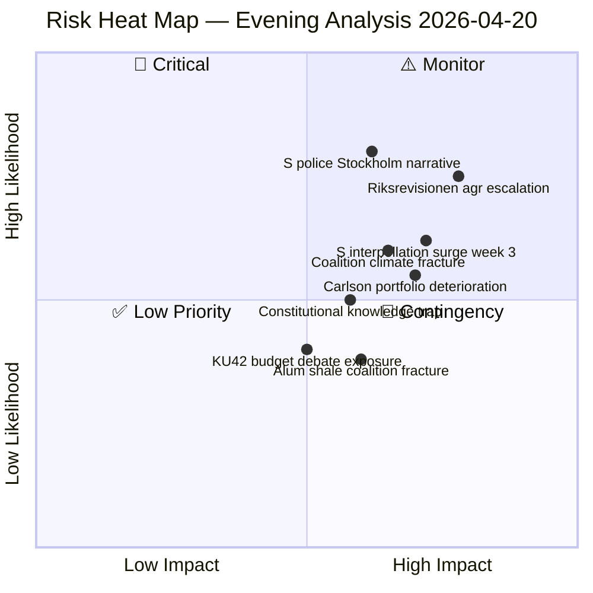
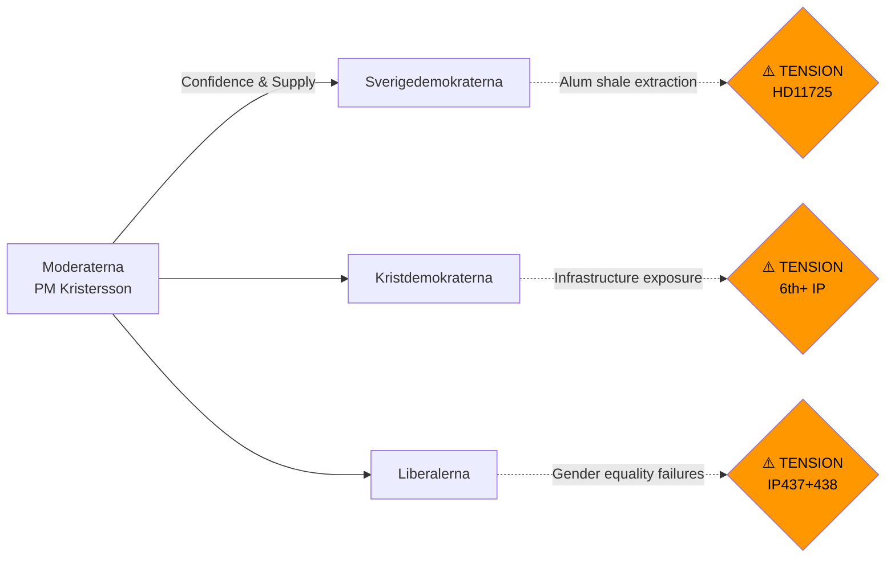

# Risk Assessment — Evening Analysis 2026-04-20

**RSK ID**: `RSK-2026-04-20-EVE001`
**Analysis Date**: 2026-04-20 17:34 UTC
**Risk Framework**: Likelihood × Impact (L×I scoring, 0.1–5.0)

---

## Risk Heat Map

---

## Risk Register

### Risk 1: Riksrevisionen Agricultural Climate Finding Escalation
**Risk ID**: RSK-EA-001
**Category**: Policy/Regulatory
**Source**: HD01MJU21 (MJU21 committee report)

| Attribute | Value |
|-----------|-------|
| **Likelihood** | 0.55 (MEDIUM) |
| **Impact** | 4 (HIGH — national climate commitment credibility) |
| **L×I Score** | **2.2** |
| **Confidence** | 🟩 HIGH |
| **Velocity** | Medium-Fast (Riksrevisionen findings typically trigger 2–3 parliamentary follow-ups) |

**Description**: Riksrevisionen's MJU21 report documents that Sweden's state efforts for agricultural climate transition are insufficient. Agriculture represents ~14% of Sweden's domestic GHG emissions. If Klimatpolitiska rådet (the independent climate policy council) issues a follow-up comment — which it does routinely for Riksrevisionen findings — the damage to government's climate credibility will be officially compounded. Combined with the fuel tax cut (HD03236, adding +0.3–0.5 MtCO₂e), Sweden faces a two-front climate accountability challenge.

**Mitigation**: Announce an agricultural climate action plan (SOU or government consultation) within 30 days. This would transform the Riksrevisionen finding from a liability into a demonstrated government responsiveness.

---

### Risk 2: S Stockholm Police Narrative Gains Media Traction
**Risk ID**: RSK-EA-002
**Category**: Political/Reputational
**Source**: HD10439 (interpellation by Mattias Vepsä, S → Gunnar Strömmer, M)

| Attribute | Value |
|-----------|-------|
| **Likelihood** | 0.60 (MEDIUM-HIGH) |
| **Impact** | 3 (MEDIUM — damages "law and order" government credibility) |
| **L×I Score** | **1.8** |
| **Confidence** | 🟩 HIGH |
| **Velocity** | Fast (Stockholm media will amplify if Strömmer response is weak) |

**Description**: S's Mattias Vepsä targets Justice Minister Strömmer on the BRÅ evaluation of the 10,000-police-officer goal. The BRÅ confirmed the numerical target was met — but Vepsä's framing focuses on Stockholm-specific distribution and quality concerns. The government's most defensible position (met the headline number) is also its most vulnerable: it invites the question "why are Stockholm residents still experiencing police shortages?" The new paid-training proposition (HD03237) is the government's structural answer — but HD03237 won't produce trained officers until 2028 at earliest.

**Mitigation**: Strömmer should cite HD03237 proactively in HD10439 response, present Stockholm deployment data, and announce regional allocation review.

---

### Risk 3: S Interpellation Surge Week 3 (Late April)
**Risk ID**: RSK-EA-003
**Category**: Political/Parliamentary
**Source**: Pattern analysis — motions (21 in 6 days), interpellations (7 in 6 days), questions (8 today)

| Attribute | Value |
|-----------|-------|
| **Likelihood** | 0.62 (MEDIUM-HIGH) |
| **Impact** | 3 (MEDIUM — parliamentary bandwidth pressure) |
| **L×I Score** | **1.86** |
| **Confidence** | 🟩 HIGH |
| **Velocity** | Fast (already accelerating) |

**Description**: S is filing at ~50% above its session average pace. The documented pattern in the interpellation analysis (April 14–17: 7 new S interpellations) plus today's 8 written questions suggests the party is in a high-output pre-election documentation phase. With the Riksdag approaching its final sessions before summer recess, each question/interpellation locks in ministerial response records. A week-3 surge (late April) could include 3–5 new interpellations targeting Carlson, Strömmer, Larsson, and potentially Prime Minister Kristersson directly.

**Mitigation**: Government communications team should triage incoming questions, prepare comprehensive responses for the most politically salient topics, and consider proactive press conference preemption on key portfolios.

---

### Risk 4: Coalition Energy/Environment Fracture on Alum Shale
**Risk ID**: RSK-EA-004
**Category**: Coalition Stability
**Source**: HD11725 (question on municipal veto on alum shale mining)

| Attribute | Value |
|-----------|-------|
| **Likelihood** | 0.30 (LOW-MEDIUM) |
| **Impact** | 3 (MEDIUM — exposes Tidö coalition environmental limits) |
| **L×I Score** | **0.9** |
| **Confidence** | 🟧 MEDIUM |
| **Velocity** | Slow (depends on government response to HD11725 and broader mining policy debate) |

**Description**: Centerpartiet (C) and S are aligned on municipal veto rights for alum shale extraction. SD is presumed to support mineral extraction for economic reasons. This creates a potential C-vs-SD tension within the Tidö coalition framework. While alum shale is not a first-tier election issue, it is a microcosm of the broader environmental tension that could widen.

---

### Risk 5: Constitutional Knowledge Trap (HD11726)
**Risk ID**: RSK-EA-005
**Category**: Reputational/Institutional
**Source**: HD11726 (question on Kunskap om grundlagarna by Eva Lindh, S → Education Minister Mohammso)

| Attribute | Value |
|-----------|-------|
| **Likelihood** | 0.40 (LOW-MEDIUM) |
| **Impact** | 3 (MEDIUM — damages constitutional reform credibility) |
| **L×I Score** | **1.2** |
| **Confidence** | 🟧 MEDIUM |
| **Velocity** | Medium (answer expected within 14 days) |

**Description**: S's Eva Lindh asks what the government is doing to improve citizen knowledge of the Swedish constitution — timed precisely one week after the Riksdag adopted two vilande constitutional amendments (KU33 on police seizure secrecy and KU32 on media accessibility). If the Education Ministry's answer is weak or non-committal, it will be used to argue the government is changing the constitution without adequately informing citizens — a powerful democratic accountability argument.

---

## Coalition Stability Risk Assessment

**Overall Coalition Stability Score**: 6.8/10 (moderate, trending cautiously lower)
**Key Vulnerability**: KD (Andreas Carlson infrastructure portfolio) and L (Nina Larsson gender equality portfolio)
**Confidence**: 🟩HIGH
