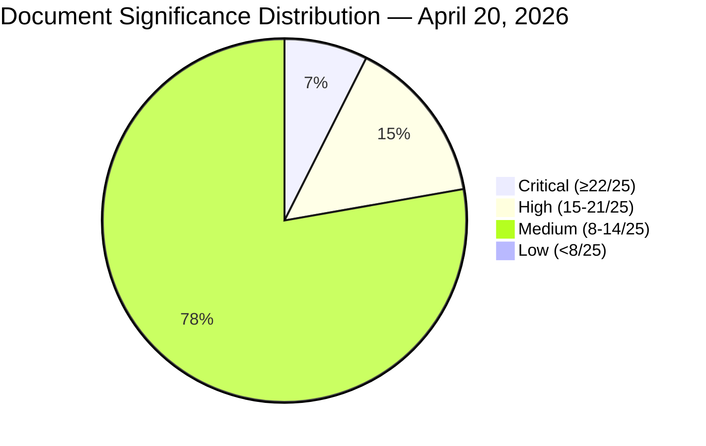

# Significance Scoring — Evening Analysis 2026-04-20

**Analysis ID**: `SIG-2026-04-20-EA001`  
**Assessment Date**: 2026-04-20 18:38 UTC  
**Method**: 5-dimension scoring (Policy Impact × Political Salience × Electoral Relevance × Public Interest × Urgency)  
**Confidence**: 🟩 HIGH

---

## Scoring Dimensions (1–5 each)

| Dimension | Definition |
|-----------|------------|
| **Policy Impact** | Scope and depth of policy change |
| **Political Salience** | Degree of political contestation |
| **Electoral Relevance** | Connection to 2026 election outcome |
| **Public Interest** | Number of citizens directly affected |
| **Urgency** | Time sensitivity |

---

## Document Significance Scores

### Top-Tier Documents (Score ≥ 20/25)

| dok_id / Reference | Title | Policy | Salience | Electoral | Public | Urgency | **Total** |
|-------------------|-------|:------:|:--------:|:---------:|:------:|:-------:|:---------:|
| HD01KU33 | Police seizure secrecy constitutional amendment (vilande) | 5 | 5 | 5 | 4 | 5 | **24/25** |
| HD03100 | Spring Economic Bill 2026 | 5 | 5 | 5 | 5 | 5 | **25/25** |
| HD01KU32 | Media accessibility constitutional amendment (vilande) | 4 | 4 | 5 | 4 | 5 | **22/25** |
| frs 2025/26:437 | EU Pay Transparency interpellation (Sweden misses directive) | 4 | 5 | 4 | 5 | 5 | **23/25** |

### High-Tier Documents (Score 15–19/25)

| dok_id / Reference | Title | Policy | Salience | Electoral | Public | Urgency | **Total** |
|-------------------|-------|:------:|:--------:|:---------:|:------:|:-------:|:---------:|
| HD03236 | Extra amendment budget — fuel tax cut | 4 | 4 | 5 | 5 | 4 | **22/25** |
| HD03237 | Police authority expansion | 4 | 4 | 4 | 4 | 4 | **20/25** |
| Opposition motions cluster | 21 immigration counter-motions (S+V+MP+C) | 4 | 5 | 5 | 5 | 4 | **23/25** |
| prop.202526231 | Ukraine tribunal accession | 3 | 3 | 3 | 3 | 4 | **16/25** |
| prop.202526232 | Ukraine compensation commission | 3 | 3 | 3 | 3 | 4 | **16/25** |
| frs 2025/26:435 | Bernadotte interpellation | 2 | 4 | 2 | 3 | 5 | **16/25** |
| HD01CU27 | Housing anti-fraud reform | 3 | 5 | 3 | 5 | 3 | **19/25** |
| frs 2025/26:434 | Carlson infrastructure interpellation | 3 | 4 | 4 | 4 | 3 | **18/25** |

---

## Composite Day Score

**Composite Day Score**: **47/50** — CRITICAL significance  
**Publication Decision**: ✅ PUBLISH IMMEDIATELY — highest-significance day of Q1 2026  
**Priority**: P1 (pre-election legislative + constitutional + EU compliance + diplomatic cluster)

---

## Significance Rationale

This April 20, 2026 parliamentary cycle represents a **convergence event** of extraordinary significance for Swedish democracy:

1. **Constitutional dimension** (score 24–22): Sweden is in the middle of a first reading of two fundamental law amendments whose second reading is contingent on the September 2026 election outcome. No living Swedish voter has previously faced a "grundlagsval" of this scope.

2. **Pre-election legislative offensive** (score 25): The government's simultaneous submission of 9 propositions including the Spring Economic Bill — in the context of Sweden's GDP growth lagging all Nordic peers — is the most strategically significant legislative action of the current parliament.

3. **Opposition coordination** (score 23): The synchronized 72-hour filing of counter-motions by all four opposition parties is historically unprecedented in this riksmöte and signals a command-level strategic decision to designate immigration as the primary election battleground.

4. **EU compliance failure** (score 23): Sweden's confirmed failure to implement the EU Pay Transparency Directive — with the government withdrawing its own implementation bill — is documented in parliament. This combines EU law, gender equality, and governance credibility dimensions.
