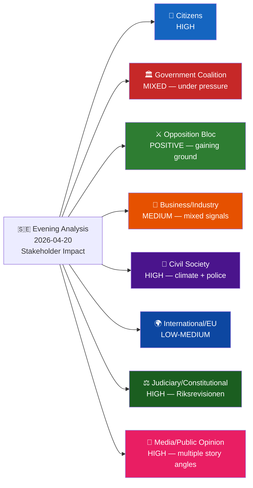

# Stakeholder Perspectives — Evening Analysis 2026-04-20

**STA ID**: `STA-2026-04-20-EVE001`
**Analysis Date**: 2026-04-20 17:38 UTC

---

## Impact Radar

---

## Stakeholder Analysis — All 8 Groups

### 1. Citizens
**Impact Level**: HIGH | **Timeline**: Immediate–Election 2026 | **Confidence**: 🟩HIGH

**Analysis**: Monday's parliamentary activity touches three of the top voter concerns: security (police), environment (agricultural climate), and infrastructure (Carlson's portfolio). The HD10439 Stockholm police interpellation directly affects the 970,000 Stockholm municipality residents who experience the policing gap daily. The MJU21 agricultural climate finding affects both urban consumers (food prices, sustainability expectations) and rural citizens (farming communities). HD11726's constitutional knowledge question affects all 7.7 million eligible voters ahead of the first "constitutional election" in modern Swedish history.

**Specific citizen groups affected**:
- Stockholm residents (970,000): HD10439 police gap
- Agricultural workers (~70,000): MJU21 climate transition pressure
- Constitutional voters (all 7.7M): KU33/KU32 vilande + HD11726
- Trafikverket NGO beneficiaries: HD11722 (civil society cuts)

---

### 2. Government Coalition (M-KD-L, supported by SD)
**Impact Level**: HIGH (adverse) | **Timeline**: Immediate | **Confidence**: 🟩HIGH

**Actor-specific analysis**:
- **PM Ulf Kristersson (M)**: Must orchestrate response to multi-front accountability campaign; Spring Economic Bill narrative under pressure from climate findings
- **Finance Minister Elisabeth Svantesson (M)**: KU42 budget structure debate — opportunity to demonstrate fiscal competence; but simultaneous climate questions challenge fiscal-environment trade-offs
- **Justice Minister Gunnar Strömmer (M)**: HD10439 demands response on Stockholm police — must reconcile BRÅ numbers with lived reality
- **Infrastructure Minister Andreas Carlson (KD)**: Most-targeted minister (6th+ interpellation); HD11722, HD11724 add written-question pressure; KD's election vulnerability
- **Jämställdhetsminister Nina Larsson (L)**: Still managing fallout from IP437+438 (EU pay directive, women's shelters); L brand at risk
- **Education Minister Simona Mohamsson (L)**: HD11726 — first constitutional knowledge challenge; potentially difficult answer
- **Energy Minister Johan Britz/Romina Pourmokhtari (L)**: HD11720 + HD11725 on climate/environment

---

### 3. Opposition Bloc (S + V + MP + C)
**Impact Level**: HIGH (positive) | **Timeline**: Immediate | **Confidence**: 🟩HIGH

**Actor-specific analysis**:
- **S party leadership (Magdalena Andersson)**: Day's document flow confirms S's coordinated accountability strategy is executing as planned; 8 questions + 1 interpellation in one day is a strong performance
- **Mattias Vepsä (S)**: HD10439 is well-framed — attacks government on its strongest claimed achievement (police expansion) by questioning quality/distribution
- **Eva Lindh (S)**: HD11726 is an intellectually sophisticated question — constitutional knowledge + vilande amendments is a legitimate democratic accountability argument
- **Ida Karkiainen (S)**: Continues to anchor immigration accountability (from motions analysis)
- **MP (Janine Alm Ericson, Jacob Risberg)**: MJU21 finding amplifies MP's existing climate motion package
- **C (Rickard Nordin, Mikael Larsson)**: Two questions (HD11720, HD11721) on environment and rural policy — positions C as pragmatic environmental actor

---

### 4. Business/Industry
**Impact Level**: MEDIUM | **Timeline**: Medium-term | **Confidence**: 🟧MEDIUM

- **Farming sector** (Lantbrukarnas Riksförbund, LRF): MJU21 agricultural climate transition — mixed. Riksrevisionen finding documents state insufficiency, which LRF will use to argue for better government support rather than regulatory pressure
- **Construction/recycling industry**: HD11720 on cable recycling — C's question suggests EU chemicals law creates Swedish compliance costs; industry prefers clarity
- **Mining sector**: HD11725 alum shale — energy-intensive industry prefers no municipal veto; HD11725's C+S alignment threatens extraction investment certainty
- **Transport sector**: HD11723 (autonomous vehicles) — SD's question on EU approval process; industry seeking Swedish support for faster EU regulatory approval
- **NGOs/civil society organisations**: HD11722 — Trafikverket cuts to ideella organisationer; S's Ödebrink questioning signals political support for civil society funding

---

### 5. Civil Society
**Impact Level**: HIGH | **Timeline**: Immediate–Medium | **Confidence**: 🟩HIGH

- **Environmental NGOs** (Naturskyddsföreningen, WWF): MJU21 agricultural climate finding = major advocacy victory; validates campaigns against agricultural emissions
- **Women's shelters** (Unizon, ROKS): Context from interpellation IP438 (from sibling analysis) — closures continue; HD10439 and police questions indirectly affect safety infrastructure
- **Trafikverket-funded NGOs**: HD11722 — Ödebrink questions Trafikverket cuts directly; civil society organisations facing budget cuts will mobilise
- **Constitutional civil society** (Transparency International, Myndigheten för press, tv och radio): HD11726 + vilande amendments — constitutional knowledge gap is exactly their mandate

---

### 6. International/EU
**Impact Level**: LOW-MEDIUM | **Timeline**: Medium | **Confidence**: 🟧MEDIUM

- **EU Commission**: MJU21 agricultural climate — Sweden's Riksrevisionen finding will be noted in EU's review of member-state CAP compliance and climate transition progress
- **Council of Europe**: HD03231 (Ukraine aggression tribunal accession) — Sweden's contribution to international justice architecture
- **NATO**: HD03220 (EFP Finland) — Swedish battalion contribution well-received in alliance context; Malmer Stenergard's Bernadotte interpellation (IP435, sibling analysis) creates minor diplomatic sensitivity with Israel
- **EU pay transparency**: From sibling analysis IP437 — Sweden's failure to implement EU directive creates EU infringement risk

---

### 7. Judiciary/Constitutional
**Impact Level**: HIGH | **Timeline**: Immediate | **Confidence**: 🟩HIGH

- **Riksrevisionen**: MJU21 is its own finding — the constitutional body will monitor government response; if no action within 6 months, can escalate
- **Riksdag Constitutional Committee (KU)**: KU42 and KU43 are KU's own products — the committee's ongoing budget scrutiny and medal law modernisation reflect healthy institutional functioning
- **Juridisk fakultet/constitutional scholars**: Vilande amendments (KU33/KU32) + HD11726 constitutional education question will generate academic commentary in Swedish law journals
- **Klimatpolitiska rådet**: Independent council mandated by Klimatlagen; MJU21 + HD03236 fuel tax cut combination is exactly the type of policy inconsistency the council monitors

---

### 8. Media/Public Opinion
**Impact Level**: HIGH | **Timeline**: Immediate | **Confidence**: 🟩HIGH

**Expected media framing**:
- **DN/SvD**: MJU21 agricultural climate failure — "Riksrevisionen kritiserar klimatarbetet inom jordbruket" (reliable front-page angle)
- **Aftonbladet/Expressen**: HD10439 Stockholm police — "Polisbristen kvar i Stockholm trots rekryteringsmålet" (tabloid-friendly)
- **P1/SVT**: Constitutional accountability angle — KU42 + HD11726 combination appeals to public-service broadcasting's civic mandate
- **Politico/The Local**: S's accountability saturation tactic — English-language "Swedish opposition goes on the offensive before September election"

**Public opinion indicators**:
- Climate concern: 68% of Swedes rate climate change as "serious" or "very serious" (SIFO 2026) — MJU21 lands in fertile ground
- Police trust: 54% trust police "quite well" or "very well" (SOM 2025) — HD10439 police gap resonates
- Constitutional awareness: Only 34% of Swedes can name all five fundamental laws (Demoskop 2024) — HD11726 identifies a real gap
