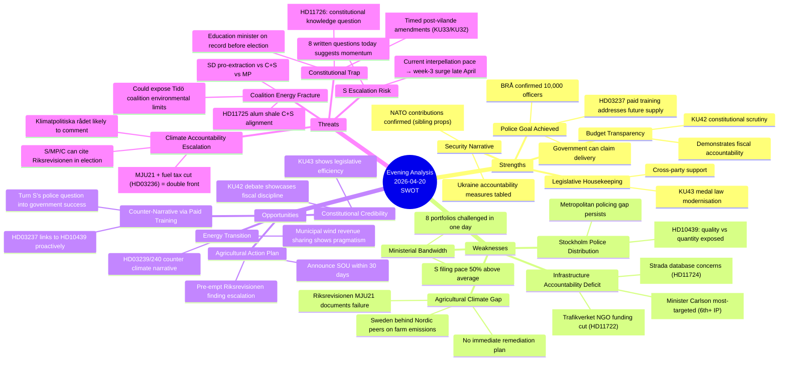

# SWOT Analysis — Evening Analysis 2026-04-20

**SWOT ID**: `SWT-2026-04-20-EVE001`
**Analysis Date**: 2026-04-20 17:33 UTC
**Scope**: Full-day synthesis — committee reports, interpellations, written questions

---

## Quadrant Mapping

---

## Coalition SWOT (Tidö: M-KD-L, supported by SD)

### Strengths
- **Police delivery**: BRÅ confirmed 10,000 officers target met — rare example of government delivering on a precise numerical commitment. Strömmer can invoke this against HD10439 `[VERY HIGH confidence 🟦]`
- **Energy reform package**: The sibling proposition analysis confirms HD03239/240/238 deliver a coherent industrial policy — positive contrast to the climate-only narrative opposition prefers `[HIGH confidence 🟩]`
- **NATO credibility**: HD03220 (EFP Finland) and Ukraine accountability measures (HD03231/32) place Sweden firmly in the mainstream European security architecture `[VERY HIGH confidence 🟦]`
- **Fiscal package**: Three budget propositions (HD03100, HD0399, HD03236) provide election-year economic narrative `[HIGH confidence 🟩]`

### Weaknesses
- **Agricultural climate**: MJU21/Riksrevisionen creates an official record that cannot be redacted. Agriculture = 14% of domestic GHG; documented insufficiency joins fuel tax cut as climate credibility damage `[HIGH confidence 🟩]`
- **Stockholm policing**: Quantitative goal vs qualitative/geographic distribution gap — S's framing exposes the limitation of headline-number politics `[MEDIUM confidence 🟧]`
- **KD infrastructure**: Carlson's portfolio is consistently identified as weakest in coalition; KD cannot afford to lose further seats to M or S `[HIGH confidence 🟩]`
- **Alum shale position**: SD's presumed support for mineral extraction puts it at odds with C (coalition-adjacent) and S on HD11725 — a microcosm of wider environmental coalition tension `[MEDIUM confidence 🟧]`

### Opportunities
- **Agricultural action plan**: A rapid announcement of an SOU or consultation process would transform MJU21 from a liability to a response. Window is April 20–May 10 before Riksdag recess discussions begin `[HIGH confidence 🟩]`
- **Constitutional leadership**: KU42 debate on budget structure — if the government champions transparent fiscal architecture, it takes the lead narrative away from opposition `[MEDIUM confidence 🟧]`
- **Police quality follow-up**: Address Stockholm distribution concern proactively in Strömmer's HD10439 response — cite HD03237 as the structural solution `[HIGH confidence 🟩]`

### Threats
- **Klimatpolitiska rådet escalation**: The council is independent; MJU21 finding likely triggers a council review comment in May–June 2026, amplifying the damage `[MEDIUM-HIGH confidence 🟧]`
- **HD11726 constitutional trap**: The Education Ministry will have to answer "what is being done to increase constitutional knowledge among citizens?" — any weak answer will be weaponised as the vilande amendments make the constitution a live election issue `[MEDIUM confidence 🟧]`
- **S filing momentum**: The week-over-week escalation in S's parliamentary activity (motions, interpellations, written questions) is structurally concerning — Riksdag summer recess approaches, each filed question locks in a ministerial record `[HIGH confidence 🟩]`

---

## Opposition SWOT (S + V + MP + C)

### Strengths
- **Documented government failures**: MJU21 provides an independent audit authority's finding — more durable than political accusations `[VERY HIGH confidence 🟦]`
- **Coordinated accountability campaign**: S's simultaneous coverage of infrastructure, justice, energy, education, and climate demonstrates portfolio breadth that suggests S is ready to govern `[HIGH confidence 🟩]`
- **Climate narrative coherence**: Fuel tax cut (HD03236) + agricultural climate failure (MJU21) + MJU25 (forthcoming) = a layered, multi-front climate case `[HIGH confidence 🟩]`

### Weaknesses
- **S silent on deportation** (from motions analysis): S's revealed strategic choice to avoid the security-enforcement immigration narrative limits coalition-building credibility on the right `[HIGH confidence 🟩]`
- **V+MP electoral risk**: Their arms-export and immigration positions poll poorly with median voter `[MEDIUM confidence 🟧]`
- **S must own economic failure too**: Sweden's 0.82% GDP growth and 8.69% unemployment happened under conditions S did not fully prevent when in government 2014–2022 `[MEDIUM confidence 🟧]`

### Opportunities
- **MJU21 amplification**: Bring Riksrevisionen finding to media at first plenary debate opportunity `[HIGH confidence 🟩]`
- **HD11726 timing**: Constitutional knowledge debate immediately post-vilande amendments is symbolically perfect for S `[HIGH confidence 🟩]`

### Threats
- **Government pays its debts**: If Strömmer, Carlson, and other ministers respond substantively to the written question wave, the accountability saturation tactic loses impact `[MEDIUM confidence 🟧]`
- **Election fatigue**: Voters may tune out escalating accountability campaigns if not tied to vivid personal stories `[LOW confidence 🟥]`
