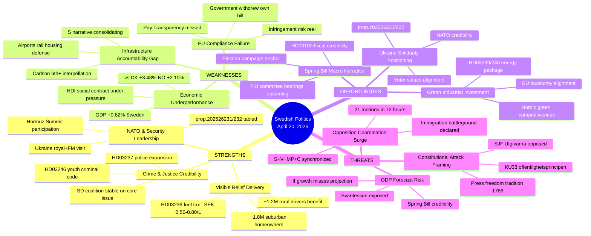

# SWOT Analysis — Evening Analysis 2026-04-20

**Analysis ID**: `SWT-2026-04-20-EA001`  
**Analysis Date**: 2026-04-20 18:36 UTC  
**Scope**: Full-day parliamentary intelligence synthesis  
**Confidence**: 🟩 HIGH  
**Days to Election 2026**: 146

---

## SWOT Mindmap

---

## 🔵 STRENGTHS (Coalition: Tidökoalitionen — M+KD+L+SD)

| ID | Strength | Evidence | dok_id | Confidence |
|----|----------|----------|--------|:----------:|
| S1 | **Crime/justice policy credibility** — HD03237 (police expansion) and HD03246 (youth criminal code) deliver on core SD/M voter priorities | 29 reservations on CU27 shows opposition contesting but M+SD delivering on promise | HD03237, HD03246 | 🟩HIGH |
| S2 | **NATO security leadership** — Royal visit to Kyiv + PM Hormuz Summit + two Ukraine propositions in one week signals Sweden's active allied posture | King + Malmer Stenergard visit 2026-04-17; prop.202526231/232 tabled same day | prop.202526231, prop.202526232 | 🟩HIGH |
| S3 | **Visible cost-of-living relief** — HD03236 fuel tax cut –SEK 0.50-0.80/litre targets 1.2M rural drivers; timed for pump-price effect July 2026 before summer recess | HD03236 extra amendment budget as part of coordinated fiscal triplet | HD03236 | 🟧MEDIUM |
| S4 | **Constitutional legitimacy** — KU32/KU33 formally adopted vilande, demonstrating coalition can amend fundamental law with majority support | Two-reading constitutional process RF 8:14 followed correctly | HD01KU32, HD01KU33 | 🟦VERY HIGH |

---

## 🔴 WEAKNESSES (Coalition: Tidökoalitionen)

| ID | Weakness | Evidence | dok_id | Confidence |
|----|----------|----------|--------|:----------:|
| W1 | **GDP growth gap** — Sweden +0.82% (2024) vs Denmark +3.48%, Norway +2.10%; 2023 contraction –0.20% makes fiscal competence claim fragile | HD03100 Spring Economic Bill must project 1.8–2.2% growth to be credible | HD03100 | 🟩HIGH |
| W2 | **EU Pay Transparency Directive failure** — Government withdrew own implementation bill (frs 2025/26:437); EU compliance failure documented in Riksdag by S-MP interpellation | Amloh (S) interpellation confirmed withdrawal of implementation proposal | frs 2025/26:437 | 🟩HIGH |
| W3 | **Infrastructure accountability deficit** — Andreas Carlson (KD) faces 6th+ interpellation; housing starts down 900 units vs. 2025; rail, airports, defense logistics all flagged | frs 2025/26:434 cites Länsstyrelsen housing data | frs 2025/26:434 | 🟩HIGH |
| W4 | **Gender equality exposure** — Nina Larsson (L) targeted by coordinated dual interpellation on same day (gender pay gap + women's shelters) | frs 2025/26:437 + frs 2025/26:438 filed April 17 same day | frs 2025/26:437, 438 | 🟩HIGH |

---

## 🟢 OPPORTUNITIES (Coalition)

| ID | Opportunity | Mechanism | Timeline | Confidence |
|----|------------|-----------|----------|:----------:|
| O1 | **Spring Bill macro narrative** — HD03100 establishes economic story before summer recess; FiU hearings May 2026 can amplify positive projections | Fiscal triplet (HD03100+HD0399+HD03236) frames election campaign | May–June 2026 | 🟧MEDIUM |
| O2 | **Green industrial leadership** — HD03239/240 energy transition package positions Sweden as Nordic investment destination for climate tech | EU taxonomy alignment; post-COVID industrial policy window | Q3 2026 | 🟧MEDIUM |
| O3 | **Ukraine solidarity bonus** — prop.202526231/232 (Ukraine commission + tribunal) demonstrate Sweden leads on international accountability | Royal + FM visit generates positive media; NATO credibility compounds | Immediate | 🟩HIGH |

---

## 🟡 THREATS (Coalition)

| ID | Threat | Evidence | dok_id | Confidence |
|----|--------|----------|--------|:----------:|
| T1 | **Historic opposition coordination** — all 4 opposition parties (S+V+MP+C) filed counter-motions on immigration within 72 hours; first time this parliamentary session | Motions synthesis: 21 motions April 13–17; synchronized filing confirmed | Multiple | 🟩HIGH |
| T2 | **"Grundlagsval" narrative** — opposition framing: voting for Tidökoalitionen = voting to restrict press freedom via KU33; SJF and Utgivarna publicly opposed | 1766 tradition of offentlighetsprincipen; 16 reservations on HD01KU33 | HD01KU33 | 🟩HIGH |
| T3 | **Riksrevisionen fiscal scrutiny** — HD03241 (fiscal framework report) alongside HD03100; adverse finding would directly undermine Spring Bill credibility | Riksrevisionen independence and historical precedent for adverse reports | HD03241, HD03100 | 🟧MEDIUM |

---

## Coalition SWOT

| | Strengths | Weaknesses |
|-|-----------|------------|
| **Opportunities** | O3+S2: Ukraine solidarity maximises NATO narrative | W1+O1: GDP gap threatens Spring Bill credibility |
| **Threats** | S1+T1: Crime policy advantage blunts immigration counter-narrative | W2+T2: EU failure + press freedom combine as "governance failure" story |

## Opposition SWOT (S+V+MP+C)

| | Strengths | Weaknesses |
|-|-----------|------------|
| **Opportunities** | S1+O1: GDP gap + infrastructure failures create "economic mismanagement" narrative | W1: Opposition lacks credible alternative to SD-supported immigration policy |
| **Threats** | T1: S/V/MP/C coordination unprecedented but risks "bloc politics" backlash | W2: V+MP on economic fringes; S must distance from both |
