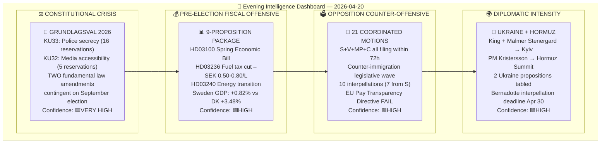
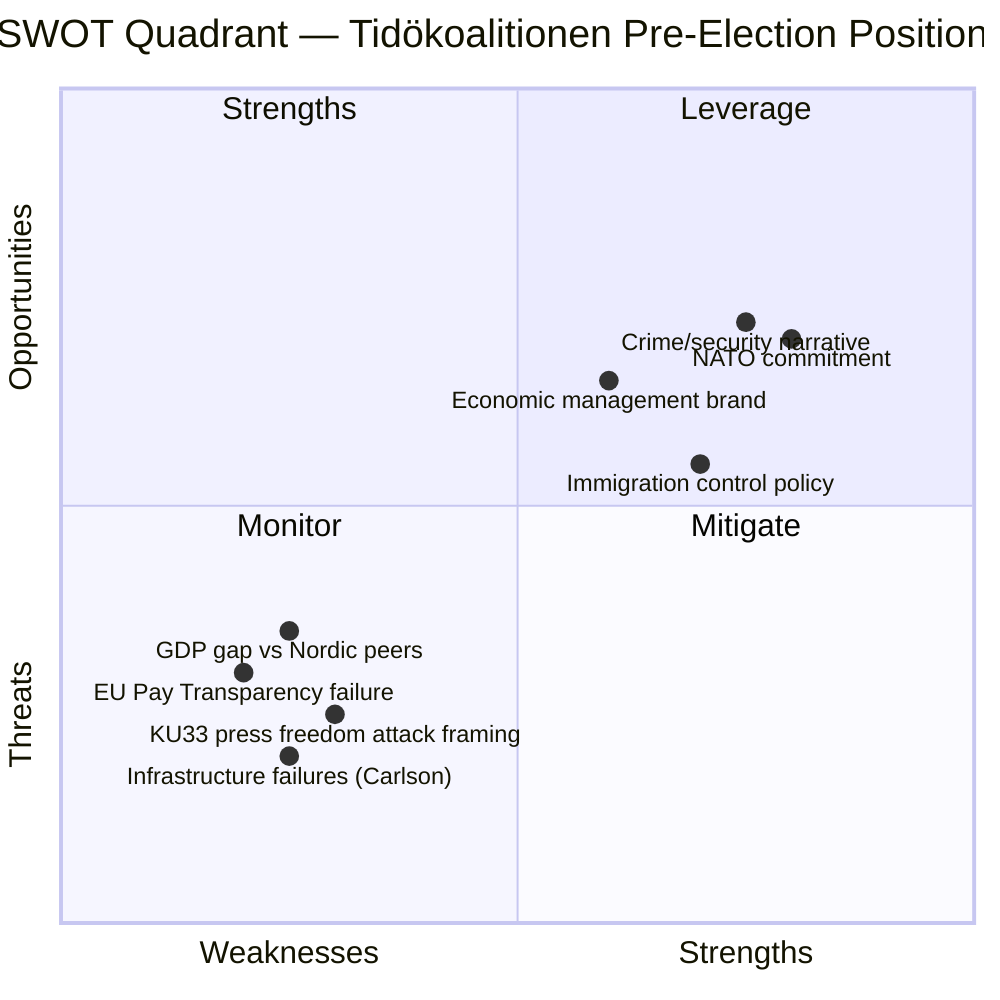

# Synthesis Summary — Evening Analysis 2026-04-20

**Synthesis ID**: `SYN-2026-04-20-EA001`  
**Analysis Date**: 2026-04-20 18:35 UTC  
**Documents Analyzed**: 54 (aggregated across all sibling workflows)  
**Analysis Period**: 2026-04-17 to 2026-04-20  
**Produced By**: evening-analysis agentic workflow (AI synthesis)  
**Overall Confidence**: 🟩 HIGH  
**Riksmöte**: 2025/26  
**Days to Election 2026**: 146 (September 13, 2026)

---

## 🎯 Confidence Scale

| Level | Label |
|:-----:|-------|
| ⬛ 1 | VERY LOW |
| 🟥 2 | LOW |
| 🟧 3 | MEDIUM |
| 🟩 4 | HIGH |
| 🟦 5 | VERY HIGH |

---

## 📊 Intelligence Dashboard

---

## 🏆 Top Findings

| Rank | Finding | Significance | dok_id | Confidence |
|------|---------|:------------:|--------|:----------:|
| 1 | 2026 is a "grundlagsval" — two constitutional amendments (KU33/KU32) require second reading by new Riksdag; election outcome determines Sweden's constitutional framework on press freedom | **CRITICAL** | HD01KU33, HD01KU32 | 🟦VERY HIGH |
| 2 | Government launches most comprehensive pre-election package: 9 propositions including Spring Economic Bill (HD03100) — fiscal credibility claim despite GDP +0.82% (lowest in Nordic) | **CRITICAL** | HD03100, HD03236 | 🟩HIGH |
| 3 | Historic opposition coordination: S+V+MP+C simultaneously counter government immigration bills within 72 hours — designates immigration as central election battleground | **HIGH** | Multiple motions | 🟩HIGH |
| 4 | Sweden confirmed to miss EU Pay Transparency Directive deadline — government withdrew own implementation bill (frs 2025/26:437); infringement risk documented in parliament | **HIGH** | frs 2025/26:437 | 🟩HIGH |
| 5 | King Gustav + FM Malmer Stenergard visit Ukraine; PM in Hormuz Strait summit — Sweden's active foreign policy posture as NATO member | **HIGH** | prop.202526231/232 | 🟩HIGH |
| 6 | Infrastructure Minister Carlson now faces 6th+ interpellation; S's "infrastructure failure narrative" consolidating across airports, rail, housing, defense logistics | **HIGH** | frs 2025/26:434 | 🟩HIGH |

---

## 📊 Aggregated SWOT — Swedish Political Landscape April 20, 2026

### Strengths
- **S1**: Crime/justice credibility — HD03237 (police expansion) + HD03246 (youth criminal code) directly appeal to swing voters `[HIGH]`
- **S2**: NATO alignment demonstrated by Ukraine visits (King + FM) and Hormuz summit participation `[HIGH]`
- **S3**: Pre-election fiscal package timing — HD03100 + HD03236 fuel tax cut delivers visible relief by July 2026 `[MEDIUM]`

### Weaknesses
- **W1**: GDP growth +0.82% — materially below Norway (+2.10%), Denmark (+3.48%), euro-area average `[HIGH]`
- **W2**: EU Pay Transparency Directive failure — government withdrew own bill, documented in parliament `[HIGH]`
- **W3**: Infrastructure performance gap — Carlson facing 6th+ interpellation across airports, rail, housing `[HIGH]`

### Opportunities
- **O1**: Spring Economic Bill (HD03100) establishes macro narrative before summer — if GDP forecasts credible `[MEDIUM]`
- **O2**: Energy transition package (HD03239/240) positions Sweden for green industrial investment `[MEDIUM]`
- **O3**: Ukraine propositions (prop.202526231/232) reinforce NATO-credibility on security policy `[HIGH]`

### Threats
- **T1**: Opposition coordination across all 4 parties (S+V+MP+C) on immigration — unprecedented 72h synchronisation `[HIGH]`
- **T2**: KU33 "attack on offentlighetsprincipen" framing by Svenska Journalistförbundet and Utgivarna `[HIGH]`
- **T3**: Riksrevisionen follow-up on HD03241 (fiscal framework) could undermine HD03100 credibility `[MEDIUM]`

---

## ⚠️ Risk Landscape

| Risk | Likelihood | Impact | L×I Score | Timeline |
|------|:----------:|:------:|:---------:|----------|
| Opposition wins election; KU33 blocked, press freedom restored | 4 | 5 | **20** | Sept 2026 |
| EU infringement proceedings on Pay Transparency Directive | 3 | 4 | **12** | Q3–Q4 2026 |
| GDP growth misses 2026 forecast; Spring Bill credibility collapse | 3 | 5 | **15** | Q2 2026 |
| S "infrastructure failure" narrative becomes dominant | 3 | 4 | **12** | 3–5 months |
| Hormuz crisis escalation disrupts energy supply chain | 2 | 4 | **8** | Ongoing |

---

## 🔭 Forward Indicators

| Indicator | Trigger | Timeline | Watch Signal |
|-----------|---------|----------|-------------|
| KU constitutional hearing — Svantesson expected | Committee schedule release | Week of Apr 21–25 | KU hearing confirmed |
| Bernadotte interpellation response | Malmer Stenergard → parliament | April 30, 2026 | Diplomatic signalling on Israel |
| EU Commission Pay Transparency assessment | Commission legal review | May–June 2026 | Infringement letter |
| HD03100 Spring Bill FiU committee hearings | FiU schedule | May 2026 | GDP forecast revisions |
| Carlson infrastructure interpellation (frs 2025/26:434) debate | SISVA date | TBC April–May | Housing starts data |

---

## 📁 Artifacts Inventory

| # | File | Type | Status |
|---|------|------|--------|
| 1 | synthesis-summary.md | Core | ✅ This file |
| 2 | swot-analysis.md | Core | ✅ |
| 3 | risk-assessment.md | Core | ✅ |
| 4 | threat-analysis.md | Core | ✅ |
| 5 | classification-results.md | Core | ✅ |
| 6 | significance-scoring.md | Core | ✅ |
| 7 | stakeholder-perspectives.md | Core | ✅ |
| 8 | cross-reference-map.md | Core | ✅ |
| 9 | data-download-manifest.md | Core | ✅ |
| 10 | README.md | Tier-C | ✅ |
| 11 | executive-brief.md | Tier-C | ✅ |
| 12 | scenario-analysis.md | Tier-C | ✅ |
| 13 | comparative-international.md | Tier-C | ✅ |
| 14 | methodology-reflection.md | Tier-C | ✅ |
