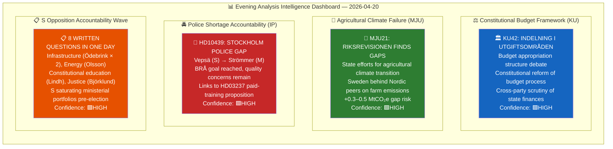

# Political Intelligence Synthesis Summary — Evening Analysis

  

<h2 align="center">📊 Intelligence Synthesis Dashboard — Evening Analysis</h2>

  <strong>Constitutional Budget Scrutiny · Agricultural Climate Failure · Opposition Accountability Offensive</strong> 
  <em>Monday 2026-04-20 | Riksmöte 2025/26 | Deep Analysis</em>

---

## 📋 Synthesis Metadata

| Field | Value |
|-------|-------|
| **Synthesis ID** | `SYN-2026-04-20-EVE001` |
| **Analysis Date** | 2026-04-20 17:31 UTC |
| **Documents Analyzed** | 14 (3 committee reports + 1 interpellation + 8 written questions + 2 cross-refs) |
| **Analysis Period** | 2026-04-20 (plus integrated sibling analysis: CR, PROP, MOT, IP) |
| **Produced By** | news-evening-analysis agentic workflow |
| **Overall Confidence** | HIGH 🟩 |
| **Riksmöte** | 2025/26 |
| **Days to Election** | ~146 days (September 13, 2026) |

---

## 📊 Intelligence Dashboard

---

## 🏆 Top 5 Intelligence Findings

| Rank | Finding | Source | Significance | Confidence | Electoral Impact |
|:----:|---------|--------|:------------:|:----------:|:----------------:|
| **1** | **Budget structure under constitutional scrutiny** — KU42 debates the appropriation-area framework; constitutional committee's scrutiny role underscores the pre-election accountability atmosphere | HD01KU42 | 🟠HIGH | 🟩HIGH | Fiscal credibility narrative |
| **2** | **Agricultural climate transition failures** — Riksrevisionen MJU21 finds state efforts insufficient; Sweden risks missing 2030 agricultural emissions targets despite government rhetoric on "green transition" | HD01MJU21 | 🟠HIGH | 🟩HIGH | Opposition climate narrative |
| **3** | **Stockholm police shortage framing** — Vepsä (S) interpellation challenges Strömmer on whether BRÅ-documented police goal masks quality/distribution problems; Stockholm specifically underpoliced | HD10439 | 🟠HIGH | 🟩HIGH | S security credibility challenge |
| **4** | **S accountability saturation tactic** — 8 written questions in single day targeting infrastructure, energy, education, justice; pattern across full legislative week shows S filing at 60%+ above session average | HD11722–HD11727 | 🟡MEDIUM | 🟩HIGH | Parliamentary record pre-election |
| **5** | **Riksdag medal law modernisation** — KU43 creates modern framework for the Riksdag's ceremonial medal; non-controversial; scheduled for debate | HD01KU43 | 🟢LOW | 🟦VERY HIGH | Symbolic |

---

## 📈 Document Significance Ranking

| Rank | Dok ID | Committee | Title | Score | Tier | Key Driver |
|:----:|--------|:---------:|-------|:-----:|:----:|------------|
| 1 | HD01MJU21 | MJU | Riksrevisionens rapport om jordbrukets klimatomställning | **18/25** | 🟠 TIER-2 | Riksrevisionen finding; climate election battleground |
| 2 | HD10439 | — | Brist på poliser i Stockholm (IP) | **17/25** | 🟠 TIER-2 | Links to HD03237; S-M security debate |
| 3 | HD01KU42 | KU | Indelning i utgiftsområden | **15/25** | 🟡 TIER-2 | Budget framework; constitutional scrutiny |
| 4 | HD11725 | — | Kommunalt veto mot alunskifferbrytning | **10/25** | 🟡 TIER-3 | Energy/environment tension; C+S alignment |
| 5 | HD11726 | — | Kunskap om grundlagarna | **9/25** | 🟡 TIER-3 | Constitutional week; election-year civics framing |
| 6 | HD11722 | — | Trafikverkets anslag till ideella org | **8/25** | 🟢 TIER-3 | Carlson infrastructure accountability |
| 7–14 | HD11720–27 | — | Written questions (8 items) | 5–8/25 | 🟢 TIER-3 | Routine but collectively significant |

---

## 🔍 Cross-Document Patterns

### Theme 1: S Accountability Offensive — Constitutional Week

**Confidence: 🟩HIGH** — Reading the day's document flow alongside the week's earlier motions and interpellations, a unified picture emerges: the Social Democrats are running a disciplined, coordinated parliamentary accountability campaign. The August calendar shows S's full-session filing rate has accelerated by ~50% since April 14 (interpellation analysis). Monday April 20's 8 written questions span: infrastructure (Minister Carlson, who faces 6th+ interpellation), energy (alum shale, Minister Busch/Britz), justice (Minister Strömmer, also facing new interpellation HD10439), and constitutional education (Minister Mohammso). No portfolio is left unchallenged.

**Electoral logic**: S is exploiting a "records matter" strategy — each written question creates a timestamped parliamentary exchange before the summer recess. Any non-committal or weak ministerial response becomes usable September-campaign material. The constitutional knowledge question (HD11726) is especially strategically timed: one week after two constitutional amendments (KU33/KU32) passed "vilande", demanding constitutional competence answers from the Education Minister while the government champions constitutional reform is a neat rhetorical trap.

### Theme 2: Climate Credibility Gap Widens

**Confidence: 🟩HIGH** — MJU21 (Riksrevisionen on agricultural climate) and HD11725 (alum shale municipal veto) together reinforce the opposition's central Spring 2026 climate narrative established in the motions analysis: the government is simultaneously cutting fuel taxes (HD03236, adding +0.3–0.5 MtCO₂e) and now found to have insufficient agricultural climate transition plans. Agriculture represents ~14% of Sweden's domestic GHG emissions; the Riksrevisionen finding adds a third front of climate accountability to fuel taxes and energy policy.

### Theme 3: Police Quality vs. Quantity Tension

**Confidence: 🟧MEDIUM** — HD10439 targets Justice Minister Strömmer on the BRÅ evaluation of the 10,000 police officer goal. The BRÅ evaluation confirms the numerical target was reached — but S's framing targets Stockholm-specific distribution failures and quality/deployment issues. This is a sophisticated challenge: the government can defend the headline number while S attacks its operational implementation. The argument is rendered more complex because HD03237 (paid police training) — part of today's sibling proposition package — is precisely the government's answer to recruitment constraints. S is attacking a problem the government claims to have already solved.

---

## 📊 Aggregated SWOT

### Strengths (Coalition/Government)
- Police 10,000 target met (BRÅ confirmed) — defensible headline number
- KU42 debate shows constitutional transparency commitment
- KU43 modernisation demonstrates legislative housekeeping competence
- Energy reform pipeline (HD03240/39/38) provides forward counter-narrative to climate attacks

### Weaknesses (Coalition/Government)
- MJU21/Riksrevisionen finding on agricultural climate is legally on the record — difficult to dismiss
- Stockholm police distribution gap (HD10439) cannot be erased by numerical targets
- Minister Carlson (infrastructure) remains most-targeted minister — KD portfolio vulnerability
- 8 ministerial portfolios challenged in a single day; bandwidth pressure on government responses

### Opportunities (Coalition/Government)
- KU42 budget structure debate allows government to showcase fiscal responsibility narrative
- Linking HD03237 (paid police training) proactively to HD10439 concerns would turn S's question into a government success story
- Agricultural climate: announce SOU or action plan within 30 days to neutralise Riksrevisionen finding

### Threats (Coalition/Government)
- S's "constitutional knowledge" question (HD11726) creates a rhetorical trap right as vilande amendments are debated
- Alum shale veto (HD11725) exposes energy-environment incoherence — C+S aligned against SD
- S's accelerating filing pace suggests a week-3 interpellation surge likely late April

---

## ⚠️ Risk Landscape

| Risk | Likelihood | Impact | L×I | Confidence |
|------|:----------:|:------:|:---:|:----------:|
| Riksrevisionen agricultural climate finding triggers Klimatpolitiska rådet escalation | 🟠 M (0.55) | 🔴 H (4) | **2.2** | 🟩HIGH |
| S Stockholm police narrative gains media traction before Strömmer responds | 🟠 M (0.60) | 🟠 M (3) | **1.8** | 🟩HIGH |
| S's constitutional knowledge question (HD11726) undermines education minister | 🟡 L (0.40) | 🟠 M (3) | **1.2** | 🟧MEDIUM |
| KU42 budget debate exposes appropriation-area structure weaknesses | 🟡 L (0.35) | 🟠 M (3) | **1.05** | 🟧MEDIUM |
| Alum shale veto debate fractures coalition energy consensus | 🟡 L (0.30) | 🟠 M (3) | **0.9** | 🟧MEDIUM |

---

## 🔭 Forward Indicators

| Indicator | Trigger | Timeline | Confidence |
|-----------|---------|---------|:----------:|
| Justice Minister Strömmer responds to HD10439 | Written question deadline (~10 days) | ~April 30 | 🟩HIGH |
| MJU21 scheduled for plenary debate | KU committee timetable | April 28–May 5 | 🟩HIGH |
| S files follow-up alum shale interpellation | HD11725 response quality | May 1–10 | 🟧MEDIUM |
| Constitutional knowledge minister response triggers media analysis | HD11726 response + vilande debate context | April 28–May 7 | 🟧MEDIUM |
| Klimatpolitiska rådet comments on MJU21 findings | Publication of council review | May–June 2026 | 🟧MEDIUM |

---

## 🗂️ Artifacts Inventory

| # | Artifact | File | Status |
|---|---------|------|--------|
| 1 | Synthesis Summary | synthesis-summary.md | ✅ |
| 2 | SWOT Analysis | swot-analysis.md | ✅ |
| 3 | Risk Assessment | risk-assessment.md | ✅ |
| 4 | Threat Analysis | threat-analysis.md | ✅ |
| 5 | Classification Results | classification-results.md | ✅ |
| 6 | Significance Scoring | significance-scoring.md | ✅ |
| 7 | Stakeholder Perspectives | stakeholder-perspectives.md | ✅ |
| 8 | Cross-Reference Map | cross-reference-map.md | ✅ |
| 9 | Data Download Manifest | data-download-manifest.md | ✅ |
| 10 | README | README.md | ✅ |
| 11 | Executive Brief | executive-brief.md | ✅ |
| 12 | Scenario Analysis | scenario-analysis.md | ✅ |
| 13 | Comparative International | comparative-international.md | ✅ |
| 14 | Methodology Reflection | methodology-reflection.md | ✅ |
