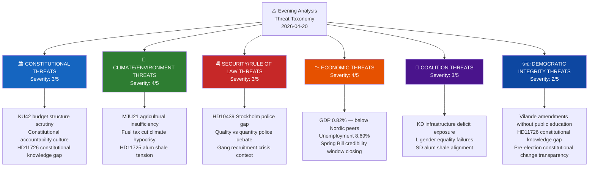

# Threat Analysis — Evening Analysis 2026-04-20

**THR ID**: `THR-2026-04-20-EVE001`
**Analysis Date**: 2026-04-20 17:35 UTC
**Framework**: STRIDE + Political Threat Taxonomy

---

## Threat Taxonomy Network

---

## Threat Category Analysis

### Category 1: Constitutional Threats
**Severity**: 3/5 | **Confidence**: 🟩HIGH

| Threat | Source | Severity | Probability | Timeline |
|--------|--------|:--------:|:-----------:|:--------:|
| Budget appropriation scrutiny exposes fiscal structural weaknesses | HD01KU42 | 2/5 | 0.35 | April–May 2026 |
| Constitutional knowledge deficit legitimises opposition campaign | HD11726 | 3/5 | 0.45 | April–September 2026 |
| Vilande amendments pass without citizen awareness | KU33+KU32 context | 4/5 | 0.55 | Pre-election 2026 |

**Analysis**: The constitutional threat cluster centres on the government's management of its constitutional reform agenda. The two vilande amendments (KU33 on police seizure secrecy, KU32 on media accessibility) are legitimate democratic instruments — but passing them without a parallel public education campaign creates a democratic legitimacy question that S's Eva Lindh (HD11726) is expertly exploiting. The Education Ministry's response will be scrutinised.

---

### Category 2: Climate/Environment Threats
**Severity**: 4/5 | **Confidence**: 🟩HIGH

| Threat | Source | Severity | Probability | Timeline |
|--------|--------|:--------:|:-----------:|:--------:|
| Riksrevisionen agricultural climate finding triggers council review | HD01MJU21 | 4/5 | 0.55 | May–June 2026 |
| Fuel tax cut + agricultural failure = documented double standard | HD03236 + MJU21 | 4/5 | 0.65 | April–September 2026 |
| Municipal alum shale veto fractures C-SD coalition alignment | HD11725 | 2/5 | 0.30 | May–July 2026 |

**Analysis**: The climate threat is the most strategically significant for the 2026 election. The MJU21 finding is produced by an independent constitutional body (Riksrevisionen) whose findings carry legal weight under the Swedish riksrevision framework. Unlike political accusations, this finding will appear in official parliament records. Combined with the fuel tax cut (a proactive government choice to increase emissions), the opposition has constructed a two-source, independently-verified climate credibility challenge.

---

### Category 3: Security/Rule of Law Threats
**Severity**: 3/5 | **Confidence**: 🟩HIGH

| Threat | Source | Severity | Probability | Timeline |
|--------|--------|:--------:|:-----------:|:--------:|
| Stockholm police deficit becomes headline story | HD10439 | 3/5 | 0.60 | April 21 – May 5 |
| Gang recruitment crisis continues despite police expansion | Policy context | 4/5 | 0.65 | Ongoing |
| Paid police training delayed implementation risk | HD03237 | 2/5 | 0.40 | 2027–2028 |

**Analysis**: The police threat is primarily electoral rather than operational. The operational situation (10,000 officers) is better than 2022 but the qualitative/geographic distribution argument is legitimate. S's Vepsä (HD10439) is sophisticated: targeting Stockholm specifically forces Strömmer to defend not just national numbers but the most politically salient urban constituency.

---

### Category 4: Economic Threats
**Severity**: 4/5 | **Confidence**: 🟩HIGH

| Threat | Source | Severity | Probability | Timeline |
|--------|--------|:--------:|:-----------:|:--------:|
| Sweden's 0.82% GDP growth gap vs Nordic peers closes too slowly | Propositions context | 4/5 | 0.60 | 2026 election |
| Spring Economic Bill credibility window narrows as election approaches | HD03100 | 3/5 | 0.50 | May–September |
| Unemployment 8.69% remains above Nordic peers | World Bank data | 4/5 | 0.65 | Persistent |

**Analysis**: The economic threat is the background condition against which all other threats are amplified. With Sweden growing at 0.82% vs Denmark (3.48%) and Norway (2.10%), the government cannot easily claim economic management success. The Spring Amendment Budget (HD03236) fuel tax cut is explicitly designed to close the "feel-good" gap — but if voters perceive it as electoral rather than structural, its impact is diminished.

---

### Category 5: Coalition Stability Threats
**Severity**: 3/5 | **Confidence**: 🟩HIGH

| Threat | Source | Severity | Probability | Timeline |
|--------|--------|:--------:|:-----------:|:--------:|
| KD infrastructure portfolio continues to deteriorate | Carlson 6th+ IP | 3/5 | 0.55 | April–May 2026 |
| L gender equality failures damage liberal-values brand | IP437+438 | 3/5 | 0.60 | April–September 2026 |
| SD-C-L tension on environment/culture policies | HD11725 + broader | 2/5 | 0.35 | Spring session |

---

### Category 6: Democratic Integrity Threats
**Severity**: 2/5 | **Confidence**: 🟧MEDIUM

| Threat | Source | Severity | Probability | Timeline |
|--------|--------|:--------:|:-----------:|:--------:|
| Constitutional amendments passed without public awareness campaign | KU33/KU32 vilande | 3/5 | 0.50 | Pre-election |
| Opposition exploits knowledge gap for delegitimisation | HD11726 | 2/5 | 0.45 | April–September |

**Analysis**: The democratic integrity threat is primarily reputational rather than operational. Sweden's constitutional process (vilande amendments) is legally sound. The risk is that the government fails to communicate adequately what the amendments mean, allowing the opposition to frame them as secretive constitutional changes.

---

## Overall Threat Assessment

**Confidence level**: Threat near MEDIUM-HIGH (2026-04-20 evening)

The dominant threat cluster is the **climate accountability compound** (MJU21 + HD03236 + HD11725) — independently verified, multi-front, and aligned with three opposition parties (S, MP, C). The secondary threat is the **parliamentary saturation campaign** — S's escalating filing pace is structurally asymmetric in that the government must respond to every question while S pays no cost for filing.
