# Threat Analysis — Evening Analysis 2026-04-20

**Threat Analysis ID**: `THR-2026-04-20-EA001`  
**Analysis Date**: 2026-04-20 18:38 UTC  
**Analysis Framework**: STRIDE + Parliamentary Intelligence Threat Taxonomy  
**Overall Threat Level**: 🔴 HIGH (constitutional/electoral threats)  
**Confidence**: 🟩 HIGH

---

## Threat Taxonomy Network

```mermaid
graph TD
    CENTER["🌆 Swedish Parliamentary<br/>Threat Landscape<br/>April 20, 2026"]
    
    CENTER --> CONST["⚖️ CONSTITUTIONAL<br/>THREATS"]
    CENTER --> ECON["💰 ECONOMIC<br/>THREATS"]
    CENTER --> INTL["🌍 GEOPOLITICAL<br/>THREATS"]
    CENTER --> INST["🏛️ INSTITUTIONAL<br/>THREATS"]
    CENTER --> POL["🗳️ POLITICAL<br/>THREATS"]
    CENTER --> LEGAL["⚖️ LEGAL/COMPLIANCE<br/>THREATS"]
    
    CONST --> C1["KU33 election-dependency<br/>RF 8:14 two-reading rule<br/>Severity: 5 CRITICAL"]
    CONST --> C2["Press freedom restriction<br/>offentlighetsprincipen 1766<br/>Severity: 4 HIGH"]
    
    ECON --> E1["GDP growth gap vs Nordic<br/>+0.82% vs DK +3.48%<br/>Severity: 4 HIGH"]
    ECON --> E2["Spring Bill projection risk<br/>1.8-2.2% forecast under challenge<br/>Severity: 4 HIGH"]
    
    INTL --> I1["Hormuz Strait crisis<br/>Energy supply disruption<br/>Severity: 3 MEDIUM"]
    INTL --> I2["Ukraine-Russia war escalation<br/>Sweden NATO obligation risk<br/>Severity: 3 MEDIUM"]
    
    INST --> IN1["Riksrevisionen HD03241<br/>Fiscal framework adverse finding<br/>Severity: 4 HIGH"]
    INST --> IN2["EU Commission enforcement<br/>Pay Transparency infringement<br/>Severity: 3 MEDIUM"]
    
    POL --> P1["Opposition 72-hour coordination<br/>Immigration battleground<br/>Severity: 4 HIGH"]
    POL --> P2["S interpellation acceleration<br/>7 of 10 from S since April 14<br/>Severity: 3 MEDIUM"]
    
    LEGAL --> L1["EU Pay Transparency Directive<br/>Government withdrew own bill<br/>Severity: 4 HIGH"]
    LEGAL --> L2["Bernadotte diplomatic incident<br/>Israel/UN accountability<br/>Severity: 2 LOW-MEDIUM"]
    
    style CENTER fill:#1a1e3d,color:#00d9ff
    style CONST fill:#8b0000,color:#fff
    style ECON fill:#ff6600,color:#fff
    style INTL fill:#006400,color:#fff
    style INST fill:#4b0082,color:#fff
    style POL fill:#00008b,color:#fff
    style LEGAL fill:#8b4513,color:#fff
```

---

## Threat Category Analysis

### Category 1: Constitutional Threats — Severity 5 (CRITICAL)

| Threat | Actor | Evidence | Severity | Timeline |
|--------|-------|----------|:--------:|---------|
| **KU33 election contingency** — fundamental law amendment on police seizure secrecy requires second reading after election; if opposition wins, amendment fails permanently | Constitutional process | HD01KU33, RF 8:14; 16 party reservations | **5** | Sept 2026 |
| **Offentlighetsprincipen erosion** — KU33 restricts the 1766 principle of public document access; SJF, Utgivarna publicly opposed; historical precedent for press freedom battle | Svenska Journalistförbundet, Utgivarna | Public statements vs. HD01KU33 | **4** | Now–Sept 2026 |

### Category 2: Economic Threats — Severity 4 (HIGH)

| Threat | Actor | Evidence | Severity | Timeline |
|--------|-------|----------|:--------:|---------|
| **GDP credibility gap** — Sweden's +0.82% growth (2024) and –0.20% contraction (2023) undermine HD03100 Spring Bill's fiscal competence narrative | Statistics Sweden, World Bank | HD03100 vs. World Bank GDP data: SWE 0.82%, DNK 3.48%, NOR 2.10% | **4** | Q2 2026 |
| **Fuel tax reversal risk** — HD03236 cuts fuel tax –SEK 0.50-0.80/L; if petrol prices drop anyway, political effect disappears; if prices rise, relief insufficient | Market factors | HD03236 extra amendment budget; pump-price dependency | **3** | July 2026 |

### Category 3: Geopolitical Threats — Severity 3 (MEDIUM)

| Threat | Actor | Evidence | Severity | Timeline |
|--------|-------|----------|:--------:|---------|
| **Hormuz energy disruption** — PM participated in Hormuz Summit; ~20% of global LNG passes through strait; Sweden's energy transition package (HD03239/240) could become crisis response | Iran, Gulf state actors | Press release 2026-04-17: PM at Hormuz Summit | **3** | Ongoing |
| **Ukraine war escalation** — Two Ukraine propositions (prop.202526231/232); King visit; if war escalates, Sweden faces higher NATO commitments under Article 5 read | Russia, NATO allies | prop.202526231/232; Royal visit 2026-04-17 | **3** | Ongoing |

### Category 4: Institutional Threats — Severity 4 (HIGH)

| Threat | Actor | Evidence | Severity | Timeline |
|--------|-------|----------|:--------:|---------|
| **Riksrevisionen HD03241 adverse finding** — Fiscal framework report published alongside HD03100; Riksrevisionen has statutory independence and history of critical findings on government fiscal assumptions | Riksrevisionen | HD03241 listed alongside HD03100 in propositions workflow | **4** | Q2 2026 |
| **EU Commission Pay Transparency enforcement** — Commission begins infringement proceedings after Sweden documented as non-compliant; fines and reputational damage | EU Commission | frs 2025/26:437; parliamentary documentation of directive withdrawal | **3** | Q3–Q4 2026 |

### Category 5: Political Threats — Severity 4 (HIGH)

| Threat | Actor | Evidence | Severity | Timeline |
|--------|-------|----------|:--------:|---------|
| **Opposition 72-hour coordination** — S+V+MP+C synchronized immigration counter-motions: historically rare; indicates strategic command coordination at party leadership level | S, V, MP, C leadership | Motions synthesis: 21 motions within 72 hours; filing timestamps | **4** | Now–Sept 2026 |
| **S interpellation acceleration** — 7 of 10 interpellations from S since April 14; pace 50% above average; accountability pressure mounting on multiple ministers | Socialdemokraterna | Interpellations synthesis: frs 2025/26:434-438 | **3** | Now–May 2026 |

### Category 6: Legal/Compliance Threats — Severity 4 (HIGH)

| Threat | Actor | Evidence | Severity | Timeline |
|--------|-------|----------|:--------:|---------|
| **EU Pay Transparency Directive non-implementation** — Government withdrew implementation bill; L-minister Nina Larsson most exposed; EU deadline passes without law; infringement near-certain | EU Commission, S, MP | frs 2025/26:437 interpellation + government withdrawal | **4** | Q3 2026 |
| **Bernadotte interpellation diplomatic exposure** — El-Haj demands Israel accountability for 1948 UN mediator assassination; response April 30; any answer risks diplomatic incident | Jamal El-Haj (independent), Israel | frs 2025/26:435 with 3 explicit demands; 10-day deadline | **2** | April 30, 2026 |
