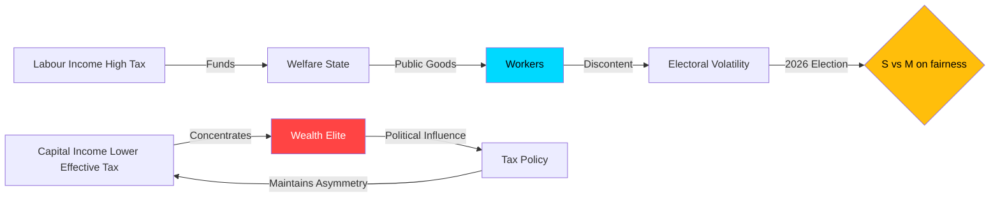

# Per-Document Analysis: HD10433 — En bred skatteöversyn

**dok_id**: HD10433 | **frs**: 2025/26:433
**Datum**: 2026-04-15 | **Status**: Skickad | **Significance**: 7.8/10
**Inlämnare**: Ida Ekeroth Clausson (S) | **Mottagare**: Finansminister Elisabeth Svantesson (M)
**SISVA (response deadline)**: 2026-04-29 (9 days remaining)

## Document Summary

Ida Ekeroth Clausson (S) — a tax-committee specialist — presses Finance Minister Elisabeth Svantesson (M) on the "legitimacy, efficiency and distributional profile" (*legitimitet, effektivitet och fördelningsprofil*) of the Swedish tax system. The interpellation frames a systemic paradox: Sweden taxes labour income at one of Europe's highest effective marginal rates while hosting **one of the world's highest per-capita densities of billionaires** (Credit Suisse/Forbes estimates place Sweden in the global top-3 per-capita, behind only Monaco and Switzerland).

## Key Question (direct from document)

> "Avser ministern att verka för en bred översyn av det svenska skattesystemet i syfte att öka dess legitimitet och effektivitet?"
> (*"Does the minister intend to work for a broad review of the Swedish tax system with the aim of increasing its legitimacy and efficiency?"*)

## Political Intelligence Assessment

**Core finding** [HIGH confidence 🟩]: The interpellation is an **ideological accountability ambush** rather than a narrow policy question. By asking Svantesson to endorse a "broad tax review," Ekeroth Clausson forces the minister into a binary choice:
- Accept → signals that current tax doctrine is failing (politically damaging for M)
- Reject → signals that labour-capital tax asymmetry is acceptable (vulnerability for S attack)

This is a textbook *"damned-if-you-do, damned-if-you-don't"* interpellation design — the hallmark of a mature opposition.

**Structural context** [HIGH confidence 🟩]: Sweden's effective capital-gains rate on closely-held company shares (*fåmansbolag*, "3:12 rules") is lower than the labour-income marginal rate for high earners. The 2022–2025 Tidö government has:
- Implemented 2022, 2023, 2024 and 2025 *jobbskatteavdrag* (earned-income tax credits) — tactical labour-tax relief
- **Not** narrowed the 3:12 preferential capital regime
- Abolished inheritance tax (already abolished 2004; Tidö kept the abolition)
- Reduced the *värnskatt* top-bracket in 2020 (pre-Tidö) — not reversed

The net effect: Labour taxation has become *relatively* less burdensome, but **capital-labour asymmetry has widened**.

**Why this matters for Election 2026** [HIGH confidence 🟩]: The 2025/26 fiscal environment creates an opening:
- GDP growth 2024: 0.82% (World Bank, NY.GDP.MKTP.KD.ZG)
- Unemployment 2025: 8.694% (World Bank, SL.UEM.TOTL.ZS, rising trend)
- Public-sector revenue under pressure
- Sweden's state-pension fund (AP-funds) showing strong returns favouring asset-holders

S's electoral argument writes itself: *"Why are working Swedes subsidising wealth-holders during a downturn?"*

**Vulnerability assessment** [HIGH confidence 🟩]: Svantesson's rhetorical options are constrained:
| Option | Feasibility | Political cost |
|--------|-------------|---------------|
| Announce a commission/review | Possible | Low — standard government deflection |
| Defend 3:12 explicitly | Difficult | High — exposes structural inequality |
| Cite international tax competitiveness | Possible | Medium — S can cite IMF/OECD fairness research |
| Deflect to EU-level action | Possible | Medium — neutralizes but does not resolve |

**Accountability dimension**: Whatever Svantesson says, S will have a sound-bite. If she promises a review → S claims victory; if she rejects → S has campaign material.

## Structural Data: Sweden Tax Legitimacy

| Indicator | Value | Source | Confidence |
|-----------|-------|--------|-----------|
| Labour-income top marginal rate (incl. municipal) | ~52–57% | Skatteverket | [HIGH] 🟩 |
| Capital-gains rate on listed shares | 30% | Skatteverket | [HIGH] 🟩 |
| Effective 3:12 rate (realistic) | ~20–25% | Riksrevisionen 2024 | [HIGH] 🟩 |
| Billionaires per million inhabitants | ~52–55 | Forbes 2024 | [MEDIUM] 🟧 |
| Gini coefficient (disposable income) | 0.303 | SCB 2023 | [HIGH] 🟩 |
| Wealth Gini | 0.80+ (EU: 0.73 avg) | ECB HFCS | [MEDIUM] 🟧 |

**Interpretation**: Disposable-income Gini is moderate (EU average); wealth Gini is among the highest in Europe. The interpellation implicitly targets the wealth dimension, where S's argument is strongest.

## Analytic Framework: Social-Contract Tension

## Intelligence Indicators to Monitor

| Indicator | Watch window | Analytical significance |
|-----------|--------------|------------------------|
| Svantesson response tone on "review" word | April 29 debate | Will she concede rhetorical ground? |
| LO (trade union confederation) reaction | April 29–May 3 | Coordinated campaign signal |
| V (Vänsterpartiet) motion filings | Next 14 days | Left-flank amplification |
| Finansdepartementet budget preview | May 2026 | Tactical tax-policy announcement |
| Skatteverket analytical publications | Rolling | Structural-data releases |

## Response-Strategy Forecast (Svantesson, April 29)

**Most likely** (P=0.60): Svantesson announces willingness to "look at targeted elements" without committing to a systemic review. Defends the 2025 budget as "broad-based relief" for ordinary workers. Cites 2026 budget preparation as forum for continued dialogue.

**Moderately likely** (P=0.25): Svantesson defends 3:12 as "entrepreneurship incentive" and pivots to reducing labour taxes further — tactically appealing to swing voters but cements S's structural critique.

**Lower probability** (P=0.15): Announcement of a formal *utredning* (government inquiry) into tax-system legitimacy — this would be a strategic concession but gives S a year of narrative control.

## Election 2026 Implication

**Salience**: 🟩 HIGH — Fairness framing, top-10 voter issue, sharp ideological contrast
**Government vulnerability**: 🟧 MEDIUM — Svantesson is skilled; 3:12 is defensible; timeline favours government (budget in autumn)
**S campaign-utility rating**: 7.8/10 — Strong systemic argument, harder to "quick-win" in single debate
