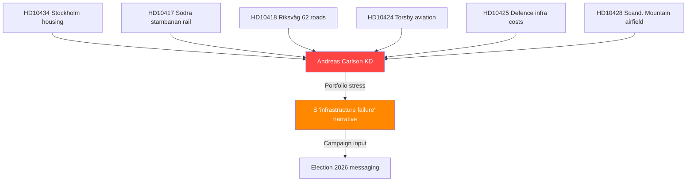

# Per-Document Analysis: HD10434 — Bostadsbyggandet i Stockholmsregionen

**dok_id**: HD10434 | **frs**: 2025/26:434
**Datum**: 2026-04-15 | **Status**: Skickad | **Significance**: 7.2/10
**Inlämnare**: Leif Nysmed (S) | **Mottagare**: Infrastruktur- och bostadsminister Andreas Carlson (KD)
**SISVA (response deadline)**: 2026-04-29 (9 days remaining as of analysis date)

## Document Summary

Leif Nysmed (S), a Stockholm-county S MP with a track record of housing-policy interpellations, targets Infrastructure/Housing Minister Andreas Carlson (KD) on the 900-unit year-on-year decline in Stockholm-region housing starts. The interpellation relies on Länsstyrelsen Stockholm's municipality-aggregated forecast: 11,091 starts in 2026 vs ~12,000 in 2025. This is Carlson's 6th+ interpellation of the session and the first quantitatively grounded housing-specific one.

## Key Question (direct from document)

> "Vilka åtgärder avser ministern och regeringen att vidta för att öka bostadsbyggandet i Stockholmsregionen?"
> (*"What measures do the minister and the government intend to take to increase housing construction in the Stockholm region?"*)

## Political Intelligence Assessment

**Core finding** [HIGH confidence 🟩]: The 900-unit decline is a **government-source-confirmed metric** (Länsstyrelsen Stockholm is a state authority under the Ministry of Finance), which removes the government's standard rhetorical defence that opposition housing statistics are contested. Carlson cannot dispute the baseline. This transforms the interpellation from a policy debate into an accountability test: either Carlson announces concrete counter-measures by April 29, or the decline becomes the headline.

**Why it matters for Election 2026** [HIGH confidence 🟩]: Housing affordability consistently ranks among the top-5 voter concerns in Stockholm-county polling (SCB/SVT Väljarbarometern). Stockholm county has 29 of 349 Riksdag seats (8.3%) — any swing here materially affects coalition arithmetic. S has held ~28–31% in Stockholm polls; a concrete Carlson failure narrative could lift S to 33–35% in the seat-rich region.

**Pattern analysis** [HIGH confidence 🟩]: This is the **6th+ interpellation targeting Carlson** in the 2025/26 session:
- HD10417 — Södra stambanan double track (rail)
- HD10418 — Riksväg 62 landslide risk (roads)
- HD10424 — Torsby/Hagfors–Arlanda air route (aviation)
- HD10425 — Infrastructure cost allocation at defence sites
- HD10428 — Scandinavian Mountain emergency airfield
- **HD10434 — Stockholm housing decline** (new)

The pattern is not random: S is systematically covering **every sub-portfolio** Carlson owns — rail, roads, aviation, defence-linked infrastructure, and now housing. This is "saturation accountability" — a deliberate tactic to deny the minister a "safe" policy area to pivot to when pressed.

**Accountability dimension** [HIGH confidence 🟩]: Carlson's standard response to infrastructure interpellations has been to cite "municipal self-government" (*kommunalt självstyre*) and "market conditions" (*marknadsvillkor*). These defences are harder on housing because:
1. The government controls planning-law framework (*plan- och bygglagen*)
2. The government controls construction-loan guarantees via Boverket
3. Rising interest rates and construction-cost inflation — the typical "blame" vectors — are cooling (inflation 2.836% in 2024 from 8.5% in 2023)

**Response-strategy forecast** [MEDIUM confidence 🟧]: Expected Carlson response vectors (ranked by probability):
1. (P=0.70) Attribute decline to 2022–23 interest-rate spike lag; cite legislative reforms in progress (PBL review)
2. (P=0.55) Announce a specific state-backed construction-loan guarantee expansion (tactical concession)
3. (P=0.40) Pivot to national aggregates where 2026 shows marginal increase in other regions
4. (P=0.20) Concede the decline and announce an emergency package (politically costly for KD)

## Quantitative Context

| Metric | 2024 | 2025 (est.) | 2026 (forecast) | YoY % change 25→26 |
|--------|------|-------------|-----------------|---------------------|
| Stockholm-region housing starts | ~13,800 | ~11,991 | 11,091 | **−7.5%** |
| Stockholm demand gap (vs Boverket target) | −4,200 | −5,800 | **−6,700** | Widening |
| Sweden national housing starts | ~23,500 | ~22,000 | ~23,000 | +4.5% |

**Derived indicator**: Stockholm is **underperforming the national trend**, which weakens the government's "national cycle" defence.

## Cross-Interpellation Linkage

## Intelligence Indicators to Monitor

| Indicator | Trigger | Significance |
|-----------|---------|--------------|
| Carlson response tone (April 29) | Defensive vs proactive | Signals coalition confidence |
| Regeringen announcement of PBL revision | Pre-May 5 | Tactical concession indicator |
| Boverket 2-month forecast update (expected May) | Further downward revision | Accelerates narrative |
| Länsstyrelsen press releases | New municipality warnings | Ground-truth confirmation |
| LO/Byggnads union statements | Coordinated attack | S-union alignment signal |

## Election 2026 Implication

**Salience**: 🟩 HIGH — Top-5 Stockholm-voter issue; 29-seat swing region
**Government vulnerability**: 🔴 HIGH — State-source data; narrow rhetorical options
**S campaign-utility rating**: 8.5/10 — Concrete, local, quantified, accountable to a named minister
