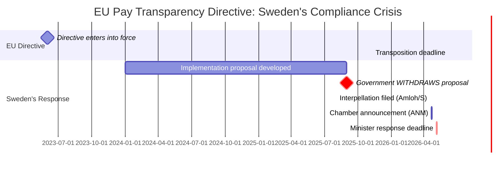

# Per-Document Analysis: HD10437 — Lönetransparensdirektivet

**dok_id**: HD10437 | **frs**: 2025/26:437  
**Datum**: 2026-04-17 | **Status**: Skickad | **Significance**: 9.2/10

## Document Summary
Sofia Amloh (S) interpellates Jämställdhetsminister Nina Larsson (L) on Sweden's failure to implement the EU Pay Transparency Directive. The government withdrew its own implementation proposal, and Sweden will not meet the EU deadline.

## Key Question (direct from document)
> "Varför väljer ministern och regeringen att inte implementera direktivet?"  
> ("Why does the minister and the government choose not to implement the directive?")

## Political Intelligence Assessment

**Core finding** [HIGH confidence 🟩]: This is the most legally and politically consequential interpellation of the batch. The EU Pay Transparency Directive (Directive 2023/970/EU) entered into force in June 2023 with a transposition deadline of June 7, 2026. Sweden's government WITHDREW its implementation proposal, meaning the directive will NOT be implemented on time. This creates: (1) EU infringement risk, (2) electoral vulnerability for coalition on gender equality, and (3) a documented policy failure that S can use in campaign materials.

**Why this matters for Election 2026** [HIGH confidence 🟩]: Sweden's gender pay gap is "bestående och har till och med ökat de senaste åren" (persistent and has even increased in recent years) — the interpellation's own words. L, as a liberal party claiming commitment to gender equality, cannot reconcile its values with its minister presiding over this compliance failure. S has a ready-made campaign message.

**Accountability dimension** [HIGH confidence 🟩]: This is not a nuanced policy disagreement — the government withdrew its own proposal. The factual record is established. Larsson must explain why Sweden chose to miss an EU deadline on equal pay.

**Response deadline**: May 5, 2026 (SISVA)  
**ANM (announced to chamber)**: April 21, 2026

## Mermaid Diagram: EU Directive Compliance Timeline

## Election 2026 Implication
**Salience**: 🟦 VERY HIGH — Pay equity is top-5 women voters issue  
**Government vulnerability**: The withdrawal of the proposal is irrevocable — no spin possible
