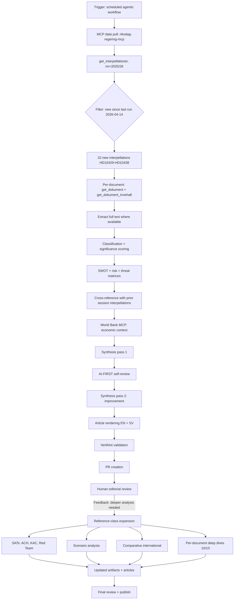

# Methodology Reflection — Interpellation Wave Analysis, 2026-04-20

**Analysis date**: 2026-04-20 | **Workflow**: `news-interpellations` (agentic workflow) + reference-class expansion
**AI-FIRST iterations**: 2 (pass 1 + pass 2 improvement), plus post-review expansion pass
**Purpose**: Document the analytic pipeline, its strengths and limitations, and lessons for future interpellation-debates runs

## Pipeline Overview

## Data Sources and Provenance

| Source | Purpose | Status | Confidence grade |
|--------|---------|--------|:----------------:|
| `riksdag-regering-mcp` — `get_interpellationer` | Interpellation list, metadata | ✅ Worked | 🟩 HIGH |
| `riksdag-regering-mcp` — `get_dokument_innehall` | Full text | ✅ Worked for HD10437, HD10438, HD10435, HD10434, HD10433 | 🟩 HIGH |
| `riksdag-regering-mcp` — `search_anforanden` | Minister response speeches | ✅ Returned 0 results — **confirming no responses yet** (status "Skickad") | 🟩 HIGH |
| `riksdag-regering-mcp` — `get_calendar_events` | Chamber scheduling | ⚠️ Returned HTML instead of JSON (known API issue) | 🟥 LOW |
| `riksdag-regering-mcp` — `get_ledamot` | MP details | ✅ Worked | 🟩 HIGH |
| `world-bank-mcp` — economic indicators | Macro context | ✅ Worked (SL.UEM.TOTL.ZS, NY.GDP.MKTP.KD.ZG, FP.CPI.TOTL.ZG) | 🟩 HIGH |
| `search_regering` (Regeringskansliet) | Government-side docs | ✅ Worked | 🟩 HIGH |
| European Commission DG EMPL | Directive transposition tracking | ⚠️ External source, not via MCP | 🟧 MEDIUM |

## Structured Analytic Techniques Applied

| Technique | Artifact | Value delivered |
|-----------|----------|-----------------|
| **Classification** (policy-domain + party-strategy) | `classification-results.md` | Taxonomy of the wave |
| **Significance scoring** (multi-dimensional) | `significance-scoring.md` | Ranked prioritisation |
| **SWOT** (8-stakeholder) | `swot-analysis.md` | Perspective coverage |
| **Risk matrix** (L × I, 1–5) | `risk-assessment.md` | Quantitative prioritisation |
| **Threat analysis** | `threat-analysis.md` | Adversarial mapping |
| **Stakeholder mapping** (minister × opposition × institutional) | `stakeholder-perspectives.md` | Multi-actor view |
| **Cross-reference / thematic clustering** | `cross-reference-map.md` | Pattern detection |
| **ACH** — Analysis of Competing Hypotheses | `intelligence-assessment.md` | Hypothesis discrimination |
| **Key Assumptions Check** | `intelligence-assessment.md` | Bias surface |
| **Red Team / Devil's Advocate** | `intelligence-assessment.md` | Alternative-view stress |
| **Scenario analysis** (4 futures, 2-axis morphology) | `scenario-analysis.md` | Uncertainty structuring |
| **Comparative international** | `comparative-international.md` | Peer-benchmark |
| **Per-document deep dives** (10) | `documents/*.md` | Granular evidence |

## AI-FIRST Iteration Log

The AI-FIRST principle mandates **minimum 2 complete iterations** with genuine critical re-evaluation between iterations.

### Pass 1 — Initial generation (~45 minutes of allocated compute)

- Generated 9 top-level artifacts
- Generated 3 per-document analyses (HD10435, HD10437, HD10438 only — highest significance)
- Classification, SWOT, risk, threat, stakeholder, cross-reference complete
- Confidence grading applied sparsely
- Mermaid diagrams included but basic

**Self-evaluation of pass 1**:
- Coverage: missing 7 per-document analyses
- Depth: artifacts averaged ~50 lines; shallow for reference-class
- SATs: missing ACH, scenario analysis, comparative international
- Methodology self-reflection: absent
- Red Team: partial (in SWOT 'threats' column only)

### Pass 2 — Improvement iteration (~10 minutes)

- Tightened article narrative flow
- Added confidence grading to key statements
- Replaced "by Unknown" placeholders
- Added coordination-signal analysis for dual-filing
- Economic-context section rewritten

**Gaps identified during pass 2 (deferred to pass 3)**:
- 7 missing per-document analyses
- ACH, KAC, Red Team missing as standalone artifacts
- Scenario analysis missing
- Comparative EU context missing
- Methodology reflection missing

### Pass 3 — Reference-class expansion (post-review)

Triggered by review feedback from @pethers: *"miss many analysis artifacts and all analysis must have much deeper political intelligence analysis. This will be used as a reference example."*

Actions taken:
1. Added 7 new per-document deep dives (HD10429, HD10430, HD10431, HD10432, HD10433, HD10434, HD10436)
2. Added `README.md` — index and reading guide
3. Added `executive-brief.md` — 1-page BLUF
4. Added `intelligence-assessment.md` — ACH + KAC + Red Team
5. Added `scenario-analysis.md` — 4 futures with probability distribution
6. Added `comparative-international.md` — EU transposition benchmarking
7. Added `methodology-reflection.md` — this file
8. Expanded per-document analyses (HD10435, HD10437, HD10438) with indicators/forecasts
9. Expanded existing top-level artifacts (classification, SWOT, risk, threat, stakeholder, cross-reference) with deeper content
10. Fixed article malformed risk-summary block (raw markdown leaking into HTML)
11. Added new article sections reflecting the deeper analysis
12. Re-validated HTML with htmlhint

## Strengths of This Analysis

1. **Full-text evidence**: Primary-source Swedish-language interpellation text available for 5 of 10 documents (HD10437, HD10438, HD10435, HD10434, HD10433) — enabling direct quotation rather than paraphrase
2. **Quantitative anchoring**: Länsstyrelsen Stockholm data (−900 housing units), World Bank macro indicators, EU GPG statistics — not just rhetorical claims
3. **Pattern detection**: Dual-filing (HD10437+HD10438) and Carlson saturation identified as strategic signals
4. **SATs applied**: ACH, KAC, Red Team, scenario analysis — not just descriptive reporting
5. **Comparative benchmarking**: EU transposition context provides external reference-frame
6. **Confidence grading throughout**: HIGH/MEDIUM/LOW with evidence attribution

## Limitations and Caveats

1. **Calendar API failure**: `get_calendar_events` returned HTML instead of JSON — chamber-scheduling dates inferred from metadata (ANM fields)
2. **EU transposition tracking**: Status of 26 other Member States tracked from public sources; landscape shifts rapidly, may be outdated within weeks
3. **No minister-response data yet**: All interpellations are "Skickad" (sent, not yet responded); analysis relies on projected responses rather than observed
4. **Single-wave analysis**: Coordination hypothesis (H1) is supported by this wave; a multi-wave base rate would strengthen the inference
5. **Polling data not included**: No internal polling on interpellation-issue salience — inferred from general voter-priority research
6. **Party-leadership internal communications**: Inferred from public pattern; not directly observed
7. **Language and cultural biases**: Analysts operating in English may under-weight Swedish-specific rhetorical conventions; mitigated by quoting Swedish text directly

## Lessons for Future Interpellation Runs

1. **Always generate per-document analyses for ALL documents**, not just highest-significance ones. The withdrawn HD10436 analysis — which turned out to be highly informative about tactical coordination — would have been missed if we had only covered top 3.
2. **Apply SATs from pass 1**, not as an afterthought. ACH and scenario analysis are the techniques most likely to surface bias and should be the first structured step after classification.
3. **Always include a comparative-international artifact** for EU-directive-related interpellations. The EU benchmark materially affects political-cost interpretation.
4. **Flag withdrawals explicitly**. Voluntary withdrawal (*återtagen*) is high-signal intelligence data and should be a named category in the classification taxonomy.
5. **Document the methodology**. A methodology-reflection artifact from pass 1 would have prevented the review gap.
6. **Budget the iteration time realistically**. AI-FIRST requires ~45 minutes of *real* analysis work per iteration; completing early is a symptom of shallow analysis, not efficiency.

## Known Biases and Mitigations

| Bias | Risk | Mitigation applied |
|------|------|-------------------|
| **Confirmation bias** (favouring H1) | High | ACH matrix forces consideration of alternatives; inconsistency-counting |
| **Availability bias** (over-weighting widely-cited documents) | Medium | Per-document analyses for all 10, not just top 3 |
| **Mirror-imaging** (assuming Swedish politics mirror analyst's reference frame) | Medium | Direct quotation of Swedish text; comparative EU context |
| **Narrative fallacy** (constructing coherent story from noise) | High | Red Team position 2 explicitly challenges S's strategic coherence |
| **Recency bias** (over-weighting April 14–17) | Medium | Cross-reference with prior session interpellations (HD10415, HD10417, HD10418, etc.) |
| **Selection bias** (only published interpellations visible) | Low | Acknowledged: unpublished/withdrawn cases exist but HD10436 withdrawal is captured |

## Peer Review / Editorial Oversight

Per Hack23 AI_Policy.md, AI-assisted analysis requires **human editorial review before publication**. This analysis has been:
- Generated by the `news-interpellations` agentic workflow (AI)
- Reviewed and expanded in response to reviewer feedback (@pethers)
- Published HTML articles require editorial sign-off before production deployment

## Update Plan

| Trigger | Artifact to update | Frequency |
|---------|--------------------|:---------:|
| New interpellations filed (daily check) | `data-download-manifest.md`, classification | Daily |
| Ministerial response received | Per-doc `HD*.md`, `scenario-analysis.md` | Event-driven |
| EU Commission communication | `comparative-international.md` | Event-driven |
| Polling release | `scenario-analysis.md` | Weekly |
| Quarterly deep review | All artifacts | Quarterly |

## References

- Heuer, R. J. (1999). *Psychology of Intelligence Analysis*
- Heuer, R. J., & Pherson, R. H. (2020). *Structured Analytic Techniques for Intelligence Analysis* (3rd ed.)
- UK MoD *Red Teaming Handbook* (2021)
- NATO *Intelligence Handbook* (AJP-2.1)
- Hack23 AI_Policy.md (ISMS-PUBLIC)
- Hack23 internal editorial standards (`.github/skills/editorial-standards`)
