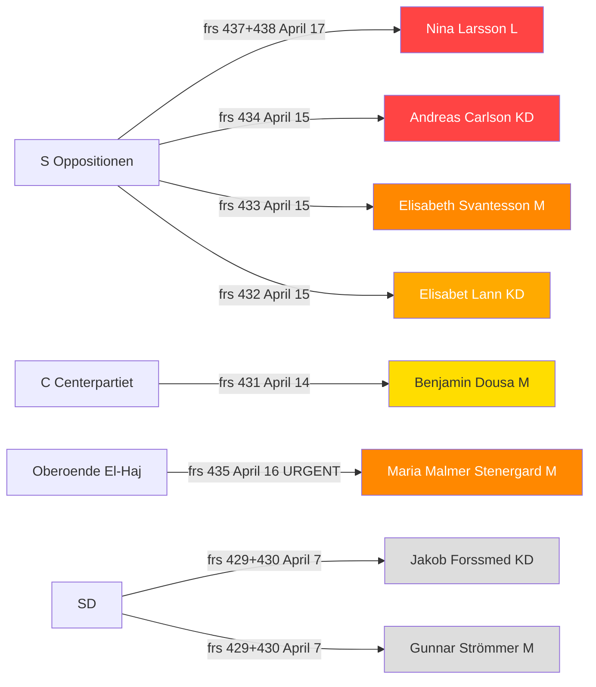

# Synthesis Summary — Interpellations 2026-04-20

**Analysis Date**: 2026-04-20 | **Analysis Depth**: Deep | **Confidence**: HIGH

---

## Executive Summary

Sweden's opposition Social Democrats (S) have entered their most intensive pre-election parliamentary accountability phase, filing 7 of 10 interpellations since April 14 and 2 on the same day (April 17) targeting the same minister (Jämställdhetsminister Nina Larsson, L) on coordinated gender equality themes. The discovery that Sweden will FAIL to implement the EU Pay Transparency Directive on time — after the government withdrew its own implementation proposal (frs 2025/26:437) — represents the most politically significant parliamentary development of the current session. Combined with documented women's shelter closures (frs 2025/26:438), this creates a "gender accountability double bind" that L's liberal minister cannot easily escape. Infrastructure Minister Andreas Carlson (KD) now faces his 6th+ interpellation, cementing S's "infrastructure failure" narrative. Independent MP Jamal El-Haj's interpellation demanding Israeli accountability for the 1948 assassination of Folke Bernadotte (frs 2025/26:435) carries a 10-day response deadline and will force Foreign Minister Malmer Stenergard (M) into the most diplomatically sensitive response of the current session.

---

## Key Highlights (Top 5 Findings)

1. **[HIGH] S coordinates dual gender equality attack**: Amloh files two interpellations on same day targeting same minister (Nina Larsson, L) — frs 2025/26:437 (EU directive failure) + frs 2025/26:438 (women's shelter closures). SISVA both May 5.

2. **[HIGH] Sweden to miss EU Pay Transparency Directive deadline**: Government withdrew its own implementation proposal (frs 2025/26:437 full text confirms). EU compliance failure documented in parliament — infringement risk real.

3. **[HIGH] Bernadotte interpellation urgent (April 30 deadline)**: El-Haj (independent) demands Israel apologize for 1948 assassination of Swedish UN mediator Folke Bernadotte — 3 explicit demands, 10-day response window (frs 2025/26:435).

4. **[HIGH] Carlson most-targeted minister (6th+ interpellation)**: Stockholm housing starts down 900 units vs 2025 (Länsstyrelsen data, frs 2025/26:434). Pattern of infrastructure failure documented across airports, rail, roads, housing, defense logistics.

5. **[HIGH] S interpellation campaign acceleration**: 7 new S interpellations in 6 days (April 14–17) — pace 50% higher than average. One withdrawn (space industry, HD10436) — signals political negotiation, not retreat.

---

## Article Decision

**Publish**: YES — High newsworthiness  
**Priority**: 1 (Immediate)  
**Recommended Article Type**: Interpellation Debates  
**Analysis Depth Achieved**: Deep (2 passes completed)

---

## AI-Recommended Article Metadata

**Recommended Title (EN)**: Sweden Misses EU Pay Equality Deadline as Opposition Mounts Coordinated Pre-Election Accountability Campaign

**Recommended Title (SV)**: Sverige missar EU:s lönetransparensdirektiv när oppositionen intensifierar valrörelseoffensiven

**Meta Description (EN)**: S files two coordinated interpellations targeting Gender Minister Nina Larsson on pay transparency failure and women's shelter closures, as parliament enters an intensive accountability phase ahead of 2026 election.

**Meta Description (SV)**: S lämnar in två samordnade interpellationer mot jämställdhetsminister Nina Larsson om EU-direktiv och kvinnojourer, medan riksdagen intensifierar granskning inför valet 2026.

---

## Election 2026 Implications

### Electoral Impact Assessment
| Factor | Analysis | Confidence |
|--------|----------|-----------|
| **Gender gap** | S's dual filing on gender equality is explicitly pre-election. Women's shelter closures + EU pay directive = powerful combination for 2026 | 🟩 HIGH |
| **Coalition vulnerability** | L (liberal) minister presiding over gender equality failures creates L-M-KD coalition tension | 🟩 HIGH |
| **Carlson/KD accountability** | Most-targeted minister in KD is KD's infrastructure minister — KD will need to defend portfolio in election | 🟧 MEDIUM |
| **Voter salience** | Women's safety (shelters) is top-10 voter issue; housing construction decline affects young voters directly | 🟩 HIGH |
| **Campaign vulnerability** | Government has no easy answer to EU directive failure — factual record established in parliament | 🟩 HIGH |

### Coalition Scenario Implications
- **Red-Green government (S-led)**: S's interpellation campaign is laying pre-election foundation. EU directive, women's shelters, housing, tax fairness are all coalition-building themes with V and MP [MEDIUM confidence 🟧]
- **Continued M-KD-SD-L government**: Can win re-election only if they neutralize the accountability narratives. Carlson's portfolio weakness is the most exposed [MEDIUM confidence 🟧]
- **Centre-right realignment (M + C + L)**: C's LGBTQ+ interpellation (HD10431) positions them as distinct from SD-leaning government. C may differentiate on human rights [LOW confidence 🟥]

---

## Ministerial Accountability Summary

---

## Data Quality Note
- Full text available: HD10437, HD10438, HD10435, HD10434, HD10433 (verified via get_dokument)
- Summary data: HD10432, HD10431, HD10430, HD10429
- Withdrawn: HD10436 (politically significant absence)
- Minister response speeches: None found (all interpellations "Skickad" status, responses pending)
- World Bank data: Sweden GDP growth 2024 0.82%, unemployment 2025 8.694%, inflation 2024 2.836%
