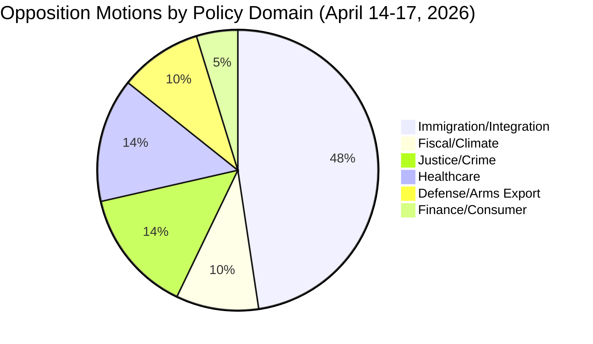
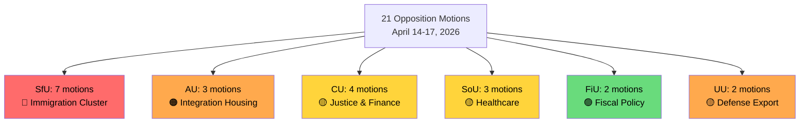

# Political Classification Results — Opposition Motions
**Date**: 2026-04-20 | **Riksmöte**: 2025/26 | **Analyst**: news-motions workflow
**Analysis Timestamp**: 2026-04-20 13:02 UTC | **Data Depth**: SUMMARY (MCP get_motioner)

---

## 🗂️ Document Classification Overview

| # | Dok_id | Motion Nr | Title (EN) | Party | Committee | Domain | Sensitivity | Urgency |
|---|--------|-----------|------------|-------|-----------|--------|-------------|---------|
| 1 | HD024080 | mot. 2025/26:4080 | Counter to new reception law | S | SfU | Immigration | 🟡 SENSITIVE | 🟠 URGENT |
| 2 | HD024087 | mot. 2025/26:4087 | Counter to new reception law | MP | SfU | Immigration | 🟡 SENSITIVE | 🟠 URGENT |
| 3 | HD024089 | mot. 2025/26:4089 | Counter to new reception law | C | SfU | Immigration | 🟡 SENSITIVE | 🟠 URGENT |
| 4 | HD024076 | mot. 2025/26:4076 | Counter to new reception law | V | SfU | Immigration | 🟡 SENSITIVE | 🟠 URGENT |
| 5 | HD024090 | mot. 2025/26:4090 | Counter to stricter deportation rules | V | SfU | Immigration/Justice | 🟡 SENSITIVE | 🟠 URGENT |
| 6 | HD024097 | mot. 2025/26:4097 | Counter to stricter deportation rules | MP | SfU | Immigration/Justice | 🟡 SENSITIVE | 🟠 URGENT |
| 7 | HD024095 | mot. 2025/26:4095 | Counter to stricter deportation rules (partial) | C | SfU | Immigration/Justice | 🟢 PUBLIC | 🟡 STANDARD |
| 8 | HD024077 | mot. 2025/26:4077 | Counter to time-limited immigrant housing | V | AU | Integration/Housing | 🟡 SENSITIVE | 🟠 URGENT |
| 9 | HD024079 | mot. 2025/26:4079 | Counter to time-limited immigrant housing | S | AU | Integration/Housing | 🟡 SENSITIVE | 🟠 URGENT |
| 10 | HD024086 | mot. 2025/26:4086 | Counter to time-limited immigrant housing | MP | AU | Integration/Housing | 🟡 SENSITIVE | 🟠 URGENT |
| 11 | HD024082 | mot. 2025/26:4082 | Counter to fuel tax cut extra budget | S | FiU | Fiscal/Climate | 🟢 PUBLIC | 🟡 STANDARD |
| 12 | HD024098 | mot. 2025/26:4098 | Counter to fuel tax cut extra budget | MP | FiU | Fiscal/Climate | 🟢 PUBLIC | 🟡 STANDARD |
| 13 | HD024078 | mot. 2025/26:4078 | Crime victim compensation law | S | CU | Justice | 🟢 PUBLIC | 🟡 STANDARD |
| 14 | HD024084 | mot. 2025/26:4084 | Crime victim compensation law | V | CU | Justice | 🟢 PUBLIC | 🟡 STANDARD |
| 15 | HD024085 | mot. 2025/26:4085 | Crime victim compensation law | MP | CU | Justice | 🟢 PUBLIC | 🟡 STANDARD |
| 16 | HD024081 | mot. 2025/26:4081 | Municipal healthcare medical competence | S | SoU | Healthcare | 🟢 PUBLIC | 🟡 STANDARD |
| 17 | HD024083 | mot. 2025/26:4083 | Municipal healthcare medical competence | V | SoU | Healthcare | 🟢 PUBLIC | 🟡 STANDARD |
| 18 | HD024094 | mot. 2025/26:4094 | Municipal healthcare medical competence | C | SoU | Healthcare | 🟢 PUBLIC | 🟡 STANDARD |
| 19 | HD024091 | mot. 2025/26:4091 | Arms export regulation | V | UU | Defense/Export | 🟡 SENSITIVE | 🟠 URGENT |
| 20 | HD024096 | mot. 2025/26:4096 | Arms export regulation | MP | UU | Defense/Export | 🟡 SENSITIVE | 🟠 URGENT |
| 21 | HD024088 | mot. 2025/26:4088 | Consumer credit law | C | CU | Finance/Consumer | 🟢 PUBLIC | 🟡 STANDARD |

---

## 📊 Classification by Policy Domain

---

## 🎯 Committee Distribution

---

## 🏛️ Opposition Party Activity Matrix

| Party | SfU | AU | CU | SoU | FiU | UU | Total |
|-------|-----|----|----|-----|-----|----|-------|
| **S (Socialdemokraterna)** | 1 | 1 | 1 | 1 | 1 | 0 | **5** |
| **V (Vänsterpartiet)** | 2 | 1 | 1 | 1 | 0 | 1 | **6** |
| **MP (Miljöpartiet)** | 2 | 1 | 1 | 0 | 1 | 1 | **6** |
| **C (Centerpartiet)** | 2 | 0 | 1 | 1 | 0 | 0 | **4** |
| **TOTAL** | **7** | **3** | **4** | **3** | **2** | **2** | **21** |

---

## 📌 Key Classification Findings

### 1. Coordinated Opposition on Immigration (HIGH Confidence 🟩)
All four major opposition parties (S, V, MP, C) filed motions on **three simultaneous immigration-related propositions** — a coordinated response not seen since the 2022 Migration Package debates. This signals a deliberate opposition strategy to frame immigration as the central political battleground before the September 2026 election.

### 2. Cross-Ideological Consensus on Fuel Tax Opposition (HIGH Confidence 🟩)
Both S (center-left) and MP (Green) oppose the government's fuel tax cut in prop. 2025/26:236. This unusual alignment of economic-left and climate-green parties creates a unified messaging opportunity: the government is both economically irresponsible (S) and climate-damaging (MP).

### 3. Arms Export — Hard Opposition from Left/Green Bloc (MEDIUM Confidence 🟧)
V and MP both reject prop. 2025/26:228 on arms export regulation, continuing a consistent pattern of opposing Sweden's post-2022 defense-industrial pivot. With NATO membership now settled, this opposition has limited practical effect but strong electoral signaling value for their core voters.

### 4. Healthcare Competence — Three-Party Rejection (MEDIUM Confidence 🟧)
The unusual alignment of S, V, and C against prop. 2025/26:216 (municipal healthcare medical competence) reflects a substantive policy disagreement about regulatory design, not just partisan positioning.
