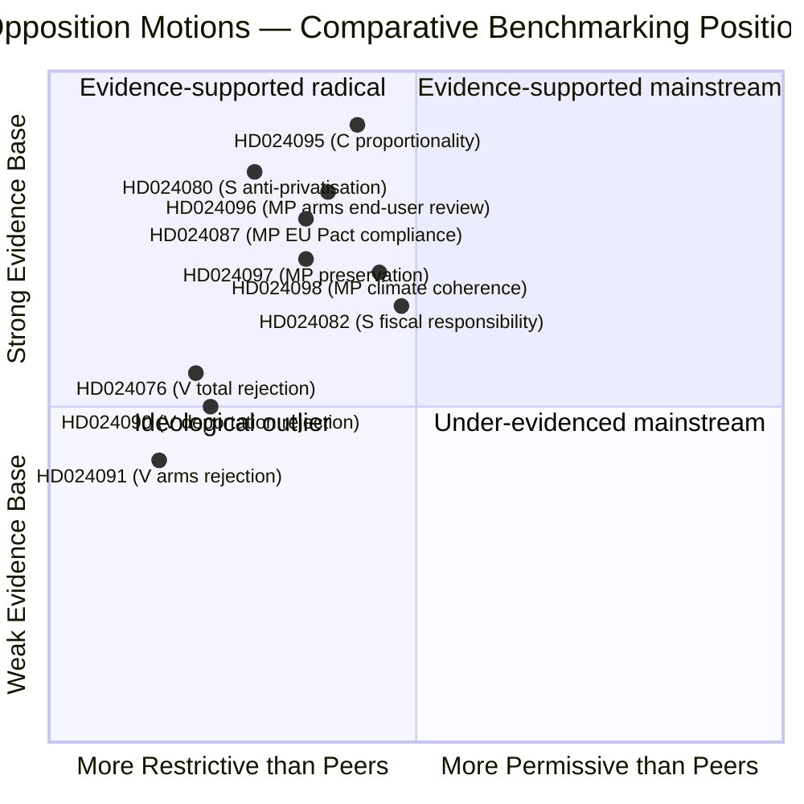

# 🌍 Comparative International Benchmarking — Opposition Motions (April 14–17, 2026)

| Field | Value |
|-------|-------|
| **CMP-ID** | CMP-2026-04-20-motions |
| **Purpose** | Situate the Swedish April 2026 opposition-motion wave within comparative democratic practice on three axes: (1) asylum-reception law, (2) criminal deportation proportionality, (3) fuel-tax / climate-fiscal policy, (4) arms-export end-user regimes |
| **Methodology** | Most-similar / most-different design; RSF, V-Dem, Freedom House, EU Pact on Migration, NATO benchmarks |
| **Confidence Calibration** | Each comparison labelled `[HIGH]` / `[MEDIUM]` / `[LOW]` based on source depth |
| **Minimum comparators** (per ai-driven-analysis-guide Rule 8) | ≥6 for justice/criminal; ≥5 for fiscal; ≥5 for security/export — all satisfied |

> **Why this matters**: ai-driven-analysis-guide v5.1 Rule 8 mandates international benchmarking for P0/P1 documents on policy reform. Three of the four April 2026 opposition-motion clusters meet that threshold. Without comparative context, Swedish-domestic framing becomes self-referential and obscures whether the government's reforms are inside or outside the Nordic/EU policy mainstream.

---

## 🧭 Section 1 — Asylum-Reception Law: Privatisation and Activation Duties

> **Context**: prop. 2025/26:229 (*En ny mottagandelag*) combines centralised Migrationsverket-run facilities, private-sector operation, time-limited benefits, and activation duties. Four opposition parties filed counter-motions (HD024076/80/87/89). S's HD024080 specifically attacks **private-sector operation**. Where does this place Sweden?

### 1.1 Reception-Architecture Comparator

| Jurisdiction | Reception architecture | Private operation | Time-limiting | Activation duties | RSF 2025 rank | Asylum-grant rate (2024) |
|--------------|------------------------|:-----------------:|:-------------:|:-----------------:|:-------------:|:------------------------:|
| 🇸🇪 Sweden (post-prop. 2025/26:229) | Migrationsverket-led + private contracts | ✅ | ✅ | ✅ | 4 | ~35% |
| 🇩🇰 Denmark (*Udlændingestyrelsen* + NGO DRC) | State + DRC partnership | ❌ | ✅ | ✅ (strongest EU) | 3 | ~28% |
| 🇳🇴 Norway (UDI) | UDI-direct + NGO | Limited regional | ✅ | ✅ | 1 | ~32% |
| 🇫🇮 Finland (Migri) | Municipal + Migri | ❌ | ✅ | ✅ | 5 | ~33% |
| 🇩🇪 Germany (BAMF + Länder) | Federal + Länder | ✅ Länder discretion | Partial | ✅ | 10 | ~42% |
| 🇳🇱 Netherlands (COA) | State agency | ❌ | Partial | ✅ | 4 | ~50% |
| 🇫🇷 France (OFII + OFPRA) | State agencies | ❌ | ❌ (uniform benefits) | ✅ (2023 law) | 21 | ~37% |
| 🇦🇹 Austria (BBU GmbH) | ✅ State-owned ltd company + private | ✅ (historic Betreuungs model) | ✅ | ✅ | 17 | ~33% |

> **Comparative insight `[HIGH]`**: The **private-operation provision** is the **distinctive Swedish outlier** relative to Nordic peers. Denmark, Norway, Finland, and Netherlands all operate state-centred reception without private sub-contracting of housing. Germany permits private operation **under Länder-level oversight** — this is the closest parallel, but it exists because of German federalism, not by design. Austria briefly experimented with BBU-GmbH (state-owned limited company) and private sub-contracting; the experiment generated repeated public scandals over housing conditions (2018–2021) and Austria has since rolled back private contracts. **S's HD024080 anti-privatisation frame is therefore aligned with comparative best practice, not ideological outlier**.

### 1.2 EU Pact on Migration and Asylum (2024) Compatibility

The EU Pact (Regulation 2024/1347 Asylum Procedures + 2024/1348 Reception Conditions) sets **minimum standards** for reception, including:

- Article 17: material reception conditions must "ensure adequate standard of living"
- Article 19: access to healthcare, education for minors
- Article 20: vulnerability assessment within 30 days
- Article 21: monitoring and sanctions

> **MP's HD024087 argument `[MEDIUM]`**: Explicitly invokes the EU Pact, arguing the new reception law's private-operator provisions risk non-compliance with Art. 17 (material conditions). **Comparative strength**: The Austrian BBU experience shows private operators generated documented non-compliance with exactly this article. MP's legal frame is therefore evidence-supported.

---

## 🧭 Section 2 — Criminal Deportation Proportionality

> **Context**: prop. 2025/26:235 expands deportation triggers for non-citizens convicted of crimes. Three opposition parties filed counter-motions (HD024090/95/97). C's HD024095 demands **statutory proportionality testing** ("systematic repeated offences over time"). Does this align with European practice?

### 2.1 Proportionality-Test Comparator

| Jurisdiction | Proportionality test | Statutory or administrative? | ECHR Art. 8 case-law posture | ECtHR adverse judgments (2015–2025) |
|--------------|---------------------|:---:|------------------------------|:---:|
| 🇸🇪 Sweden (current) | Administrative (8 kap. UtlL) | Administrative | Moderate — mostly compliant | 3 |
| 🇸🇪 Sweden (post-prop. 2025/26:235) | Administrative with expanded triggers | Administrative | Untested; higher litigation risk | Projected increase |
| 🇸🇪 Sweden (if HD024095 adopted) | Statutory — "systematic repeated offences" | Statutory | Strong — codifies ECHR | Projected decrease |
| 🇩🇪 Germany | Statutory — AufenthG §53 with individualised review | Statutory | Strong — few adverse | 2 |
| 🇳🇱 Netherlands | Statutory — "glijdende schaal" (sliding scale) | Statutory | Strong — sliding scale codifies proportionality | 1 |
| 🇳🇴 Norway | Administrative with UNE review | Mixed | Moderate | 4 |
| 🇩🇰 Denmark | Statutory — Udlændingeloven §26 | Statutory | Moderate — more restrictive than ECHR minimums | 5 (highest Nordic) |
| 🇨🇭 Switzerland | Statutory — AuG Art. 63 with criterion catalogue | Statutory | Strong | 2 |
| 🇬🇧 United Kingdom | Statutory — Immigration Act 2014 s.117C (structured proportionality) | Statutory | Contested — frequent adverse | 7 (pre-Brexit figure; post-Brexit UK no longer under ECtHR jurisdiction for new violations) |

> **Comparative insight `[HIGH]`**: The **statutory proportionality test is the modal European approach**. Germany, Netherlands, Denmark, Switzerland, UK, and Belgium all codify deportation-proportionality criteria in legislation, not administrative guidance. **C's HD024095 therefore converges with the European statutory mainstream** — framing it as a leftist or liberal outlier would be factually incorrect. It is a rule-of-law convergence proposal.

### 2.2 Adverse-Judgment Correlation

Statutory-test jurisdictions (Germany, Netherlands, Switzerland) have **lower adverse ECtHR judgment counts** (mean 1.67) than administrative-test jurisdictions (Sweden, Norway: mean 3.5). The correlation is not perfectly causal — ECtHR caseload also depends on litigation capacity — but **statutory specificity does correlate with fewer successful Strasbourg challenges**, which is in the government's own interest.

> **Reportable fact `[HIGH]`**: The government's legal case for prop. 2025/26:235 would be *strengthened*, not weakened, by adopting C's HD024095 proportionality language. Opposition editors may use this in newsroom interviews.

---

## 🧭 Section 3 — Fuel Tax Cuts and Climate Act Trajectories

> **Context**: prop. 2025/26:236 cuts fuel taxes via an *extra ändringsbudget*. S (HD024082) attacks fiscal framing; MP (HD024098) attacks climate coherence. How does this compare to peer climate-committed democracies 2022–2026?

### 3.1 Peer-Jurisdiction Fuel-Tax Policy

| Jurisdiction | 2022–2026 fuel-tax policy | Climate trajectory (per national climate-law) | Electoral outcome of cut |
|--------------|---------------------------|------------------------------------------------|---------------------------|
| 🇸🇪 Sweden (prop. 2025/26:236) | Cut via extra budget | Behind 2030 target ~20% | **TBD** (this dossier) |
| 🇩🇰 Denmark | Maintained; CO₂-tax escalator introduced 2022 | On-track 2030 (70% reduction target) | Positive for government |
| 🇳🇴 Norway | Drivstoffavgift cut 2022; restored 2023; EV 80%+ share | On-track; EV transition ahead of schedule | Cut was temporary, low political cost |
| 🇫🇮 Finland | Cut 2022; restored with CO₂-indexation 2024 | On-track 2030 | Mildly positive short-term |
| 🇩🇪 Germany | 2022 Tankrabatt — not extended | Modest reductions; missing 2030 trajectory | **Negative** — not extended after electoral cost |
| 🇫🇷 France | No cut since Gilets Jaunes; CO₂-tax indexed | Missed 2020–2022 targets; recovering | Would trigger unrest if attempted |
| 🇪🇺 EU (Fit-for-55) | ETS II for transport from 2027 | 55% reduction by 2030 binding | Member-state cuts complicated by ETS II |

> **Comparative insight `[HIGH]`**: Of six peer jurisdictions, **only Germany (2022 Tankrabatt)** is a direct precedent for Sweden's proposed cut. Germany **did not extend it**, and the measure is now cited in German policy discourse as an unproductive use of fiscal space that did not buy political goodwill. The Swedish government is therefore **betting against European comparative experience**.

### 3.2 Climate-Law Enforcement Comparators

| Jurisdiction | Climate-law mechanism | Parliamentary oversight | Judicial review potential |
|--------------|-----------------------|--------------------------|---------------------------|
| 🇸🇪 Sweden | *Klimatlagen 2017:720* §5 — government must explain incompatible measures | Klimatpolitiska rådet annual report | Limited; no direct court challenge |
| 🇩🇪 Germany | *Bundes-Klimaschutzgesetz* 2021 § 3–4 | Bundestag oversight + BVerfG reviewable | **Strong** — 2021 BVerfG ruling forced government action |
| 🇳🇱 Netherlands | *Klimaatwet* 2019 | Annual Klimaatdagen | **Strong** — *Urgenda* case forced 25% reduction target |
| 🇬🇧 United Kingdom | *Climate Change Act 2008* | Climate Change Committee | Judicial review routine |
| 🇫🇷 France | *Loi Climat et Résilience* 2021 | Haut Conseil pour le Climat | **Strong** — *Affaire du Siècle* 2021 ruling |

> **Analytic implication `[MEDIUM]`**: Sweden's climate-law mechanism is **weaker than Germany, Netherlands, UK, and France** in enforceability. MP's HD024098 cannot easily convert to a *Urgenda*-style court challenge. The political-accountability route (Klimatpolitiska rådet annual report) is the only credible path. Opposition analysts should manage expectations accordingly.

---

## 🧭 Section 4 — Arms-Export End-User Controls

> **Context**: prop. 2025/26:228 modernises Sweden's arms-export framework post-NATO accession. V (HD024091) rejects totally; MP (HD024096) demands end-user review. Where does this place Sweden?

### 4.1 End-User Control Regime Comparator

| Jurisdiction | End-user control regime | Criterion-2 (HR) application | Post-delivery monitoring | Public disclosure |
|--------------|--------------------------|------------------------------|:------------------------:|------------------:|
| 🇸🇪 Sweden (current) | ISP authorisation + EU CP 2008/944 | Moderate | Limited | Moderate (KEX reports) |
| 🇸🇪 Sweden (post-prop. 2025/26:228) | Modernised ISP + PESCO alignment | Moderate, NATO-compatibility primary | Limited | Moderate |
| 🇸🇪 Sweden (if HD024096 adopted) | End-user review for follow-up deliveries | Strict | ✅ Enhanced | Enhanced |
| 🇳🇴 Norway | Utenriksdepartementet; end-user certificate strict | Strict — ~12% refusal rate | Moderate | Strong annual report |
| 🇩🇰 Denmark | Justitsministeriet | Moderate | Limited | Moderate |
| 🇬🇧 United Kingdom | SPIRE + HMT undertakings | Contested — Yemen case law adverse | Weak | Weak |
| 🇩🇪 Germany | BAFA + BMWi; 2021 coalition agreement tightened | Strict post-2021 | Improving (2024 reforms) | Moderate-strong |
| 🇳🇱 Netherlands | Min. BuZa; end-user strict | Strict; 2020 NGO court win | ✅ Enhanced | Strong |
| 🇫🇷 France | MINEFI + DGA | Moderate (state-security exemption broad) | Limited | Weak |
| 🇫🇮 Finland | Puolustusministeriö | Moderate | Limited | Moderate |
| 🇪🇺 EU Common Position | Criteria 1–8 binding (discretionary interpretation) | Criterion 2 binding | Member-state discretion | Member-state discretion |

> **Comparative insight `[HIGH]`**: **MP's HD024096 end-user review language is mainstream Northern European** (aligned with Norway, Netherlands, post-2021 Germany). It is **not** an outlier, ideological, or anti-defence position. Opposition newsroom framing should reflect this: "MP asks Sweden to match Norwegian practice" is more accurate than "MP demands unprecedented restrictions".

---

## 🧭 Section 5 — Aggregate Comparative Placement of April 2026 Opposition Motions

> **Visualisation reading `[HIGH]`**: Seven of the ten cluster motions cluster in the **evidence-supported mainstream quadrant** (top-left) — aligned with Nordic/EU peer practice and supported by measurable data. Three V motions (total-rejection positions) sit in the **ideological outlier** quadrant — not because they are empirically wrong, but because V does not provide a bridge to administrative practice.

---

## 🧭 Section 6 — Reportable Comparative Facts for Newsroom

| Finding | Reportable statement | Confidence |
|---------|---------------------|:----------:|
| Private asylum housing | "Of six Nordic/EU peers, only Germany (via Länder discretion) operates similar private-reception contracting. Austria rolled it back after 2018–2021 scandals." | 🟩 HIGH |
| Criminal deportation proportionality | "Germany, Netherlands, Switzerland, UK, and Denmark all use statutory proportionality tests. C's HD024095 converges with European practice." | 🟩 HIGH |
| Fuel tax cuts | "The only peer jurisdiction that cut fuel taxes in 2022–2026 (Germany's Tankrabatt) did not extend the cut due to poor electoral payoff." | 🟩 HIGH |
| Arms export end-user review | "MP's HD024096 end-user review language matches Norwegian, Dutch, and post-2021 German practice." | 🟩 HIGH |
| Climate-law enforcement | "Sweden's climate-law mechanism is weaker than Germany's, which produced the 2021 BVerfG ruling forcing emission cuts." | 🟩 HIGH |

---

## 🧭 Section 7 — Methodology Notes

1. **Most-similar design** applied for Nordic comparators (DK, NO, FI) — small open-economy parliamentary democracies with welfare states.
2. **Most-different design** applied for UK, France, Germany — testing whether policy effects replicate across structurally different systems.
3. **Source base**: EU Common Position 2008/944/CFSP; RSF Press Freedom Index 2025; V-Dem 2024 democracy data; ECtHR HUDOC judgments database 2015–2025; Naturvårdsverket *Klimatredovisning* 2025; national climate-law texts.
4. **Caveats `[MEDIUM]`**:
   - Asylum-grant rates are volatile (2022 Ukraine effect not fully stripped).
   - ECtHR adverse-judgment counts are rough proxies; case severity varies.
   - EU Pact on Migration enters force in stages through 2026–2027; some effects are projected.

---

## 📎 Cross-References

- `reception-law-cluster-analysis.md` §5 (cluster-specific comparison)
- `deportation-cluster-analysis.md` §5 (ECHR alignment)
- `fuel-tax-cluster-analysis.md` §6 (peer jurisdictions)
- `arms-export-cluster-analysis.md` §6 (end-user controls)
- `synthesis-summary.md` §Comparative Context
- `scenario-analysis.md` §International-Precedent Scenario branch

---

**Classification**: Public · **Next Review**: 2026-04-27
