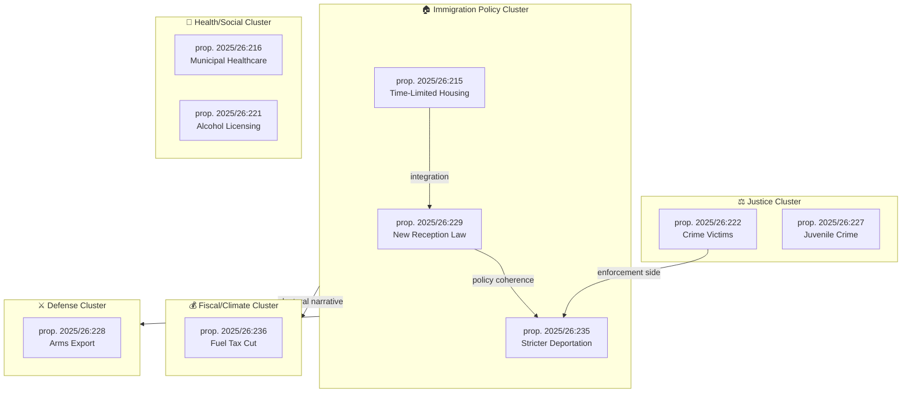
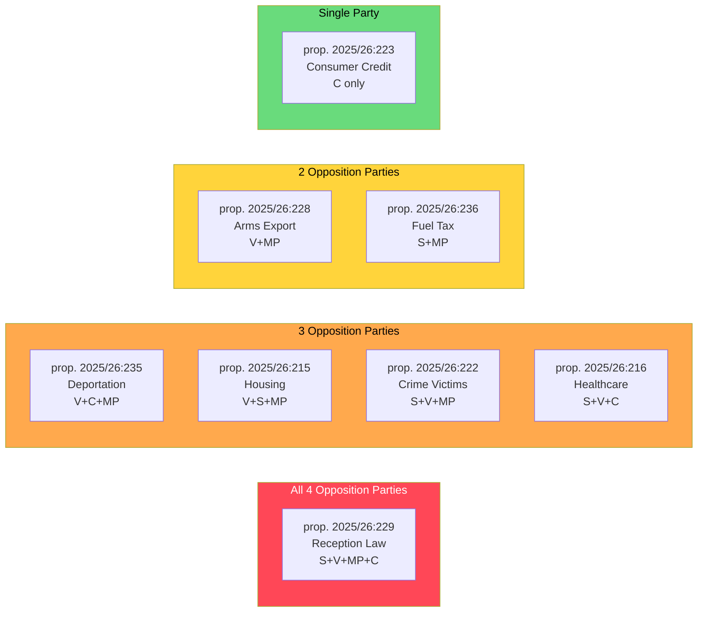

# Cross-Reference Map — Opposition Motions (April 14–17, 2026)
**Date**: 2026-04-20 | **Riksmöte**: 2025/26 | **Analyst**: news-motions workflow
**Analysis Timestamp**: 2026-04-20 13:08 UTC

---

## 🔗 Document Cross-Reference Network

### Proposition → Motion Cross-Reference

| Proposition | Title | Counter-Motions | Filing Parties | Committee |
|-------------|-------|-----------------|----------------|-----------|
| prop. 2025/26:229 | En ny mottagandelag | HD024076, HD024080, HD024087, HD024089 | V, S, MP, C | SfU |
| prop. 2025/26:235 | Skärpta regler om utvisning på grund av brott | HD024090, HD024095, HD024097 | V, C, MP | SfU |
| prop. 2025/26:215 | Tidsbegränsat boende för vissa nyanlända invandrare | HD024077, HD024079, HD024086 | V, S, MP | AU |
| prop. 2025/26:236 | Extra ändringsbudget – Sänkt skatt på drivmedel | HD024082, HD024098 | S, MP | FiU |
| prop. 2025/26:222 | Ersättningsregler med brottsoffret i fokus | HD024078, HD024084, HD024085 | S, V, MP | CU |
| prop. 2025/26:216 | Stärkt medicinsk kompetens i kommunal hälso- och sjukvård | HD024081, HD024083, HD024094 | S, V, C | SoU |
| prop. 2025/26:228 | Ett modernt och anpassat regelverk för krigsmateriel | HD024091, HD024096 | V, MP | UU |
| prop. 2025/26:223 | En ny konsumentkreditlag | HD024088 | C | CU |

> **Scope note**: The table above is restricted to the canonical 21-motion April 14–17 opposition set filed against government propositions. Related parliamentary items (e.g., skr. 2025/26:226 on Sida humanitarian aid and its follow-on motions HD024070 / HD024072) fall outside this dossier's scope and are tracked in a separate skrivelse analysis.

---

## 🕸️ Motion Interdependency Network

---

## 📊 Party Coordination Analysis

### Cross-Party Motion Alignment (same proposition)

---

## 🔗 Previous Period Cross-References

### Connection to Motions from Last Run (2026-04-17)

The April 14–17 motions build on the April 15–17 batch covered in the previous run:

| Previous Motion | Today's Related Motion | Connection |
|-----------------|----------------------|------------|
| HD024090–HD024097 (April 16) | Today's April 14-15 motions | Same policy packages, earlier filings |
| HD024097 (MP, deportation) | HD024090 (V, deportation) | Parallel rejection strategies |
| HD024093 (C, cybersecurity) | HD024095 (C, deportation) | C's consistent "more analysis needed" framing |

### Policy Continuity from Previous Riksmöte

- The immigration motions continue opposition strategy from 2024/25 riksmöte when similar restrictions were resisted
- V's complete rejection pattern (HD024090, HD024091) mirrors V's consistent "no" to all security-related legislation since 2022
- MP's partial acceptance approach (HD024097 preserving parts of deportation law) shows MP learning from 2022 when total rejections cost them parliamentary representation

---

## 📊 Analytical Cross-Reference to Economic Context

| Motion Cluster | Economic Context Link | Data Point |
|---------------|----------------------|------------|
| Immigration motions (HD024076/80/87/89) | Unemployment rising to 8.69% (2025) increases political salience | World Bank SL.UEM.TOTL.ZS 2025 |
| Fuel tax motions (HD024082/98) | Sweden GDP growth only 0.82% (2024), down from 5.2% (2021) | World Bank NY.GDP.MKTP.KD.ZG 2024 |
| Housing motions (HD024077/79/86) | Integration impacts long-term labour supply; unemployment context | World Bank SL.UEM.TOTL.ZS 2025 |
| Arms export (HD024091/96) | Sweden's defence spending 2.1% GDP (2025) post-NATO | NATO benchmarking context |

---

## 🔭 Forward Cross-Reference Connections

1. **SfU Hearings** (May 2026): All immigration motions will be heard in Social Affairs Committee — expect testimony from Röda Korset, UNHCR Sweden
2. **FiU Budget Vote** (May 2026): Fuel tax extra budget — HD024082/98 will be voted down but provide campaign material
3. **Translation trigger**: These articles will be translated by news-translate workflow into DA, NO, FI, DE, FR, ES, NL, AR, HE, JA, KO, ZH
4. **CIA Platform connection**: Voting records for these motions will appear at https://hack23.github.io/cia/ when chamber votes occur (June 2026)
