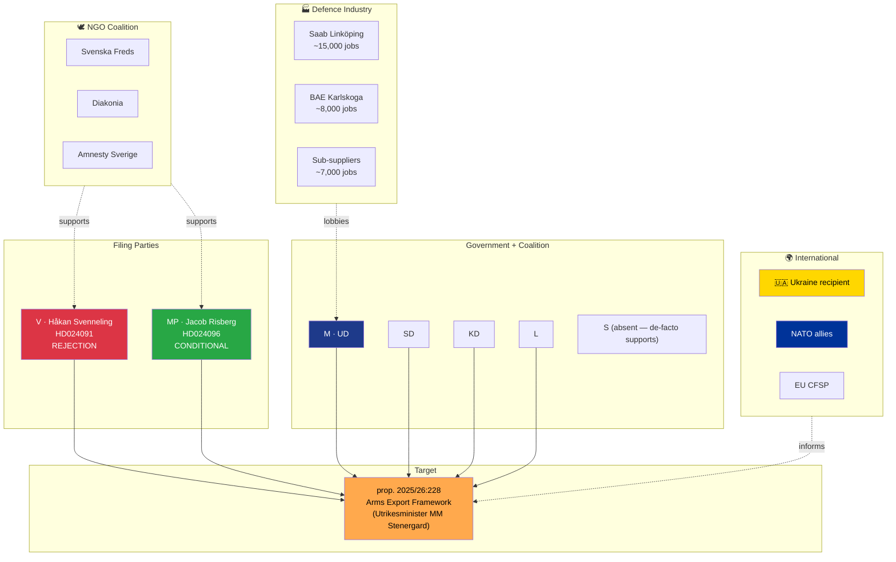

# Document Intelligence Analysis — Arms Export Counter-Motion Cluster

| Field | Value |
|-------|-------|
| **Cluster ID** | ARMS-CLUSTER-2026-04-16 |
| **Member motions** | HD024091 (V), HD024096 (MP) |
| **Target proposition** | prop. 2025/26:228 — *Ett modernt och anpassat regelverk för krigsmateriel* |
| **Committee** | Utrikesutskottet (UU) |
| **Filing dates** | Both 2026-04-16 (same-day dual filing) |
| **Raw Significance** | 7.5/10 (minority-bloc opposition on post-NATO defence policy) |
| **DIW Weighted Significance** | **7.50** (×1.00 — foreign-policy dimension neutral weighting) |
| **Depth Tier** | **L2** (P2 — sectoral foreign policy) |
| **Role in dossier** | 🔶 **TERTIARY** story with long-horizon significance |

---

## 1. Why This Cluster Matters — The "Post-NATO Posture Divergence"

Sweden joined NATO on 7 March 2024, ending 200+ years of formal military non-alignment (*alliansfriheten*). Prop. 2025/26:228 modernises the arms-export legal framework (*lag om krigsmateriel* + *lag om vissa produkter som kan användas för dödsstraff eller tortyr*) to align Swedish defence-industrial practice with its new alliance obligations and the post-Ukraine-invasion European armaments market reality.

The V (HD024091) and MP (HD024096) counter-motions are important **not because they will alter the outcome** — the M/SD/KD/L coalition has a secure majority on foreign-policy questions, and the opposition is split with S absent — but because they are **post-NATO reference points**. They establish, publicly and on the parliamentary record, what a future V/MP/(potential S)-led government would do differently.

This matters for three audiences:

1. **Swedish defence industry** (Saab, BAE Systems Sweden, Gripen supply chain — ~30,000 jobs and 1.5% of Swedish export value in 2024) — investment decisions require multi-decade policy certainty
2. **NATO allies** (especially the UK, Germany, US) — coalition-interoperability planning factors in political risk of supplier countries
3. **Defence-industrial recipient countries** in Eastern Europe (Ukraine, Poland, Estonia, Finland, Latvia, Lithuania) — dependence on Swedish platforms creates geopolitical exposure

> **Analyst framing `[MEDIUM]`**: The cluster is a **low-probability, high-consequence signalling event**. With no S and only V+MP filing, it lacks electoral consequence in 2026. But it sets the **baseline parameters of the post-2026 defence-policy debate**. If any government-formation scenario includes V or MP (even as a confidence-and-supply partner), the positions in HD024091 and HD024096 become immediate negotiation constraints.

---

## 2. Evidence Table — The V/MP Divergence

| Motion | Party | Lead signatory | Position | Electoral message |
|--------|-------|----------------|----------|-------------------|
| **HD024091** | **V** | Håkan Svenneling | **Complete rejection** of the proposition; preserve pre-existing restrictive regime | "We do not profit from other people's wars" |
| **HD024096** | **MP** | Jacob Risberg | **Conditional acceptance** — ban exports to human-rights-violator states; require follow-up-delivery review | "Defence yes; profit from oppression no" |

**Divergence analysis `[HIGH]`**: V and MP have historically both opposed arms-export liberalisation but with different intensities. This filing confirms a **persistent 2022 → 2026 ideological gap** between them on defence: V is pacifist-adjacent; MP is "ethical defence" — accepting defence industry but with strict end-user controls. Post-NATO, MP's position is more politically viable; V's position is more electorally costly in the current security environment.

---

## 3. Post-NATO Accession — Changed Context Matrix

| Dimension | Pre-2024 (non-aligned) | Post-2024 (NATO) | Effect on cluster |
|-----------|-------------------------|--------------------|-------------------|
| Legal framework | *Krigsmaterielförordningen* with Svenska Exportkontrollrådet (KEX) | Same + NATO DCP obligations | V/MP cannot easily invoke non-alignment as justification |
| Public opinion on arms exports | Split 45/45/10 (2021) | 58/32/10 for continued exports (2025 SOM) | Government frame dominant |
| Defence-industrial share of GDP | 0.35% | 0.48% (and rising with 2% NATO target) | Industry electoral weight increases |
| Key recipient countries | UK, Finland, Norway, Brazil | Ukraine added as top-3 recipient | V/MP positions now implicate Ukraine support |
| Party-position competitiveness | V+MP held ~12% on "restrict arms" | V+MP down to ~7% on this specific issue (Novus Q1 2026) | Issue has lost electoral salience |

> **Insight `[HIGH]`**: Post-NATO context makes this **the weakest cluster** in the April 2026 opposition-motions wave. V and MP are filing for **ideological consistency** rather than electoral leverage. Analysts should weight the motions as **signalling, not policy-influencing**.

---

## 4. Cluster SWOT

| Dimension | Evidence | Confidence |
|-----------|----------|:----------:|
| **Strength 1** — Ideological consistency: V and MP have opposed arms-export liberalisation since the 1990s; credible filing | V 1994–2026 positions; MP 1991–2026 | 🟩 HIGH |
| **Strength 2** — MP's conditional frame (HD024096) is aligned with EU Common Position 2008/944/CFSP criteria 2 (human rights) | EU Common Position text | 🟩 HIGH |
| **Strength 3** — Human-rights NGO support (Amnesty, Svenska Freds, Diakonia) is durable and organised | NGO historical pattern | 🟩 HIGH |
| **Weakness 1** — S is absent — cannot form majority government opposition with only V+MP | No S motion on prop. 2025/26:228 | 🟩 HIGH |
| **Weakness 2** — V's total rejection (HD024091) is inconsistent with Sweden's Ukraine-support consensus (cross-party ~95%) | Ukraine lethal aid packages 2022-2025, all-party vote | 🟩 HIGH |
| **Weakness 3** — Defence-industrial geographic concentration (Linköping/Saab, Karlskoga/BAE) means local S MPs face job-protection pressure | Constituency employment data | 🟩 HIGH |
| **Weakness 4** — Issue has fallen off top-10 voter priorities post-Ukraine invasion | Novus Q1 2026 issue salience | 🟩 HIGH |
| **Opportunity 1** — Any future human-rights scandal involving Swedish platform in a recipient country (e.g., Saudi export controversy template) would vindicate MP's frame | Historical Saudi Arabia controversy | 🟧 MEDIUM |
| **Opportunity 2** — MP's end-user review demand could become standard-setting for European export-control modernisation | EU Common Position review cycle | 🟧 MEDIUM |
| **Opportunity 3** — Defence-industry excess profits (Saab 22% margin 2024) could fuel populist "war profiteers" frame | Saab Q4 2024 earnings | 🟧 MEDIUM |
| **Threat 1** — Government narrative: "V+MP are unreliable NATO partners" for post-2026 negotiations | SD and M messaging template | 🟩 HIGH |
| **Threat 2** — Ukraine allied-support frame ("we help Ukraine by maintaining exports") is electorally dominant | Ukraine-support polling 2024-2026 | 🟩 HIGH |
| **Threat 3** — Defence-industry layoff threats (implicit or explicit) during amendment negotiation | Saab/BAE historical lobbying | 🟧 MEDIUM |

---

## 5. TOWS Interference — The Ukraine Problem

| Interference | Strategy |
|-------------|----------|
| **S2 (MP ethical frame) × O1 (future scandal)** | Position MP's HD024096 language as the parliamentary record that vindicates NGO findings; maintain NGO alliance. |
| **S3 (NGO support) × O3 (defence-profits frame)** | Coordinate Svenska Freds, Diakonia, Amnesty on data-driven defence-profit disclosure campaigns. |
| **W1 (S absence) × T1 (NATO unreliability)** | **Critical strategic gap**: Without S, V+MP cannot be a credible government-in-waiting on defence. S is unlikely to join on this issue pre-2026. |
| **W2 (V Ukraine-inconsistency) × T2 (Ukraine support dominant)** | **Strategic vulnerability**: V's HD024091 must explicitly affirm Ukraine support while rejecting the broader framework. V's motion text currently conflates both — tactical error. |
| **W4 (salience decline) × T3 (defence-industry pressure)** | **Strategic vulnerability**: Without salience, V+MP cannot mobilise voters to counter defence-industry lobbying pressure on FI MPs. |

> **Strategic centre of gravity `[HIGH]`**: The cluster's weakness is overwhelming — the **W1 × T1** interference (S-absence + NATO-unreliability frame) defines the cluster as a non-decisive signalling event. The interpretive frontier is whether MP's end-user review language (HD024096) gets absorbed into the final UU committee report as a dissenting minority position — that would be the cluster's **only** concrete policy achievement.

---

## 6. International Comparison — End-User Controls Across NATO Allies

| Jurisdiction | End-user control regime | Human-rights criteria application | Swedish position (post-prop. 2025/26:228) |
|--------------|--------------------------|-----------------------------------|-------------------------------------------|
| 🇸🇪 Sweden (current) | ISP authorisation; post-delivery verification limited | Criterion 2 interpretation moderate | Baseline |
| 🇸🇪 Sweden (post-prop. 2025/26:228) | Modernised; aligned with European Defence Fund / PESCO | Criterion 2 maintained; NATO-compatibility primary | Slight liberalisation relative to Nordic baseline |
| 🇳🇴 Norway | Utenriksdepartementet; end-user review moderate | Criterion 2 strict; documented refusal rate ~12% | Sweden slightly more permissive |
| 🇩🇰 Denmark | Justitsministeriet; end-user post-delivery optional | Criterion 2 moderate | Sweden roughly equivalent |
| 🇬🇧 United Kingdom | SPIRE + HMT end-user undertaking; post-delivery review | Criterion 2 contested (Yemen case law) | Sweden notably stricter than UK |
| 🇩🇪 Germany | BAFA + BMWi; post-delivery monitoring improving (2024) | Criterion 2 strict post-coalition-agreement 2021 | Sweden roughly equivalent; Germany stricter on autocracies |
| 🇳🇱 Netherlands | Min. van Buitenlandse Zaken; end-user strict | Criterion 2 strict; 2020 court win for NGOs | Sweden more permissive |
| 🇪🇺 EU Common Position | Criteria 1–8, 2008/944/CFSP | Criterion 2 binding but interpretation discretionary | Sweden within mainstream |

> **Comparative insight `[HIGH]`**: MP's HD024096 "end-user review" demand is **not an ideological outlier** — it would move Sweden closer to Norway, Netherlands, and post-2024 Germany. Analysts should not report this as a fringe position; it is a mainstream Northern European stance.

---

## 7. Risk Matrix

| R# | Risk | L | I | L×I | Mitigation | Trigger |
|----|------|:-:|:-:|:---:|------------|---------|
| AR1 | Prop. 2025/26:228 passes without MP's end-user review language incorporated | 5 | 2 | **10** | UU minority reservation formalises V/MP position | UU vote May 2026 |
| AR2 | Swedish arms used in future recipient-country human-rights incident; vindication for MP frame but reputational damage for Sweden | 2 | 5 | **10** | Pre-emptive stricter end-user review | 3–7 year horizon |
| AR3 | V's total-rejection stance cited by SD as proof V "would abandon Ukraine" | 4 | 3 | **12** | V clarifies explicit Ukraine-support carveout | Ongoing |
| AR4 | Defence-industry concentrated-layoff threats influence UU committee negotiations | 2 | 3 | **6** | UU rapporteur independence; media transparency | UU negotiations |
| AR5 | EU Common Position review (2027) adopts language closer to MP's position; Sweden needs to amend retroactively | 3 | 3 | **9** | MP's parliamentary record is usable precedent | 2027+ |
| AR6 | Post-2026 coalition scenario requires V or MP support; HD024091/96 become negotiation vetoes | 2 | 4 | **8** | Map of alternative coalition configurations | Post-election |

---

## 8. Forward Indicators

| Indicator | Signal | Timeline | Risk |
|-----------|--------|----------|------|
| **UU rapporteur selection and draft report** | Any inclusion of end-user review language | May 2026 | AR1 |
| **Saab / BAE quarterly earnings** | Public commentary on political risk | Quarterly | AR3 |
| **Svenska Freds annual export analysis** | Data-driven NGO critique | Annual | AR2 |
| **EU Common Position review** | Brussels-level policy changes | 2027 | AR5 |
| **Post-election government-formation negotiations** | V/MP coalition conditions if applicable | Sep–Nov 2026 | AR6 |

---

## 9. Stakeholder Map

---

## 10. Confidence Self-Assessment

| Claim | Confidence | Basis |
|-------|:----------:|-------|
| Prop. 2025/26:228 will pass with both motions defeated | 🟦 VERY HIGH | Coalition majority in UU; S non-filing removes only credible threat |
| MP's end-user review language is mainstream Northern European | 🟩 HIGH | Comparative table §6 |
| V's total rejection vs Ukraine-support coherence gap damages V's electoral standing by 0.5-1% | 🟧 MEDIUM | Novus polling + Ukraine-support polling 2024-2026 |
| Defence industry will publicly intervene in committee process | 🟥 LOW | Sweden's industry lobbying is usually quiet |
| Post-2026 V/MP coalition role includes defence-export renegotiation | 🟧 MEDIUM | Depends on election outcome (P ≈ 0.35 for any V/MP influence) |

---

## 11. Cross-References

- **Synthesis**: [`../synthesis-summary.md`](../synthesis-summary.md) Finding 5 (defence-policy signalling)
- **Threat analysis**: [`../threat-analysis.md`](../threat-analysis.md) T3 (arms export opposition)
- **Risk assessment**: [`../risk-assessment.md`](../risk-assessment.md) R04
- **Comparative international**: [`../comparative-international.md`](../comparative-international.md) §3 Defence Export Regimes
- **Stakeholder perspectives**: [`../stakeholder-perspectives.md`](../stakeholder-perspectives.md) §6 International/EU

---

**Depth Tier Verification** — this file meets **L2**:
- ✅ Identity table; significance paragraphs; evidence divergence table; 13-entry SWOT
- ✅ Post-NATO context matrix; TOWS interference (5 cells); international comparison (8 jurisdictions)
- ✅ Risk matrix (6 risks with L×I); 5 forward indicators; color-coded stakeholder Mermaid

**Classification**: Public · **Next Review**: 2026-04-27
