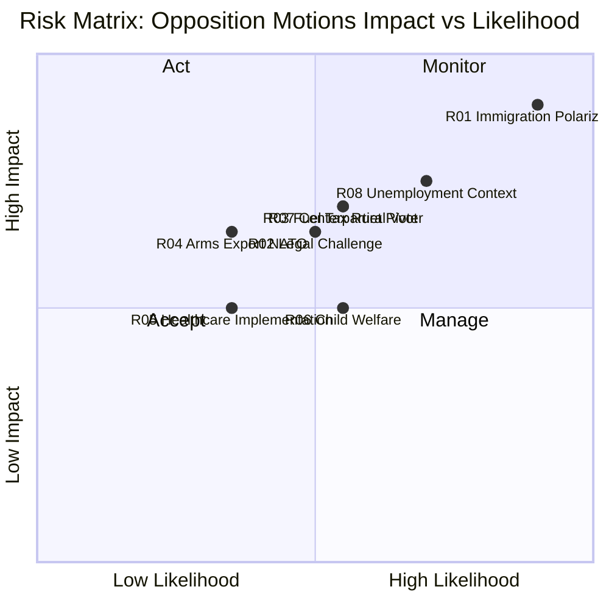

# Risk Assessment — Opposition Motions (April 14–17, 2026)
**Date**: 2026-04-20 | **Riksmöte**: 2025/26 | **Analyst**: news-motions workflow
**Analysis Timestamp**: 2026-04-20 13:05 UTC

---

## 🎯 Risk Matrix: Policy Change Risks from Opposition Motions

### Scoring Methodology
- **Likelihood (L)**: 1 (very unlikely) → 5 (near-certain)
- **Impact (I)**: 1 (minimal) → 5 (transformational)
- **Score**: L × I = 1–25

| Risk ID | Risk Description | L | I | L×I | Mitigation Strategy | Forward Trigger |
|---------|-----------------|---|---|-----|---------------------|----------------|
| R01 | Government passes immigration bills over opposition → deepens polarization before 2026 election | 5 | 5 | **25** | None — parliamentary majority is deterministic | Committee votes expected May–June 2026 |
| R02 | New Reception Law (prop. 2025/26:229) faces legal challenge at Administrative Court | 3 | 4 | **12** | Government must ensure ECHR/EU Pact compatibility | Legal challenge if passed (Q3 2026) |
| R03 | Opposition fuel tax stance alienates rural voters — S loses seats in Norrland constituencies | 3 | 4 | **12** | S needs to reframe as climate/equity argument | 2026 election polling data Q2 2026 |
| R04 | Arms export counter-motions (V+MP) create reputational risk with EU/NATO partners | 2 | 4 | **8** | Coalition will pass law; V/MP positions noted but ineffective | UU committee report May 2026 |
| R05 | Healthcare reform (SoU) passes with S+V+C opposition → creates implementation friction | 2 | 3 | **6** | Government has majority in SoU | Committee vote June 2026 |
| R06 | Crime victim compensation changes create unintended consequences for child welfare | 3 | 3 | **9** | MP's partial rejection (HD024085) raises this risk explicitly | Constitutional review before implementation |
| R07 | C breaks from opposition consensus on deportation → could negotiate with government | 3 | 4 | **12** | C's HD024095 is a conditional rather than rejection | SfU negotiations March–May 2026 |
| R08 | Unemployment rising (8.69% in 2025) amplifies anti-immigration sentiment → opposition narrative becomes harder | 4 | 4 | **16** | Opposition must show integration creates economic value | Monthly unemployment data releases |

---

## 🔴 Critical Risks (L×I ≥ 20)

### R01: Immigration Polarization Lock-In (L×I = 25)

**Narrative**: The government's three-proposition immigration package (prop. 2025/26:229, 235, 215) will pass with M/SD/KD/L majority. The opposition's 10 counter-motions, while democratically essential, will all fail. This creates a **polarization lock-in** scenario: the government campaigns on "we secured the borders" while opposition campaigns on "we defended human rights" — both narratives are true and irreconcilable. With unemployment at 8.69% in 2025 (World Bank data), voter anxiety about resource competition makes the government's framing electorally stronger.

**Risk materialization timeline**: Committee votes SfU → May 2026; Chamber vote → June 2026.

**Opposition strategic response**: S (Socialdemokraterna) is likely to pivot to "integration investment" narrative — HD024079 (time-limited housing) frames integration as economic productivity, not welfare spending. This is their best counter-narrative.

---

## 🟠 High Risks (L×I 10–19)

### R08: Unemployment Context Erodes Opposition Immigration Narrative (L×I = 16)

**Economic context**: Sweden's unemployment rate rose from 8.4% (2024) to 8.69% (2025) while GDP growth was only 0.82% in 2024 (after -0.2% in 2023). This economic fragility makes voters more receptive to government arguments about limiting immigration-related public expenditure. S's counter-motions must demonstrate economic benefits of integration, not just humanitarian arguments.

**Forward indicator**: Q1 2026 Labour Force Survey results (expected April/May 2026) will either strengthen or weaken this risk.

### R07: Centerpartiet as Pivot Party (L×I = 12)

**Strategic significance**: Centerpartiet's HD024095 on deportation is distinctively moderate — it does not reject the government's deportation expansion but demands proportionality testing (systematic repeated offenses required). This positions C as a potential negotiating partner with the government on immigration. If C negotiates, it breaks the four-party opposition front. The government may prefer a narrow majority (SD+M+KD+L) but a deal that brings C in would provide legitimacy.

**Forward indicator**: C leader Annie Lööf's statements on deportation proportionality (expected May 2026 SfU hearings).

### R03: Fuel Tax — S Rural Voter Risk (L×I = 12)

**Specific risk**: The extra budget (prop. 2025/26:236) cuts fuel taxes, which directly benefits rural Swedish households with longer commutes and higher fuel dependency. S's HD024082 opposing the cut may be read in rural constituencies as "S doesn't care about our fuel costs." With S having lost Norrland ground in 2022, this is a real electoral vulnerability.

**Mitigation**: S's motion (HD024082) explicitly argues the government should "return to parliament with a new proposal" — not a blanket rejection, but a demand for better design. This is a nuanced position that may be lost in media coverage.

---

## 📊 Risk Visualization

---

## 🔭 Forward Risk Indicators

| Indicator | Trigger | Timeline | Risk Connected |
|-----------|---------|----------|----------------|
| SfU committee scheduling of immigration propositions | Committee dates announced | May 2026 | R01, R07 |
| C leader Annie Lööf comments on deportation proportionality | Media statement / interview | May 2026 | R07 |
| Q1 2026 Labour Force Survey (Statistikmyndigheten SCB) | Monthly release | May 2026 | R08 |
| European Court of Human Rights: Sweden deportation cases | Any new ECHR ruling | Q2-Q3 2026 | R02 |
| SVT Opinion polls on immigration as #1 issue | Monthly polls | Ongoing | R01, R03 |
| FiU committee vote on extra budget (prop. 2025/26:236) | Committee vote | May 2026 | R03 |

---

## 🎯 Coalition Stability Assessment

**Current coalition stability**: STABLE (M/SD/KD/L intact)
- All immigration propositions will pass as planned
- Extra budget fuel tax cut will pass
- Arms export modernization will pass
- Opposition motions are on record but will be voted down

**Risk to coalition from these motions**: LOW in parliamentary terms, MEDIUM in electoral terms
- The opposition has successfully differentiated its immigration policy positions
- The fuel tax opposition creates a clear narrative split for 2026 campaigning
- C's moderate position on deportation is the only wild card
