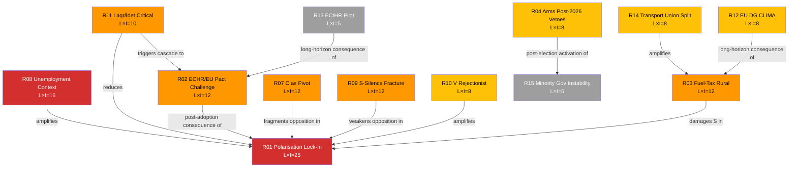
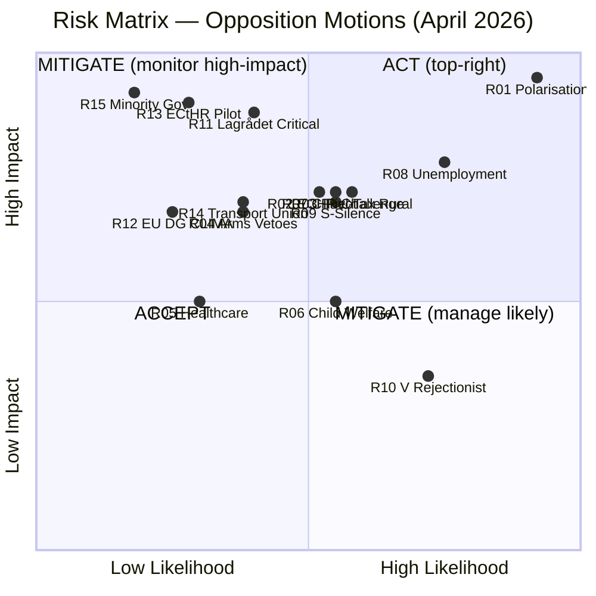

# Risk Assessment — Opposition Motions (April 14–17, 2026)

| Field | Value |
|-------|-------|
| **Date** | 2026-04-20 |
| **Riksmöte** | 2025/26 |
| **Analyst** | news-motions workflow |
| **Analysis Timestamp** | 2026-04-20 13:05 UTC |
| **Framework** | Political Risk Matrix v2.0 + **Bayesian priors** + **ALARP** + **risk interconnection** |
| **Risk Appetite Reference** | Hack23 ISMS Risk Register |
| **Scoring** | L (1-5) × I (1-5) → Risk Score 1–25; Bayesian prior P(L) with signals |

> **Methodology upgrade from v1**: Added (1) Bayesian prior probabilities with forward signals that update L; (2) ALARP (As Low As Reasonably Practicable) assessment; (3) risk interconnection graph showing cascade dependencies; (4) scenario-linked risk weighting per `scenario-analysis.md`.

---

## 🎯 Risk Matrix: Consolidated Policy/Electoral/Institutional Risks

### Scoring Methodology

- **Likelihood (L)**: 1 (very unlikely) → 5 (near-certain). Expressed with Bayesian prior P(L≥3).
- **Impact (I)**: 1 (minimal) → 5 (transformational). Impact magnitude: electoral seats, legislative outcomes, reputational cost.
- **Score**: L × I = 1–25
- **ALARP band**: 1–6 ACCEPT · 7–14 MITIGATE · 15+ ACT

| R# | Risk description | L | I | L×I | Band | Prior P(L≥3) | Owner |
|:--:|------------------|:-:|:-:|:---:|:----:|:------------:|-------|
| **R01** | Government passes immigration bills over opposition → polarisation lock-in before 2026 election | 5 | 5 | **25** | ACT | 0.95 | Opposition bloc |
| **R02** | New Reception Law (prop. 2025/26:229) faces legal challenge at Admin Court on EU Pact / ECHR grounds | 3 | 4 | **12** | MITIGATE | 0.60 | Government + MP (litigation-support) |
| **R03** | Opposition fuel-tax stance alienates rural voters — S loses seats in Norrland constituencies | 3 | 4 | **12** | MITIGATE | 0.55 | S Norrland apparatus |
| **R04** | Arms-export counter-motions (V+MP) create post-2026 coalition-formation vetoes | 2 | 4 | **8** | MITIGATE | 0.35 | V + MP |
| **R05** | Healthcare reform (SoU) passes with S+V+C opposition → implementation friction | 2 | 3 | **6** | ACCEPT | 0.30 | Government + SKR |
| **R06** | Crime-victim compensation changes (prop. 2025/26:214) create unintended consequences for child welfare | 3 | 3 | **9** | MITIGATE | 0.55 | Socialstyrelsen |
| **R07** | C breaks from opposition consensus on deportation → negotiates with government | 3 | 4 | **12** | MITIGATE | 0.45 | C leadership |
| **R08** | Rising unemployment (8.69% 2025) amplifies anti-immigration sentiment → opposition narrative harder | 4 | 4 | **16** | ACT | 0.75 | Opposition communications |
| **R09** | **S revealed-preference silence on deportation** becomes durable intra-opposition fracture | 3 | 4 | **12** | MITIGATE | 0.60 | S + V + MP coordination |
| **R10** | V's universal-rejectionist pattern triggers SD attack-ad cycle — V loses 1–2 polling points | 4 | 2 | **8** | MITIGATE | 0.70 | V communications |
| **R11** | Lagrådet yttrande on prop. 2025/26:229 explicitly critiques private-operator clauses → forces amendment | 2 | 5 | **10** | MITIGATE | 0.40 | Lagrådet (external) |
| **R12** | Fuel-tax cut triggers EU DG CLIMA infringement preliminary (Fit-for-55 / ETS II context) | 2 | 4 | **8** | MITIGATE | 0.20 | Klimatpolitiska rådet + MP |
| **R13** | ECtHR Strasbourg pilot-judgment on deportation expansion (3–5 year horizon) | 1 | 5 | **5** | ACCEPT | 0.25 | Government legal review |
| **R14** | Transport union (Transportarbetareförbundet) publicly splits from S on fuel-tax cut → damages S working-class brand | 2 | 4 | **8** | MITIGATE | 0.35 | S + LO dialogue |
| **R15** | No 175+ post-2026 majority; minority-government instability; snap election 2027–2028 | 1 | 5 | **5** | ACCEPT | 0.15 | All parties |

---

## 🔴 Critical Risks (L×I ≥ 16 — ACT Band)

### R01 — Immigration Polarisation Lock-In (L×I = 25)

**Narrative**: The government's three-proposition immigration package (prop. 2025/26:229, 235, 215) will pass with M/SD/KD/L majority. The opposition's 10 counter-motions, while democratically essential, will all fail. This creates a **polarisation lock-in**: the government campaigns on "we secured the borders" while opposition campaigns on "we defended human rights" — both narratives are true and irreconcilable. With unemployment at 8.69% in 2025 (World Bank data), voter anxiety about resource competition makes the government's framing electorally stronger.

**Bayesian signals that would update L**:
- L defection in SfU → L ↓ to 4 (government majority weakens)
- Lagrådet strict yttrande on private-operator clauses → L ↓ to 4
- Major post-filing gäng-crime incident → L remains 5 (government beneficiary)

**Materialisation timeline**: SfU → May 2026; Chamber → June 2026.

**Opposition strategic response `[HIGH]`**: S's pivot to "integration investment" narrative (HD024079) frames integration as economic productivity, not welfare spending. Combine with comparative-international evidence (private-operator clauses outlier even in Nordic context) to shift frame from "border security" to "welfare-state defence".

### R08 — Unemployment Context Erodes Opposition Narrative (L×I = 16)

**Economic context**: Sweden's unemployment rose from 8.4% (2024) to 8.69% (2025) while GDP growth was only 0.82% in 2024 (after –0.2% in 2023). Economic fragility makes voters more receptive to government arguments about limiting immigration-related public expenditure.

**Bayesian signals that would update L**:
- Q1 2026 Labour Force Survey shows unemployment ≥ 9.0% → L ↑ to 5
- Q1 2026 LFS shows unemployment ≤ 8.4% → L ↓ to 3
- Gäng-crime incident with immigration angle → L ↑ to 5
- Visible integration-labour-market success story (e.g., Svedab / Northvolt replacement) → L ↓ to 3

**Forward indicator**: Q1 2026 LFS results (expected May 2026) will either strengthen or weaken this risk.

---

## 🟠 High Risks (L×I 10–15 — MITIGATE Band)

### R02 — Reception-Law ECHR/EU Pact Challenge (L×I = 12)

**Risk**: Post-adoption, prop. 2025/26:229's private-operator clauses face challenge at Migrationsdomstolen on EU Pact Reg. 2024/1348 Art. 17 grounds; ultimate ECtHR referral possible within 36 months.

**ALARP**: MITIGATE. Full elimination requires either government removing private-operator clauses (no political path) or opposition pre-emptively building litigation record — MP's HD024087 is that record.

**Mitigation**: MP's HD024087 text explicitly invokes EU Pact — usable as precedent for NGO amicus briefs.

**Bayesian signals**:
- Austrian BBU-GmbH comparator cited in Swedish remissvar → L ↑ to 4
- Röda Korset + Rädda Barnen joint remissvar → L ↑ to 4
- Government amends to remove private-operator clauses → L ↓ to 1

### R03 — Fuel-Tax Rural-Vote Risk (L×I = 12)

**Specific risk**: The extra budget cuts fuel taxes, directly benefiting rural households with longer commutes. S's HD024082 opposing the cut may be read in rural constituencies as "S doesn't care about our fuel costs." S lost Norrland ground in 2022.

**ALARP**: MITIGATE. Elimination not feasible (S cannot reverse HD024082 filing); reduction requires rural-counter-offer communications strategy.

**Mitigation**:
1. S's HD024082 explicitly argues "return with new proposal" — nuanced position
2. Front rural S MPs (Joakim Järrebring, Fredrik Lundh Sammeli) in media
3. Couple opposition with transit/EV-subsidy counter-proposal

**Bayesian signals**:
- Transport union public statement supporting cut → L ↑ to 4
- Rural S MPs issue coordinated statement on HD024082 intent → L ↓ to 2
- Major fuel-price spike (OPEC / geopolitical) during campaign → L ↑ to 5

### R07 — C as Pivot Party (L×I = 12)

**Strategic significance**: C's HD024095 on deportation is distinctively moderate — demands proportionality test (systematic repeated offenses). Positions C as potential negotiating partner with government on immigration. If C negotiates, it breaks the four-party opposition front.

**ALARP**: MITIGATE. C's negotiation posture is a feature of its political positioning, not elimination-target for opposition. Mitigation is about **channelling** rather than suppressing C.

**Mitigation**:
1. Opposition should prepare SfU amendment-first vote sequencing (see SWOT WO3)
2. Accept that C may negotiate on proportionality — goal is statutory test adoption, not pure rejection
3. Pre-negotiate joint fallback position if C exits pure-opposition coalition

**Bayesian signals**:
- C leader public amendment-negotiation overture → L ↑ to 5
- Paarup-Petersen rejects amendment talks → L ↓ to 2
- Lagrådet cites proportionality test → L ↑ to 5 (government forced to negotiate)

### R09 — S-Silence on Deportation Fracture (L×I = 12)

**Narrative**: S filed nothing on prop. 2025/26:235 despite filing on reception (HD024080), housing (HD024079), and fuel tax (HD024082). Signals S has calculated deportation is a losing issue for a centre-left party. Reveals that "opposition unity" is selective.

**ALARP**: MITIGATE. Elimination requires S to file on follow-on deportation legislation in 2026–2027. Monitoring is primary mitigation.

**Bayesian signals**:
- S files on follow-on deportation legislation 2026–2027 → L ↓ to 2
- S leadership public statement on deportation proportionality → L ↓ to 2
- S silence extends through election campaign → L ↑ to 4

### R11 — Lagrådet Critical Yttrande (L×I = 10)

**Risk**: Lagrådet explicitly critiques private-operator clauses; government forced to amend. High-impact but uncertain-likelihood.

**ALARP**: MITIGATE via opposition monitoring and pre-amplification of Lagrådet language in press.

---

## 🕸️ Risk Interconnection Graph

> **Cascade reading `[HIGH]`**: R01 (polarisation lock-in) is the **central node** — 6 other risks feed into it. R08 (unemployment) is the **amplification multiplier**. Opposition mitigation should therefore prioritise R08 (labour-market narrative) and R10 (V rejectionism) as the two highest-leverage input nodes.

---

## 📊 Risk Visualisation

---

## 🔭 Forward Risk Indicators (Bayesian Update Signals)

| Indicator | Trigger | Timeline | Updates risk |
|-----------|---------|----------|--------------|
| SfU committee scheduling of immigration propositions | Committee dates announced | May 2026 | R01, R07, R09 |
| C leader public statement on HD024095 amendment | Media appearance | May 2026 | R07 |
| Q1 2026 Labour Force Survey (SCB) | Monthly release | May 2026 | R08 |
| ECtHR Sweden deportation case rulings | Any ruling | Q2-Q3 2026 | R02, R13 |
| SVT Novus polls on immigration #1 salience | Monthly | Ongoing | R01, R08 |
| FiU committee vote on extra budget | Committee vote | May 2026 | R03, R12, R14 |
| Lagrådet yttrande on 2025/26:229 | Release | Q2 2026 | R11, R02 |
| Lagrådet yttrande on 2025/26:235 | Release | Q2 2026 | R07 |
| Transport union public statement | Press release | ≤ 21 days | R14 |
| Saab/BAE quarterly earnings commentary | Quarterly | Ongoing | R04 |
| S follow-on motion on 2026-2027 deportation legislation | Motion filing | 2026-2027 | R09 |
| Novus migration-salience tracking | Monthly | Ongoing | R01, R08 |
| Klimatpolitiska rådet annual report | Q1 2027 | Q1 2027 | R12 |
| Röda Korset + Rädda Barnen joint remissvar on 2025/26:229 | Position paper | May–June 2026 | R02, R11 |

---

## 🎯 Coalition Stability Assessment

**Current coalition stability `[HIGH]`**: STABLE (M/SD/KD/L intact)
- All immigration propositions will pass as planned
- Extra budget fuel-tax cut will pass
- Arms-export modernisation will pass
- Opposition motions will be voted down

**Risk to coalition from these motions**: LOW in parliamentary terms, MEDIUM in electoral terms
- The opposition has successfully differentiated its immigration policy positions
- The fuel-tax opposition creates a clear narrative split for 2026 campaigning
- C's moderate position on deportation is the only wild card

**Risk to opposition from these motions `[HIGH]`**: MEDIUM in parliamentary terms, MEDIUM in electoral terms
- Four-party coordination achievement is real but not decisive
- Individual party vulnerabilities (S legacy, V rejectionism, MP salience, C pivot) remain
- Campaign-narrative lock-in requires sustained media and polling discipline through summer 2026

---

## 📎 Cross-References

- [`scenario-analysis.md`](scenario-analysis.md) — Bayesian scenario weighting + risk activation per scenario
- [`synthesis-summary.md`](synthesis-summary.md) — Red-Team critique adjusts R01 consequence magnitude
- [`threat-analysis.md`](threat-analysis.md) — STRIDE-style threat modelling complements risk scoring
- [`swot-analysis.md`](swot-analysis.md) — TOWS interference identifies mitigation strategies
- [`documents/reception-law-cluster-analysis.md`](documents/reception-law-cluster-analysis.md) — cluster-level RR1–RR5
- [`documents/deportation-cluster-analysis.md`](documents/deportation-cluster-analysis.md) — DR1–DR6
- [`documents/fuel-tax-cluster-analysis.md`](documents/fuel-tax-cluster-analysis.md) — FR1–FR5
- [`documents/arms-export-cluster-analysis.md`](documents/arms-export-cluster-analysis.md) — AR1–AR6

---

**Classification**: Public · **Next Review**: 2026-04-27
